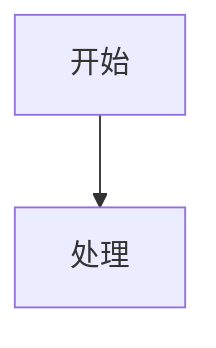

# 海中鱼巣流程图落盘

## Core Rule

Create durable files, not chat-only diagrams:

```text
D:\海中鱼巣\流程图\<filename>.md
D:\海中鱼巣\流程图\<filename>.html
```

The `.md` and `.html` filenames must match except for extension.

## Start Context

1. Confirm cwd is `D:\海中鱼巣`.
2. If the chart represents an active plan, service boundary, migration route, root-cause path, or demand/task/method lifecycle, read `AGENTS.md`, `计划/计划索引.md`, and relevant specs/plans first.
3. If the chart is conceptual and no authority source is needed, create it directly.
4. Use scoped `rg` and short reads when deriving from code.

## File Naming

```text
YYYYMMDD_<主题>_流程图_v0.1.md
YYYYMMDD_<主题>_流程图_v0.1.html
```

If a matching topic exists, increment the version unless the user asks to update the exact file.

## Markdown Format

````markdown
# <标题>

更新时间：YYYY-MM-DD

## 依据

```text
<source files, plans, specs, logs, or user material>
```

## 说明

<short boundary notes>

## 流程图



## 关键边界

```text
<constraints and non-goals>
```
````

## HTML Format

The HTML must be standalone enough to open in a browser and render the same Mermaid text through CDN. Include:

```html
<script type="module">
  import mermaid from "https://cdn.jsdelivr.net/npm/mermaid@10/dist/mermaid.esm.min.mjs";
  mermaid.initialize({ startOnLoad: true, securityLevel: "loose", flowchart: { useMaxWidth: false, htmlLabels: true } });
</script>
```

## Project Boundaries

Preserve these in diagrams:

```text
函数事实不是迁移单位；服务逻辑包才是迁移确认单位。
线程不是动作来源。
日志 / 控制台 / 显示只做人读。
需求目标是目标状态，不是 I64。
特征值服务只由特征服务直接访问。
独立重建的只读控制面板第一版、SQL 审计投影和六类真实树已完成；不得扩大为完整业务操作、数据库恢复或旧能力迁移。D455 / 体素 / 外设仍未接入。
```

## Validation

Before final response:

1. Confirm both files exist.
2. Confirm the Markdown contains a Mermaid fenced block.
3. Confirm the HTML contains the same graph text and Mermaid CDN import.
4. Run `git diff --check -- <md> <html>` inside the repo.
5. Return clickable absolute links.
