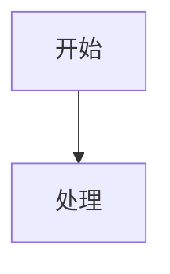

# 海中鱼巣流程图落盘

## 入口与门禁

1. 先遵守仓库根目录 `AGENTS.md`，不在技能内复制其权威顺序、角色权限或机器硬规则。
2. 用 `git rev-parse --show-toplevel` 解析当前仓库根目录；只有用户明确指定另一个现存项目路径时才改用该路径。不得硬编码盘符、旧项目名或路径别名。
3. 只有当前顶层任务树拥有设计写角色时才落盘。执行、集成或只读角色只返回事实和应交给设计窗口的输入，不写流程图。
4. 实现、服务边界、生命周期、迁移、根因或活动计划流程图必须先读取 `规范/规范目录.md`、相关现行正式规范、有效设计或计划以及必要的当前代码证据。依据缺失、冲突或过期时停止落盘并退回设计治理。
5. 纯概念图可以不依赖实现依据，但必须在标题、说明和关键边界中同时标明 `概念草图 / 非正式 / 非权威 / 不得作为施工依据`。概念图不会因生成、评审或用户确认自动成为规范、详细设计、计划或代码许可。

## 专用流程

```text
固定对象与用途
-> 区分正式依据、当前事实、假设和待核项
-> 定义输入、前置拒绝、核心步骤、结构承载、输出和失败收口
-> 检查跨服务写入方、读取方、发布边界和验证点
-> 生成同一 Mermaid 主体的 Markdown 与 HTML
-> 验证两个载体一致
```

从代码反推时，使用限定范围的 `rg` 和短读取；函数事实只作证据，流程边界按现行正式规范和服务逻辑组织。不得把日志、显示、线程、返回码或草稿文本画成机器事实。

## 路径与命名

在解析出的仓库根目录下写入：

```text
流程图/YYYYMMDD_<主题>_流程图_v0.1.md
流程图/YYYYMMDD_<主题>_流程图_v0.1.html
```

同一主题已存在时递增版本；用户明确要求修订某个现存文件时原地更新。两份文件除扩展名外名称一致。

## Markdown 最小结构

````markdown
# <标题>

更新时间：YYYY-MM-DD

## 依据

```text
<现行正式规范、有效设计/计划、当前代码证据或用户材料>
```

## 身份与边界

<正式设计图，或“概念草图 / 非正式 / 非权威 / 不得作为施工依据”>

## 流程图



## 关键边界

```text
<前置拒绝、内部错误、结构承载、非目标和验证>
```
````

## HTML 要求

HTML 必须可独立打开，并包含与 Markdown 完全相同的 Mermaid 图文本及：

```html
<script type="module">
  import mermaid from "https://cdn.jsdelivr.net/npm/mermaid@10/dist/mermaid.esm.min.mjs";
  mermaid.initialize({ startOnLoad: true, securityLevel: "loose", flowchart: { useMaxWidth: false, htmlLabels: true } });
</script>
```

## 验证

1. 确认 `.md` 与 `.html` 均存在且名称配对。
2. 确认 Markdown 有 Mermaid fenced block，HTML 有相同图文本和 Mermaid import。
3. 确认图中每项正式规则均能回指当前依据；概念项均保持非权威标记。
4. 在仓库根目录运行 `git diff --check -- <md> <html>`。
5. 返回两个文件的绝对可点击链接，并准确声明其正式或草稿身份。
