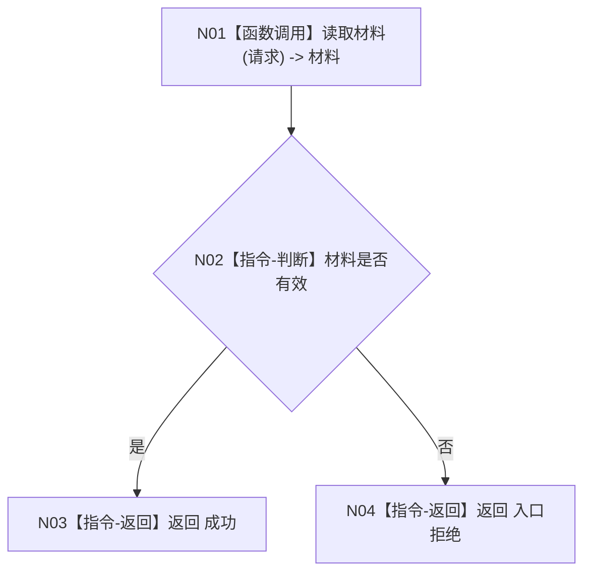

# 海中鱼巣流程图落盘

## 入口与门禁

1. 先遵守仓库根目录 `AGENTS.md`，不在技能内复制其权威顺序、角色权限或机器硬规则。
2. 用 `git rev-parse --show-toplevel` 解析当前仓库根目录；只有用户明确指定另一个现存项目路径时才改用该路径。不得硬编码盘符、旧项目名或路径别名。
3. 交互智能体可按用户直接指令取得明确流程图切片并直接落盘；计划智能体或计划支撑智能体只在自己默认拥有的设计包内落盘；流程图与知识图谱维护智能体只在正式移交的当前代码图谱维护切片内，把现状单函数流程图写入 `流程图/代码流程图/**`。计划智能体为新计划形成目标相关流程图并负责对应计划索引登记，但不得修改全项目共享当前代码图谱；计划支撑智能体只在执行侧提出具名无法裁决问题后，于来源计划原目标内直接新建或修改解决该问题所需的目标流程图，不承担新计划终审或正常登记。计划选择、S0 PASS、正常执行、纯代码错误和环境问题不触发计划支撑流程图写入。执行智能体只返回事实，不写流程图。
4. 实现、服务边界、生命周期、迁移、根因或活动计划流程图必须先读取 `规范/规范目录.md`、相关现行正式规范、有效设计或计划以及必要的当前代码证据。依据缺失、冲突、过期或设计包所有权不符时停止落盘。
5. 纯概念图可以不依赖实现依据，但必须在标题、说明和关键边界中同时标明 `概念草图 / 非正式 / 非权威 / 不得作为施工依据`。概念图不会因生成、评审或用户确认自动成为规范、详细设计、计划或代码许可。

## 专用流程

目标业务流程图使用：

```text
固定业务目标与完成边界
-> 冻结输入、输出、前置、步骤、分支、事实读写和非成功结果
-> 为每个业务节点建立所需能力合同
-> 查询当前能力证据并裁决复用 / 组合 / 适配 / 扩展 / 新建
-> 映射目标函数组、详细设计和验证
-> 生成包含 Mermaid fenced block 的 Markdown
```

目标 / 现状单函数流程图使用：

```text
固定对象与用途
-> 区分正式依据、当前事实、假设和待核项
-> 固定本图唯一根函数、完整参数和返回结果
-> 把每个节点分类为函数调用或本函数内具体指令
-> 为复杂被调函数建立独立单函数流程图和双向引用
-> 检查参数 / 结果传递、结构承载、发布边界和验证点
-> 生成包含 Mermaid fenced block 的 Markdown
-> 验证 Markdown 正式载体
```

从代码反推时，使用限定范围的 `rg` 和短读取；函数事实只作证据，流程边界按现行正式规范和服务逻辑组织。不得把日志、显示、线程、返回码或草稿文本画成机器事实。

## 业务流程图合同

1. 一份正式业务流程图只对应一个业务闭环，不要求与一个函数或一份代码流程图对应。
2. 必须记录业务输入、输出、前置条件、完成条件、每个节点的事实读写、事务边界、逻辑内返回和验证点。
3. 节点可以是业务操作或能力合同，但不得直接伪写成当前已经存在的函数。每个节点必须在配套映射表中绑定候选能力、复用 / 新建裁决和目标函数组。
4. 一张业务图可以映射多份单函数施工图；一个共享函数可以被多张业务图引用。业务流程图不能替代详细设计或单函数合同。
5. 业务流程图、业务—能力—函数映射、详细设计和计划必须互相引用；任何未裁决节点都保持设计缺口。

## 单函数与节点合同

1. 每份代码实施类、施工类或现状实现流程图只对应一个根函数。文件身份和正文必须记录根函数中文名、归属模块 / 文件 / 层级、现有或待新增、完整签名、参数列表与返回结果；无参数或 `void` 必须显式写明。
2. 每个参数记录名称、类型、方向、所有权 / 生命周期和非法值；返回结果记录类型、成功 / 逻辑内返回 / 内部错误语义以及调用方如何接收。图中的每个返回节点必须产生合同允许的结果。
3. 图内执行节点只允许：
   - `函数调用`：具名被调函数、完整签名、实参与形参绑定、返回接收和后继；
   - `本函数内指令`：一条明确的判断、顺序操作、循环控制、赋值 / 构造、读取、写入、事务操作或返回。
4. 模块、服务、仓库、业务阶段和目标不是执行节点；需要展示归属时使用元数据、`subgraph` / 泳道或节点附注。禁止用“处理”“校验”“服务”“写入”等抽象节点隐藏未确认函数或多条指令。
5. 被调函数具有非平凡内部过程时，另建该函数自己的 Markdown 单函数流程图，并在调用节点和被调图的函数合同中双向引用。多个函数共同构成的业务过程使用流程图组索引和调用图表达，不得压入一张流程图。
6. 节点使用稳定编号和类型标签，例如：

```text
N03【函数调用】读取有效关系(主体, 类型) -> 关系组
N04【指令-判断】关系组是否为空
N05【指令-返回】返回 逻辑内空候选
```

边必须标明判断条件或传递材料。泛化的“开始 / 结束”节点不能代替真实入口指令或返回指令。

## 路径与命名

局部设计包流程图在解析出的仓库根目录下按其现行设计包合同写入；没有更精确合同且属于通用落盘时使用：

```text
流程图/YYYYMMDD_<业务主题>_业务流程图_v0.1.md
流程图/YYYYMMDD_<函数名或函数主题>_函数流程图_v0.1.md
```

同一主题已存在时递增版本；用户明确要求修订某个现存 Markdown 文件时原地更新。不得新建、更新、同步、配对或验证 HTML。历史 HTML 只作非权威旧载体原地保留，不随 Markdown 修订。

流程图与知识图谱维护智能体不使用上述通用顶层路径；它按 `hai-zhong-yu-chao-flowchart-code-correction` 的代码函数图谱重建合同，只在 `流程图/代码流程图/**` 写现状单函数流程图、逐行映射及配套队列 / 清单，并在 `流程图/主程序可达调用关系/**` 中除 `能力证据目录/**` 外维护聚合调用事实。

## Markdown 最小结构

````markdown
# <标题>

更新时间：YYYY-MM-DD

## 依据

```text
<现行正式规范、有效设计/计划、当前代码证据或用户材料>
```

## 身份与边界

<正式设计图，或“概念草图 / 非正式 / 非权威 / 不得作为施工依据”>

## 函数合同

```text
根函数：
归属模块 / 文件 / 层级：
现有或待新增：
完整签名：
参数：
返回结果：
被调函数流程图：
```

## 流程图


```mermaid
flowchart TD
    N01["N01【函数调用】读取材料(请求) -> 材料"] --> N02{"N02【指令-判断】材料是否有效"}
    N02 -- 是 --> N03["N03【指令-返回】返回 成功"]
    N02 -- 否 --> N04["N04【指令-返回】返回 入口拒绝"]
```

## 节点合同

| 节点 | 类型 | 参数 / 输入绑定 | 结果 / 输出绑定 | 事实读写 | 后继条件 | 验证 |
| --- | --- | --- | --- | --- | --- | --- |
| N01 | 函数调用 | 请求 -> 请求 | 材料结果 -> 材料 | 只读材料 | 调用完成 | 具名验证 |

## 关键边界

```text
<前置拒绝、内部错误、结构承载、非目标和验证>
```
````

## 验证

1. 确认 `.md` 存在并包含 Mermaid fenced block；不存在新增或同步的 HTML。
2. 业务图确认一图一个业务闭环且业务—能力—函数映射完整；单函数图确认一图只有一个根函数，函数完整签名、全部参数与返回结果没有省略。
3. 确认每个执行节点只属于函数调用或本函数内具体指令；每个调用节点均有参数 / 结果绑定，复杂被调函数均有双向引用的独立流程图。
4. 确认模块 / 服务 / 阶段未被画成执行节点，全部边有条件或材料，全部返回路径有具名结果。
5. 确认图中每项正式规则均能回指当前依据；概念项均保持非权威标记。非函数概念图不能充当代码实施类有效流程图。
6. 在仓库根目录运行 `git diff --check -- <md>`。
7. 返回 Markdown 文件的绝对可点击链接，并准确声明其正式或草稿身份。
