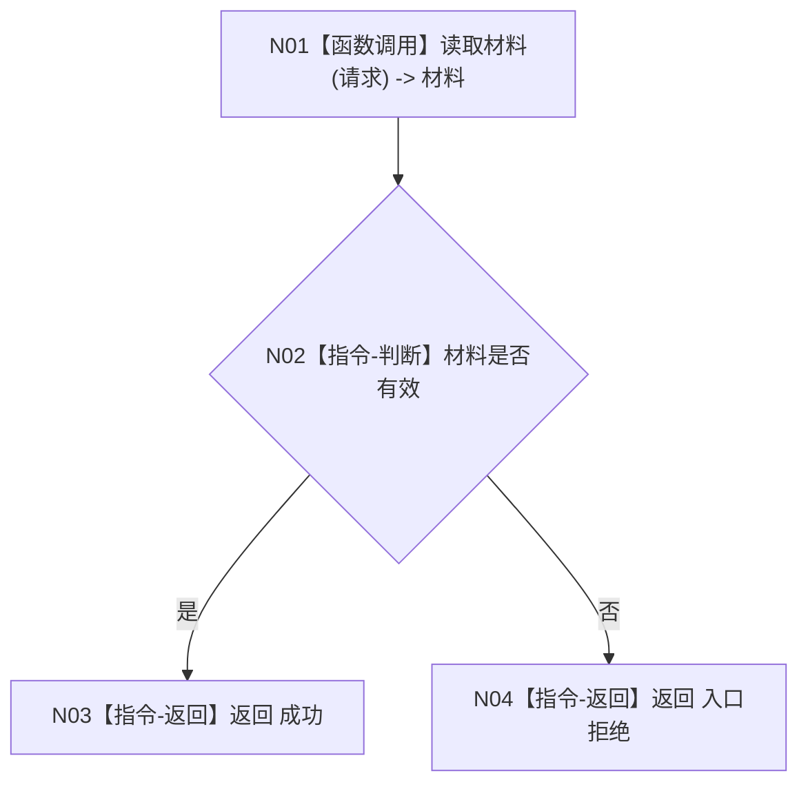

# 海中鱼巣流程图落盘

## 入口与门禁

1. 先遵守仓库根目录 `AGENTS.md`，不在技能内复制其权威顺序、角色权限或机器硬规则。
2. 用 `git rev-parse --show-toplevel` 解析当前仓库根目录；只有用户明确指定另一个现存项目路径时才改用该路径。不得硬编码盘符、旧项目名或路径别名。
3. 只有计划智能体或计划支撑智能体可以在自己拥有的设计包内落盘：计划智能体只为创建新计划形成所需流程图；计划支撑智能体只在执行侧报告具名计划 / 设计问题、明确请求修订且复核成立后，修订该既有计划的关联流程图。计划选择、S0 PASS 和正常执行不触发流程图写入。交互智能体只形成目标 / 草稿输入；执行智能体只返回事实，不写流程图。
4. 实现、服务边界、生命周期、迁移、根因或活动计划流程图必须先读取 `规范/规范目录.md`、相关现行正式规范、有效设计或计划以及必要的当前代码证据。依据缺失、冲突、过期或设计包所有权不符时停止落盘。
5. 纯概念图可以不依赖实现依据，但必须在标题、说明和关键边界中同时标明 `概念草图 / 非正式 / 非权威 / 不得作为施工依据`。概念图不会因生成、评审或用户确认自动成为规范、详细设计、计划或代码许可。

## 专用流程

```text
固定对象与用途
-> 区分正式依据、当前事实、假设和待核项
-> 固定本图唯一根函数、完整参数和返回结果
-> 把每个节点分类为函数调用或本函数内具体指令
-> 为复杂被调函数建立独立单函数流程图和双向引用
-> 检查参数 / 结果传递、结构承载、发布边界和验证点
-> 生成同一 Mermaid 主体的 Markdown 与 HTML
-> 验证两个载体一致
```

从代码反推时，使用限定范围的 `rg` 和短读取；函数事实只作证据，流程边界按现行正式规范和服务逻辑组织。不得把日志、显示、线程、返回码或草稿文本画成机器事实。

## 单函数与节点合同

1. 每份代码实施类、施工类或现状实现流程图只对应一个根函数。文件身份和正文必须记录根函数中文名、归属模块 / 文件 / 层级、现有或待新增、完整签名、参数列表与返回结果；无参数或 `void` 必须显式写明。
2. 每个参数记录名称、类型、方向、所有权 / 生命周期和非法值；返回结果记录类型、成功 / 逻辑内返回 / 内部错误语义以及调用方如何接收。图中的每个返回节点必须产生合同允许的结果。
3. 图内执行节点只允许：
   - `函数调用`：具名被调函数、完整签名、实参与形参绑定、返回接收和后继；
   - `本函数内指令`：一条明确的判断、顺序操作、循环控制、赋值 / 构造、读取、写入、事务操作或返回。
4. 模块、服务、仓库、业务阶段和目标不是执行节点；需要展示归属时使用元数据、`subgraph` / 泳道或节点附注。禁止用“处理”“校验”“服务”“写入”等抽象节点隐藏未确认函数或多条指令。
5. 被调函数具有非平凡内部过程时，另建该函数自己的 Markdown / HTML 单函数流程图，并在调用节点和被调图的函数合同中双向引用。多个函数共同构成的业务过程使用流程图组索引和调用图表达，不得压入一张流程图。
6. 节点使用稳定编号和类型标签，例如：

```text
N03【函数调用】读取有效关系(主体, 类型) -> 关系组
N04【指令-判断】关系组是否为空
N05【指令-返回】返回 逻辑内空候选
```

边必须标明判断条件或传递材料。泛化的“开始 / 结束”节点不能代替真实入口指令或返回指令。

## 路径与命名

在解析出的仓库根目录下写入：

```text
流程图/YYYYMMDD_<函数名或函数主题>_函数流程图_v0.1.md
流程图/YYYYMMDD_<函数名或函数主题>_函数流程图_v0.1.html
```

同一主题已存在时递增版本；用户明确要求修订某个现存文件时原地更新。两份文件除扩展名外名称一致。

## Markdown 最小结构

````markdown
# <标题>

更新时间：YYYY-MM-DD

## 依据

```text
<现行正式规范、有效设计/计划、当前代码证据或用户材料>
```

## 身份与边界

<正式设计图，或“概念草图 / 非正式 / 非权威 / 不得作为施工依据”>

## 函数合同

```text
根函数：
归属模块 / 文件 / 层级：
现有或待新增：
完整签名：
参数：
返回结果：
被调函数流程图：
```

## 流程图


```mermaid
flowchart TD
    N01["N01【函数调用】读取材料(请求) -> 材料"] --> N02{"N02【指令-判断】材料是否有效"}
    N02 -- 是 --> N03["N03【指令-返回】返回 成功"]
    N02 -- 否 --> N04["N04【指令-返回】返回 入口拒绝"]
```

## 节点合同

| 节点 | 类型 | 参数 / 输入绑定 | 结果 / 输出绑定 | 事实读写 | 后继条件 | 验证 |
| --- | --- | --- | --- | --- | --- | --- |
| N01 | 函数调用 | 请求 -> 请求 | 材料结果 -> 材料 | 只读材料 | 调用完成 | 具名验证 |

## 关键边界

```text
<前置拒绝、内部错误、结构承载、非目标和验证>
```
````

## HTML 要求

HTML 必须可独立打开，并包含与 Markdown 完全相同的 Mermaid 图文本及：

```html
<script type="module">
  import mermaid from "https://cdn.jsdelivr.net/npm/mermaid@10/dist/mermaid.esm.min.mjs";
  mermaid.initialize({ startOnLoad: true, securityLevel: "loose", flowchart: { useMaxWidth: false, htmlLabels: true } });
</script>
```

## 验证

1. 确认 `.md` 与 `.html` 均存在且名称配对。
2. 确认 Markdown 有 Mermaid fenced block，HTML 有相同图文本和 Mermaid import。
3. 确认一图只有一个根函数，函数完整签名、全部参数与返回结果没有省略。
4. 确认每个执行节点只属于函数调用或本函数内具体指令；每个调用节点均有参数 / 结果绑定，复杂被调函数均有双向引用的独立流程图。
5. 确认模块 / 服务 / 阶段未被画成执行节点，全部边有条件或材料，全部返回路径有具名结果。
6. 确认图中每项正式规则均能回指当前依据；概念项均保持非权威标记。非函数概念图不能充当代码实施类有效流程图。
7. 在仓库根目录运行 `git diff --check -- <md> <html>`。
8. 返回两个文件的绝对可点击链接，并准确声明其正式或草稿身份。
