# 应用逻辑流程图草稿提取信息数据

日期：2026-07-08

状态：草稿信息数据 / 证据材料 / 非计划 / 不入队 / 非正式流程图产物 / 未改代码 / 未迁移旧函数

## 1. 数据定位

本文件根据用户附件中的“16 项迁移顺序目录对应流程图草稿”提取整理，但不直接采用旧 16 项顺序作为当前权威顺序。

当前项目已经将应用逻辑流程图迁移顺序升级为 `0-20`，并已生成 `流程图/20260708_应用逻辑流程图迁移模板_v0.2.md`。因此本文件按当前 `0-20` 顺序重排草稿，补齐运行宿主降权、任务结果回写、事件日志审计、仓库快照恢复拒绝矩阵、控制面板 / 数据库后置候选等缺项。

本文件不是计划，不是正式流程图落盘产物，不生成匹配 HTML，不登记可执行队列，不形成 C++ 实施许可。后续若要正式生成某一张流程图，必须另行按 `流程图/20260708_应用逻辑流程图迁移模板_v0.2.md` 生成 `流程图/*.md` 和 `流程图/*.html` 成对文件。

## 2. 依据

```text
用户附件：16 项迁移顺序目录对应流程图草稿
实施记录/20260708_应用逻辑流程图迁移顺序信息数据.md
流程图/20260708_应用逻辑流程图迁移模板_v0.2.md
规范/迁移路线权力分层规范.md
规范/详细设计/服务操作函数矩阵第一批.md
规范/000_项目规则总纲.md
规范/001_规则迁移清单.md
```

## 3. 总迁移顺序草稿

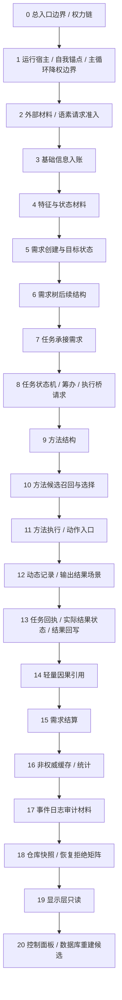

## 4. 分项草稿

### 0. 总入口边界 / 权力链流程

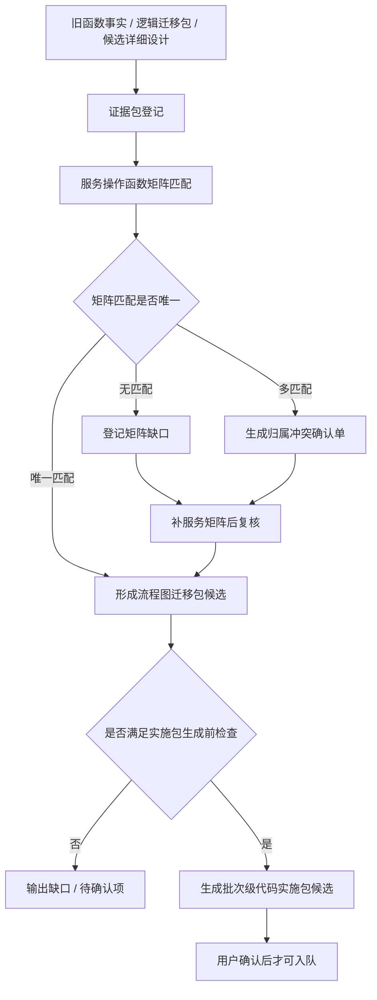

关键边界：

```text
函数事实不是迁移单位。
流程图发现需求不得直接写 C++。
实施包候选不等于代码实施许可。
```

### 1. 运行宿主 / 自我锚点 / 主循环降权边界流程

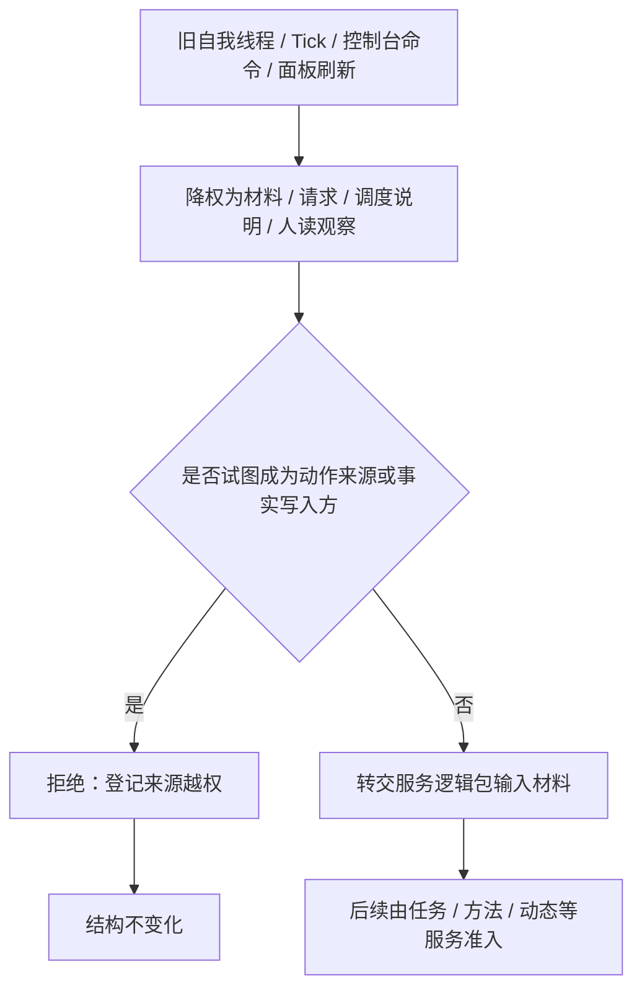

关键边界：

```text
线程、Tick、控制台命令和面板刷新不能成为动作来源。
旧自我主循环不直接迁移为新项目机器事实写入方。
```

### 2. 外部材料 / 语素请求准入流程

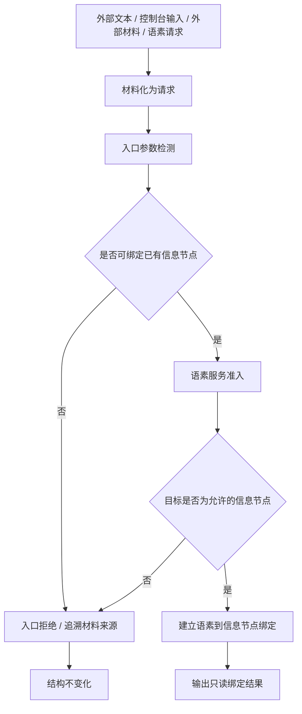

关键边界：

```text
外部材料只作为请求或材料。
材料准入失败时不创建事实。
显示文本、控制台输出和日志不得承载机器事实。
```

### 3. 基础信息入账流程

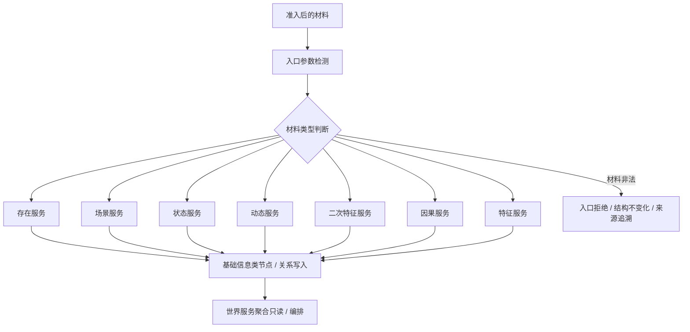

关键边界：

```text
基础信息必须走原子服务。
世界服务只做聚合编排。
不得绕过原子服务直接写基础信息结构。
```

### 4. 特征与状态材料流程

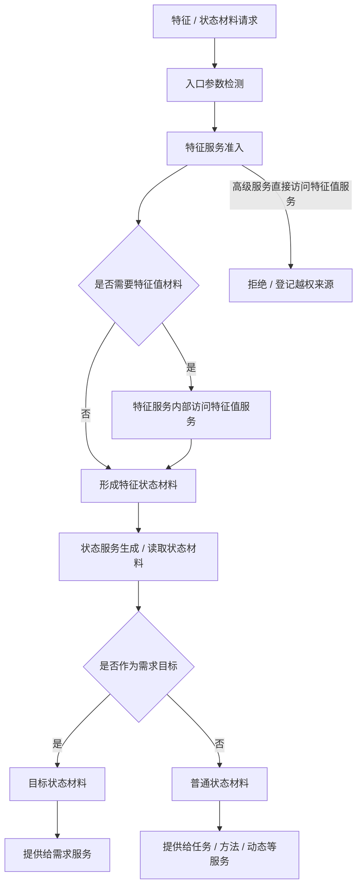

关键边界：

```text
需求目标是目标状态，不是 I64。
高级服务不得直接访问特征值服务。
需要特征状态材料时必须通过特征服务。
```

### 5. 需求创建与目标状态流程

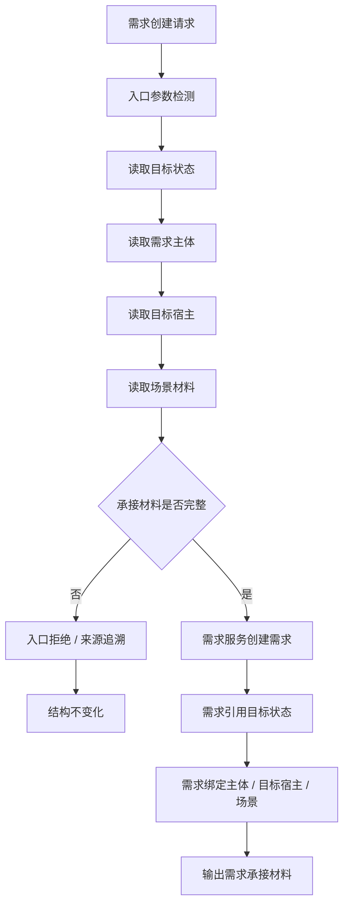

关键边界：

```text
需求目标必须是目标状态。
缺目标状态、主体、目标宿主或场景时拒绝。
不得把 I64、文本方向或显示摘要当作需求目标事实。
```

### 6. 需求树后续结构流程

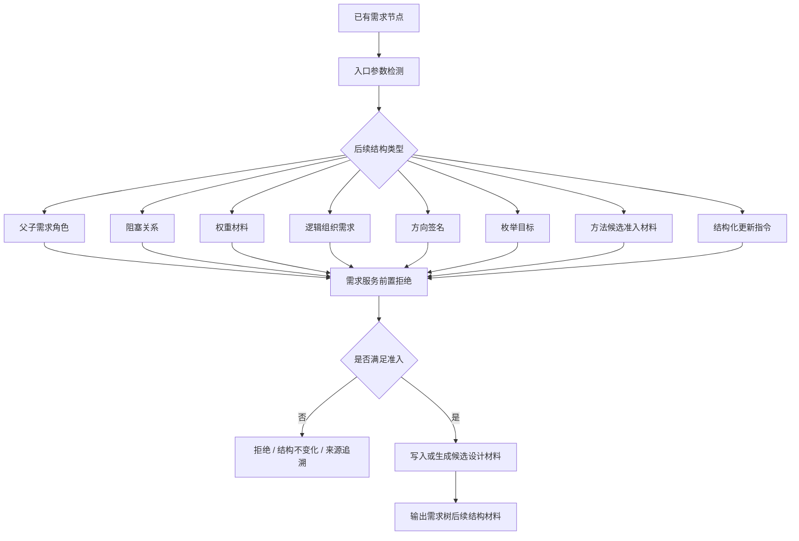

关键边界：

```text
不实现完整需求树算法。
不实现方法候选算法。
方向 bool、文本说明、显示标题、日志或控制台输出不得作为机器事实。
```

### 7. 任务承接需求流程

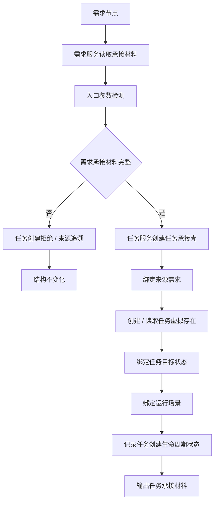

关键边界：

```text
任务必须来源于有效需求。
任务目标状态必须来自需求目标状态。
调用方不得隐式补齐需求事实。
```

### 8. 任务状态机 / 筹办 / 执行桥请求流程

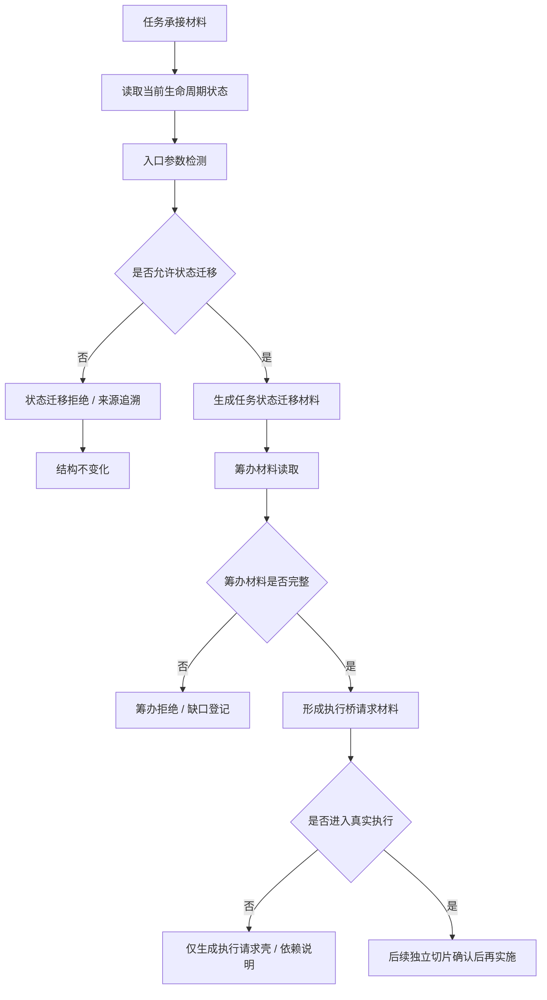

关键边界：

```text
第一轮只迁移请求材料、状态迁移和拒绝路径。
不实现真实线程、派发、std::async、取消、超时或外设等待。
```

### 9. 方法结构流程

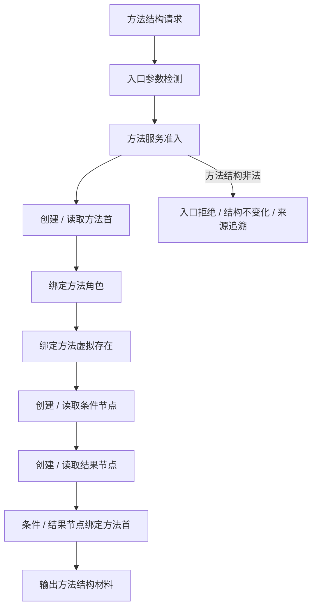

关键边界：

```text
方法结构必须由方法服务组织。
不得用文本、日志、函数名或显示标题冒充方法身份。
```

### 10. 方法候选召回与选择流程

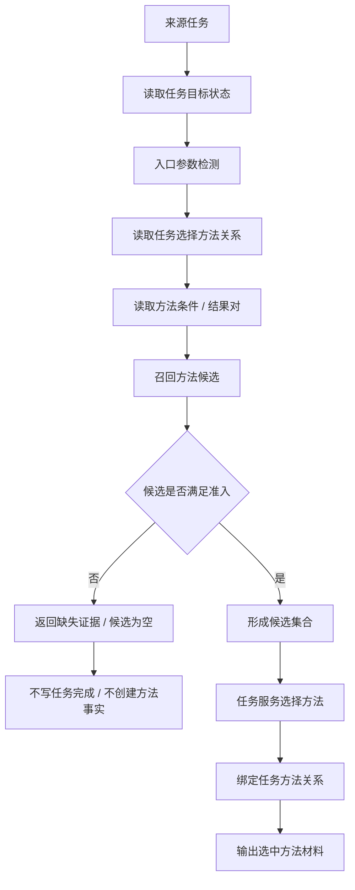

关键边界：

```text
第一轮只做候选读取和准入。
不实现完整方法学习。
不跳过候选集直接凭文本选择方法。
```

### 11. 方法执行 / 动作入口流程

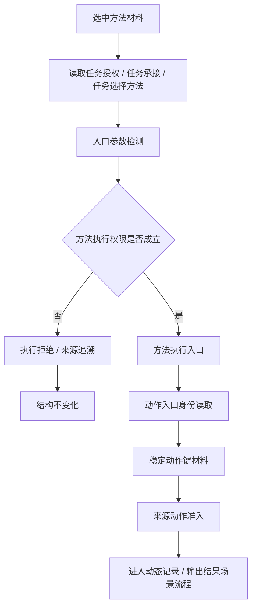

关键边界：

```text
方法执行权限来自任务授权、任务承接和任务选择方法。
线程、按钮、控制台命令、日志标签不得成为动作来源。
不实现真实动作分派。
```

### 12. 动态记录 / 输出结果场景流程

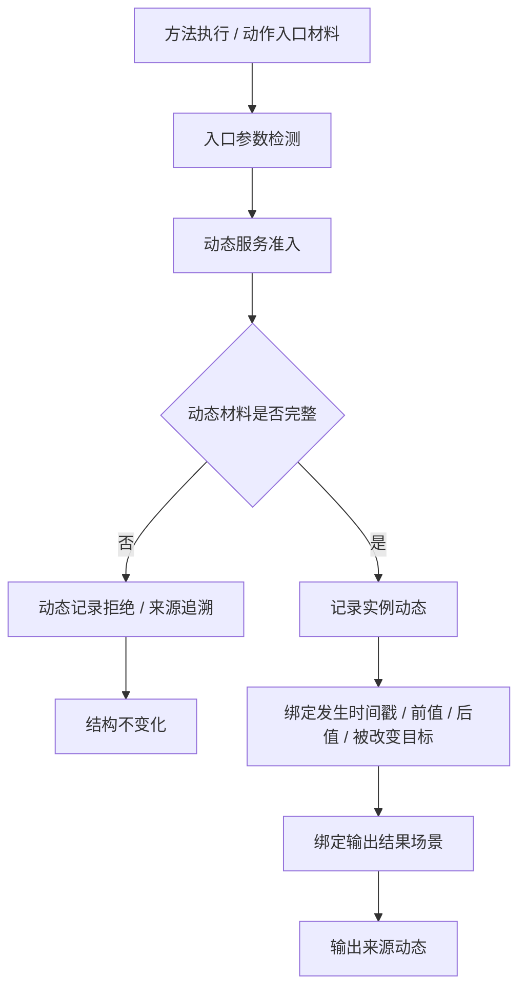

关键边界：

```text
动态必须有发生时间戳、主体、场景和变化材料。
输出结果场景只是结构承载，不由日志或显示标题替代。
```

### 13. 任务回执 / 实际结果状态 / 结果回写流程

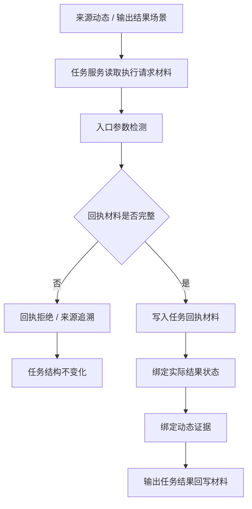

关键边界：

```text
任务回执不等于需求满足。
实际结果状态必须可由状态服务承载。
缺来源任务、实际结果状态或动态证据时拒绝。
```

### 14. 轻量因果引用流程

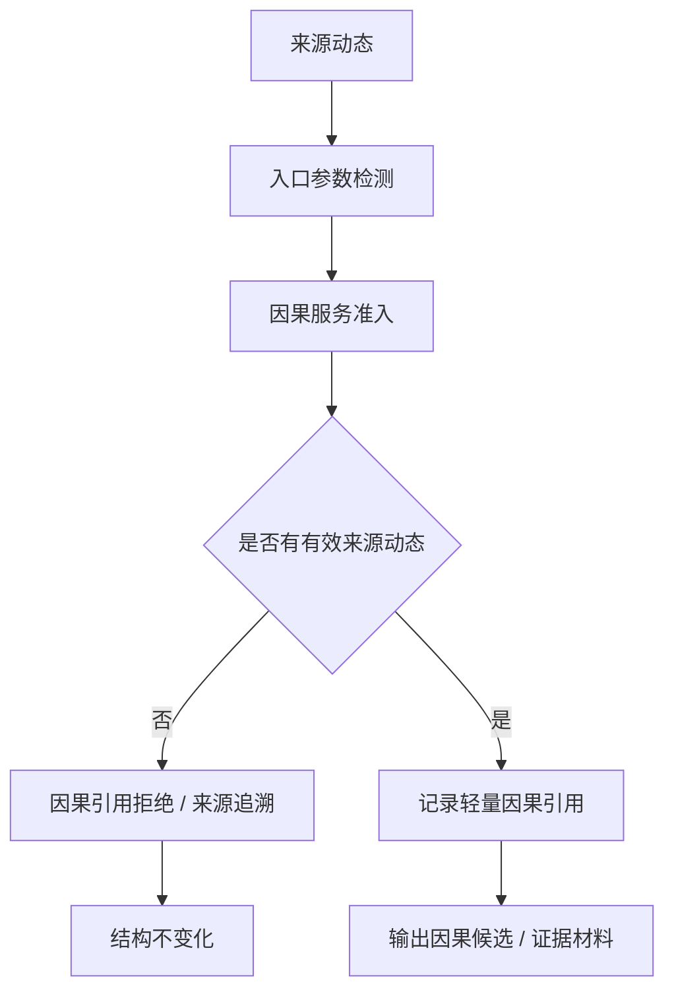

关键边界：

```text
因果引用只用来源动态做准入证据。
不得把单个轻量因果引用解释为稳定因果结论。
轻量因果不提前裁决需求满足。
```

### 15. 需求结算流程

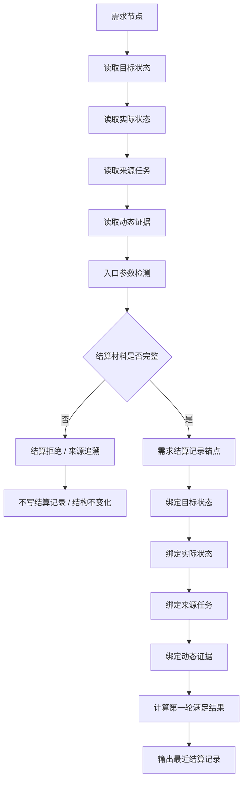

关键边界：

```text
任务完成不等于需求满足。
需求结算必须以目标状态、实际状态、来源任务和动态证据为准。
非权威摘要不能作为结算事实。
```

### 16. 非权威缓存 / 统计流程

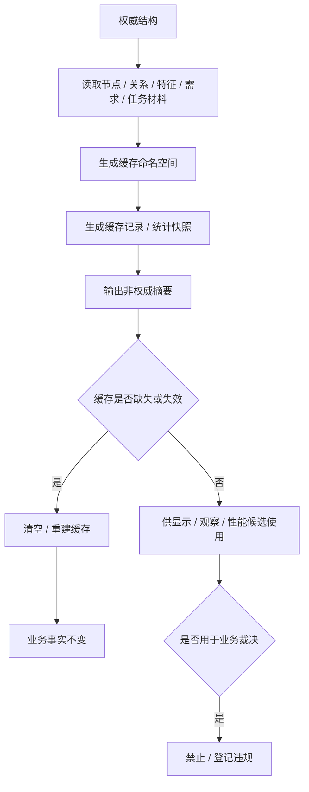

关键边界：

```text
缓存、哈希、命中次数、统计快照只作非权威材料。
不得参与需求满足、任务完成、方法成功等业务裁决。
```

### 17. 事件日志审计材料流程

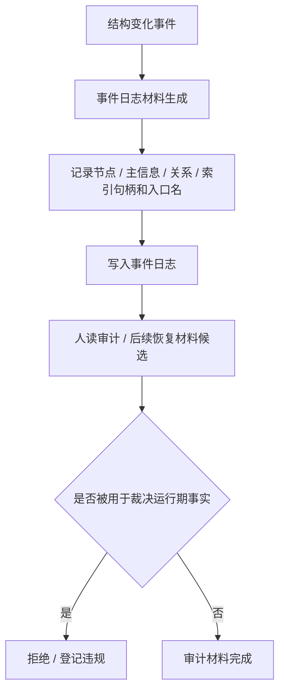

关键边界：

```text
事件日志不作为当前运行期事实源。
日志只做人读审计和恢复材料候选。
```

### 18. 仓库快照 / 恢复拒绝矩阵流程

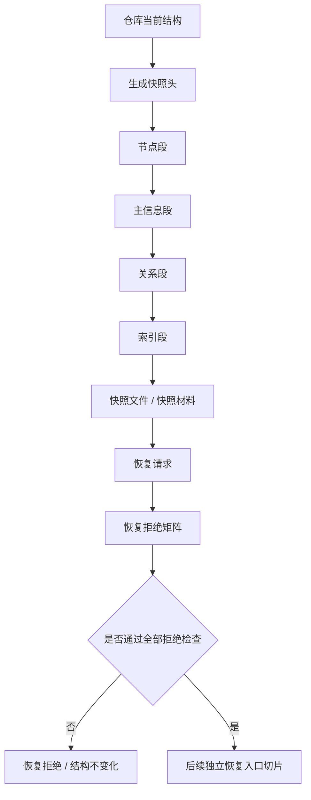

关键边界：

```text
快照只作恢复、审计和人读材料。
恢复入口必须另建 C++ 实施切片。
不得恢复半结构。
```

### 19. 显示层只读流程

```mermaid
flowchart TD
    A["权威结构 / 领域服务只读入口"] --> B["显示层读取材料"]
    B --> C["生成只读 DTO / 摘要 / 结构视图"]
    C --> D["显示标题 / 树视图 / 人读 JSON / HTML"]
    D --> E["人读观察"]
    E --> F{"是否反写机器事实"}
    F -- "是" --> G["禁止 / 登记违规"]
    F -- "否" --> H["只读完成"]
```

关键边界：

```text
显示层只读结构，不写业务事实。
显示标题、JSON、HTML、控制台输出不得承载机器事实。
```

### 20. 控制面板 / 数据库重建候选流程

```mermaid
flowchart TD
    A["旧控制面板 / HTML / WebView2 / SQL / ADO 事实"] --> B["FS-X 排除证据保留"]
    B --> C{"是否有用户明确重建指令"}
    C -- "否" --> D["不生成计划 / 不入队 / 不改代码"]
    C -- "是" --> E["另建控制面板或数据库重建专项候选"]
    E --> F["按只读视图 / 快照 / 审计边界重新设计"]
    F --> G["后续确认后才可生成计划或实施包候选"]
```

关键边界：

```text
控制面板和数据库不参与旧能力迁移。
不能自动从旧控制面板、SQL、ADO 事实生成迁移计划。
后续只按用户明确指令重建。
```

## 5. 第一批建议流程图包草稿

```mermaid
flowchart TD
    A["第一批流程图迁移"] --> P1["P1 需求树后续结构流程图迁移包"]
    P1 --> P2["P2 任务承接需求流程图迁移包"]
    P2 --> P3["P3 任务状态机 / 筹办 / 执行桥请求流程图迁移包"]
    P1 --> B["生成正式流程图文件候选"]
    P2 --> B
    P3 --> B
    B --> C{"发现服务矩阵缺口"}
    C -- "是" --> D["登记矩阵缺口"]
    D --> E["补服务操作函数矩阵"]
    E --> F["复核影响"]
    F --> G["再生成或修订批次级实施包候选"]
    C -- "否" --> H["保留为流程图迁移证据材料"]
```

## 6. 服务矩阵增量补充草稿

```mermaid
flowchart TD
    A["流程图迁移过程"] --> B{"是否发现新服务需求"}
    B -- "否" --> C["流程图保持证据材料"]
    B -- "是" --> D["登记矩阵缺口"]
    D --> E["补服务操作函数矩阵"]
    E --> F["复核影响范围"]
    F --> G{"是否需要代码实施"}
    G -- "否" --> H["生成 / 修订文档治理产物"]
    G -- "是" --> I["生成或修订批次级实施包候选"]
    I --> J["等待确认门禁"]
    J --> K{"用户确认"}
    K -- "否" --> L["继续待确认 / 小修"]
    K -- "是" --> M["登记可执行队列"]
```

禁止路径：

```mermaid
flowchart LR
    A["流程图发现需求"] --> B["直接写 C++"]
    B --> C["禁止"]
```

## 7. 后续正式文件建议

如果后续要把草稿落成正式流程图文件，必须按当前 `0-20` 顺序和 v0.2 模板生成成对 Markdown / HTML 文件。建议优先生成：

```text
流程图/20260708_总入口边界权力链流程图_v0.1.md
流程图/20260708_总入口边界权力链流程图_v0.1.html
流程图/20260708_运行宿主自我锚点主循环降权边界流程图_v0.1.md
流程图/20260708_运行宿主自我锚点主循环降权边界流程图_v0.1.html
流程图/20260708_需求树后续结构流程图_v0.1.md
流程图/20260708_需求树后续结构流程图_v0.1.html
流程图/20260708_任务承接需求流程图_v0.1.md
流程图/20260708_任务承接需求流程图_v0.1.html
流程图/20260708_任务状态机筹办执行桥请求流程图_v0.1.md
流程图/20260708_任务状态机筹办执行桥请求流程图_v0.1.html
```

本文件本身不触发正式流程图落盘、计划生成、入队或代码实施。
