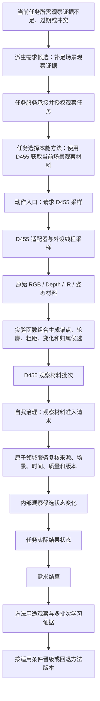

# 基于 D455 的自我外设本能方法、实验函数候选与因果链信息数据

日期：2026-07-13
版本：v0.1
状态：候选信息数据 / 非正式规范 / 非详细设计 / 非计划 / 不入队 / 未改代码 / 未构建 / 未接真实外设

## 1. 文档定位

本文根据 `D:\D455` 当前代码、README、实验记录、评估协议和方法治理材料，先梳理 `海中鱼巣` 的真实观察需求，再筛选可供自我使用的实验函数和本能方法候选：

```text
使用 D455 获取当前场景观察材料
```

本文只完成需求、任务、方法、学习、实验函数、结构映射、输入输出、因果链、质量门控、降级、失败收口和验证口径梳理，不把 D455 代码直接迁入本项目，不生成真实外设接入许可，也不改变当前“D455 / 体素 / 真实外设尚未接入”的项目状态。

若后续把本候选提升为正式项目口径，必须另行形成并核对：

```text
外设本能方法治理规范
-> 外设本能方法目标流程图（Markdown + HTML）
-> 外设本能方法详细设计
-> S0 当前接口复核与分层实施计划
-> 计划索引、Codex 任务队列和项目记忆同步
```

## 2. 本项目对外设 D455 的真实需求

### 2.1 需求主体不是 D455

当前项目正式建立的自我根需求只有安全根需求和服务根需求，它们的主体、目标宿主和所在场景都绑定到自我存在。当前没有“D455 根需求”，也不应因为仓库里有 D455 项目就反向创造一个设备需求。

因此，正确口径是：

```text
自我需要的是可复核的外部观察能力，不是某个固定型号。
D455 是满足视觉 / 空间观察任务的一种外设方法候选，不是需求来源。
```

### 2.2 需求触发条件

只有出现以下差距之一时，才允许形成外设观察需求候选：

```text
当前任务的执行条件依赖外部场景，但没有在时效内的观察材料。
已有观察材料已经过期、来源版本不匹配或相互冲突。
方法执行结果需要外部场景证据复核，但当前材料不足。
安全或服务任务需要判断当前空间可行动性，但缺少可复核空间材料。
连续多批次观察暴露稳定的信息缺口，且已排除设备输入无效。
```

单个空帧、单次轮廓丢失、截图、日志、用户描述或一次评分失败，只是事件或材料，不直接成为已确认需求。

### 2.3 需求、目标状态和保护条件

建议的派生需求候选是：

| 项目 | 候选口径 |
| --- | --- |
| 需求 | `补足当前任务所需的场景观察证据` |
| 主体 | 自我存在 |
| 目标宿主 | 自我存在，或正式设计后确认的任务观察能力宿主 |
| 目标状态 | `当前场景观察材料满足本任务证据合同` |
| 当前状态 | 缺失 / 过期 / 冲突 / 质量不足 / 适用方法缺失 |
| 保护条件 | 不伪造精确距离、不删除仍可信二维轮廓、不把缓存冒充当前测量、不越过任务授权、不直写世界事实 |

这里的目标状态描述“自我是否取得足够的观察证据”，不描述外部对象是否存在。外部对象、外部场景状态和外部动态必须由后续观察准入和领域服务另行裁决。

### 2.4 D455 应提供的能力

本项目对 D455 的最小能力需求可以归并为八项：

1. 提供带设备身份、流身份、帧号、时间戳、校准版本和算法版本的只读原始材料。
2. 近场输出带深度有效率、空间范围和支撑证据的三维观察候选。
3. 远场在精确深度不足时仍保留二维轮廓，并在双目证据足够时提供粗距和不确定度。
4. 对深度孔洞、反光、黑色物体、遮挡和短时丢失执行诚实降级，不以“无深度”推出“不存在”。
5. 建立完整的观察材料账本，区分当前测量、历史复用、未知、无效、遮挡和低置信背景候选。
6. 在静止、慢速相机平移和局部运动条件下保持可接受的时序连续性与资源预算。
7. 所有缓存和异步结果带来源帧、缓存版本、结果年龄和适用条件，过期或错版本不得写回。
8. 向自我治理提交非权威观察材料，由对应领域服务复核；D455 自身不裁决需求满足、任务完成或世界事实。

### 2.5 第一项任务可见本能方法

适用于自我的第一项任务可见本能方法，不应定义为“识别物体”“确认存在”或“刷新世界事实”，而应定义为：

```text
本能方法：使用 D455 获取当前场景观察材料
```

其业务语义是：

> 在任务已经授权并选择本方法后，经待确认的外部实现动作入口完成一次有界、可停止、可降级的 D455 采样和材料处理；把带来源、时间、版本、质量、缓存和缺失证据的观察材料批次提交给自我治理的观察材料准入请求；只记录“自我发起采样并提交材料”这一动作证据，不把观察结果直接写成世界事实。

“本能”只表示预先登记、可被任务快速召回的正式方法，不表示后台常驻线程、单个 C++ 函数、无任务授权执行或永不回退。

## 3. 来源事实与适配裁决

### 3.1 D455 当前可复用事实

| D455 当前事实 | 对本项目的可复用意义 | 不得扩大解释 |
| --- | --- | --- |
| 输入包含 RGB、Depth、左红外；质量分割还会使用右红外，可选姿态和运动材料 | 外设输入必须按来源流、帧号、时间戳和有效性分别记录 | 不能因为流已采集就认为场景事实已成立 |
| 处理主链包含可靠深度锚点、边界、候选、彩图轮廓修正、PCL / 锚点 / cue 支撑、历史跟踪和可选全画面归簇 | 外设方法应输出分阶段证据和来源，不只输出最终标签 | 不直接复制 D455 内部函数或把内部函数自动登记为海中鱼巢正式方法 |
| 当前输出明确只是“外设观察存在材料 / 稳定候选轮廓” | 本能方法输出应止于观察材料批次和提交回执 | 不得宣称已确认存在、扫描事实或跟踪事实 |
| 评估协议区分像素账本完整率、非未知覆盖率、未知率、近场三维置信、远场粗距置信、轮廓质量、时序稳定和性能 | 质量必须由明确特征、值域、阈值和生成动作表达 | 总分、显示效果或单个 `pass` 不能替代逐项证据 |
| 深度证据不足时允许降级为双目粗距轮廓、纯图像轮廓、深度孔洞视觉候选或未知 | 本项目必须保留“有轮廓但无可靠距离”“无足够证据”等诚实状态 | 不得用预测值、缓存值或背景回填伪装当前精确深度 |
| 注意力差异扫描和 ROI 并发使用版本、年龄、对齐和确定性合并门控 | 缓存与异步结果必须带来源版本和最大年龄，过期结果不得写回 | 线程、ROI、缓存命中或队列结果不是动作来源和世界事实 |
| 方法改进按固定回放、独立留出、影子和适用桶治理；当前没有方法进入 P7 实时影子 | 本能基线可以存在，但改进版本必须按条件和证据晋级 | 不能把某个候选或某个场景桶冠军说成全局最佳 |

### 3.2 海中鱼巢当前事实

| 当前事实 | 可承接点 | 当前缺口 |
| --- | --- | --- |
| 方法服务已有方法登记项、条件 / 结果规格、动作入口、稳定动作键、输入 / 输出规格和动作执行桥请求材料 | 可以承载本能方法身份、条件、结果、动作入口和执行前复核 | 真实动作分派和真实外设执行尚未建立 |
| 任务服务已有任务授权、承接、方法选择和执行桥请求材料 | 可以保证本能方法仍由任务授权和任务选择产生执行权限 | 外设材料提交后的专用任务结果合同尚未建立 |
| 动态服务和方法服务已有动作动态证据入口 | 可以记录“自我完成采样并提交材料”的实例动态 | 不得把线程、设备帧或外部运动当作本方法的动作来源 |
| 外设采样材料线程壳已能承载模拟或空外部材料消息 | 可以复用线程角色、消息边界、过期丢弃和停止收口口径 | 当前明确不接 D455、体素、真实驱动和外设控制 |
| 消息和队列只承载请求、材料、回执和调度信号 | 外设观察批次可以先作为非权威材料消息流转 | 尚缺有类型的真实外设来源、观察批次和材料页结构 |

### 3.3 “实验函数”与“正式方法”的判定规则

D455 已经明确：内部算法函数不自动等于正式方法。正式方法至少需要方法编号、适用条件、输入句柄、输出特征迁移、失败回执、降级路径、成本和验证记录。

本文采用四级证据：

| 级别 | 含义 | 可得结论 |
| --- | --- | --- |
| A | 已有需求、任务、方法和晋级记录，且方法按适用桶通过约定验证 | 可以成为海中鱼巢方法候选，但仍需本项目重新设计和真实影子验证 |
| B | 有针对该机制的固定回放、局部探针或消融证据 | 可以进入原子方法候选库，不能直接声明正式可用 |
| C | 只作为通过整链的一环，没有函数级独立证据 | 只能作为复合方法内部步骤候选 |
| D | 仅显示、调度、导出、评分或存在明确反证 | 不得登记为自我本能方法 |

### 3.4 D455 当前唯一具备完整需求—任务—方法记录的候选

D455 当前最完整的实验学习链是慢速相机平移刷新稳定性：

```text
需求 visual-need-slow-pan-refresh-stability
当前差距：candidate_0029 有 6 帧超过 100ms
目标：超过 100ms 的帧数降为 0，p95 不超过 100ms，远场保留不下降
-> 任务 task-slow-pan-refresh-stability-001
主目标：降低慢速平移刷新尖峰
基线：method-candidate-0029
候选：method-candidate-0029 / method-candidate-0030
-> 方法 method-candidate-0030
适用条件：确定性慢速平移回放、粗粒度彩图分割、非实时生产最终版
-> 固定回放结果
p95=63.2137ms，max=91.658ms，超过 100ms 的帧数=0，远场得分=10
-> 需求状态 satisfied
-> 晋级记录 promotion-slow-pan-candidate-0030
状态仍为 replay_only；无独立留出、无在线影子、不是实时生产冠军
```

因此，`candidate_0030` 是当前最强的“实验所得复合方法种子”，但它不是一个单独函数，也不能原样成为自我的生产本能。海中鱼巢可吸收它的函数组合和失败回执合同，并保留 `replay_only` 边界。

### 3.5 可进入本能方法候选库的函数

以下函数有针对性实验或回放证据，可以作为 `使用 D455 获取当前场景观察材料` 内部的原子 / 聚合方法候选；当前均不等于已经登记的海中鱼巢方法。

| 中文候选方法 | D455 函数 | 类型 | 实验证据 | 海中鱼巢结论 |
| --- | --- | --- | --- | --- |
| 扫描外设观察变化 | `scanAttentionDifference`，`D455.cpp:7260-7335` | 原子候选 | candidate_0048 四场景回放保持覆盖率 100%、未知率 0、merge / split / contour-lost / stale 为 0，扫描 p95 约 0.754-0.895ms | B 级；只输出变化率、对齐和位移特征。慢速平移 max 108.834ms，且仅支持有限二维平移，所以只能作条件方法候选 |
| 计算外设观察刷新区域 | `colorContourMotionRefreshRoi`，`D455.cpp:6369-6643` | 原子候选 | 合成局部运动可形成 4 个 ROI、p95 76800px、无过大拒绝；真实遮挡和慢速平移证明简单门槛不能跨场景通用 | B 级；输出刷新区域候选和拒绝原因，不自行丢弃材料，不直接裁决相机或对象运动 |
| 在关注区域提取彩图轮廓材料 | `extractColorContourRegionsInRois`，`D455.cpp:6816-6861` | 原子候选 | candidate_0048 多 ROI 固定线程池回放中无轮廓丢失 / 合并 / 分裂事件 | B 级；输出二维轮廓材料，不确认存在、距离和对象身份。当前置信主要受面积影响，需本项目重做特征合同 |
| 估计双目轮廓粗距 | `estimateStereoContourDistances`，`D455.cpp:7461-7575` | 原子候选 | candidate_0035 局部双目探针 `built=4, failed=0`，遮挡代理 `built=10, failed=0`；但真实独立留出未支持晋级 | B 级；只输出粗距、不确定度和证据，双目失败必须降级为纯图像轮廓，不能删除轮廓 |
| 合并当前轮廓与历史轮廓材料 | `mergeColorContourRoiRefresh`，`D455.cpp:6886-6945` | 原子状态迁移候选 | candidate_0033 保留缓存双目区域并使远场双目失败事件为 0 | B 级；必须补来源帧、缓存版本、年龄和当前复核状态，历史证据不得冒充当前测量 |
| 编排全画面观察材料归属 | `buildFullFrameClusterMap`，`D455.cpp:8237-8300` | 复合聚合候选 | 多组回放通过结构覆盖门槛 | B 级但禁止原样迁入；当前把全部剩余像素写为 0.20 置信的 `FarBackground`，覆盖率 100% 不等于分类正确。本项目未分配项必须保持未知 / 未归属材料 |

### 3.6 只可作为复合方法内部步骤的函数

下列函数参加了通过回放的主链，但当前没有函数级独立消融或探针，只能作为 C 级内部步骤候选：

| D455 函数 | 当前职责 | 本项目裁决 |
| --- | --- | --- |
| `makeReliableDepthAnchorMask` | 原始 / 滤波深度生成稀疏可靠锚点 | 候选内部步骤；先补函数级固定回放或自检再考虑原子方法 |
| `makeBoundaryAnalysis` | 生成深度边、孔洞边、灰度边和切分边界 | 候选内部步骤；斜面碎裂可能发生在此前后，不宜提前固化为本能 |
| `extractObservationMaterials` | 深度切片和连通域生成观察候选 | 候选内部步骤；深度切片存在斜面碎裂风险 |
| `refineObservationMaterialsWithPclClusters` | 给已有候选增加 PCL 支撑 | 只作修正 helper；PCL 不重建 mask / contour，不能承担完整感知方法 |
| `refineDepthMaterialsWithColorContours` | 用彩图轮廓修正深度候选 | 有整链证据但无独立消融；先留在复合方法内部 |
| `selectCandidatesByCue` | 按锚点、边界和纹理证据筛候选 | 误拒绝会直接丢材料；未补独立验证前不提升 |
| `SegmentationTracker::update` | 跨帧匹配、确认和短时保持 | 只能借鉴职责，不能复制实现；未匹配轨迹也把 `sourceFrameId` 改成当前帧，会掩盖历史来源 |

### 3.7 明确不可作为本能方法的函数和设施

| 对象 | 原因 |
| --- | --- |
| `dropStereoFailedColorContourRegions` | 双目失败不等于二维轮廓无效；独立留出中相关候选 near / far 降到 6 / 0，任务失败且未晋级 |
| `ColorContourRoiWorkerPool` | 线程调度设施，不是业务方法；线程不是动作来源 |
| `AsyncColorContourRefreshWorker` | 异步执行机制，不是方法身份；只吸收只读输入、确定性合并和版本 / 年龄拒绝契约 |
| `buildFinalSegmentationFrame` | 输出组装 helper，不形成机器事实 |
| `writeClusterMapExport` / `writeFinalSegmentationExport` / `ProfileCsvWriter` | 分析、显示和验收材料生成器，不参与自我实时裁决 |
| `scripts/score_run.py`、排行榜和晋级脚本 | 实验治理方法，不是自我感知本能方法 |

### 3.8 首轮方法粒度结论

首轮只建议向任务系统暴露一个复合本能方法：

```text
使用 D455 获取当前场景观察材料
```

上表函数只作为该方法内部的原子 / 聚合方法候选。不要把每个 C++ 函数都提升成任务可见方法；否则任务系统会直接依赖设备算法细节，方法条件、失败回执和降级链也会被拆散。

## 4. 方法定义

### 4.1 方法身份

| 项目 | 候选定义 |
| --- | --- |
| 中文方法名 | `使用 D455 获取当前场景观察材料` |
| 方法类型 | 复合本能方法 |
| 方法角色 | 方法首；带条件规格、结果规格和主动动作入口 |
| 方法来源 | 正式化后由系统预登记；不要求有学习来源任务，但每次执行仍必须有当前任务授权和任务选择方法关系 |
| 稳定动作键 | 非零 `U64`；正式设计时统一分配，不使用函数名或字符串作为机器身份 |
| 方法生命周期 | 候选 -> 影子 -> 可用 -> 暂停 / 回退；“本能”不等于永远可用或跳过验证 |
| 方法目标状态 | 当前任务完成一次受控外设采样，并成功提交一批可复核观察材料 |
| 明确不是目标 | 确认外部存在、确认物体身份、直接更新世界场景、自动生成需求、自动完成任务、证明外设能力已迁移 |

### 4.2 “本能”的项目语义

本项目中的“本能方法”只表示该方法在正式化后由系统预先登记、具有稳定方法身份和稳定动作入口，可在条件满足时成为任务候选。它不表示：

```text
程序启动即自动执行
外设线程可以自行产生动作
无需任务授权
无需任务选择方法
可以绕过方法执行桥
可以直接写节点仓库或基础信息结构
可以把材料标签直接升级为世界事实
```

D455 的真实驱动调用仍属于外部实现。正式设计必须确认“本能方法身份”如何引用待确认的外部实现动作入口，不得把真实设备 API 伪装成本能方法内部仓库写入，也不得借 `本能方法入口` 绕过当前 `外部实现入口待确认` 门禁。

### 4.3 方法族、条件化配置和内部函数

针对不同视觉条件，不需要把每个 D455 函数都暴露给任务系统。建议固定三层：

```text
任务可见方法族
“使用 D455 获取当前场景观察材料”

-> 条件化具体方法配置
明亮稳定 / 低照度 / 静止收敛 / 慢速平移 / 局部运动 / 剧烈运动 / 远场 / 深度孔洞 / 遮挡重现

-> 配置内部函数
锚点、边界、候选、轮廓、双目、ROI、缓存合并、跟踪和账本编排
```

任务只提出结果合同，方法召回根据条件规格选择具体配置。任务不得直接指定 `scanAttentionDifference`、`estimateStereoContourDistances` 等实现函数。

### 4.4 视觉条件预判方法

所有具体方法之前先运行一个低成本、非权威的预判方法：

```text
快速判定当前视觉条件
```

| 输入组 | 必须生成的结构化条件特征 |
| --- | --- |
| 来源有效性 | RGB / Depth / 左 IR / 右 IR 是否有效，帧号、时间戳、同步跨度、校准版本 |
| 亮度 | 归一化亮度均值、欠曝比例、过曝比例、RGB 边缘密度、IR 均值和归一化梯度差 |
| 设备光学控制 | RGB / Stereo 自动曝光状态、曝光 / 增益读回、发射器状态、激光功率、控制版本和切换后同步状态 |
| 运动 | 视觉全局位移、相位响应、局部变化率、变化连通域数、陀螺仪角速度、加速度变化 |
| 深度 | 有效深度比例、孔洞比例、饱和值比例、可靠锚点比例、边缘 / 内部区域标记 |
| 稳定性 | 连续有效帧数、中心漂移、面积变化、模式振荡、身份切换、缓存年龄 |
| 任务合同 | 是否要求精确三维、粗距、二维轮廓、身份连续、最大材料年龄和资源预算 |

“明亮”“黑暗”“高速”只是人读分类。机器选择必须依赖上述数值、枚举、句柄和版本。亮暗阈值当前缺少专门 D455 低照度实验，正式设计只能记为待标定阈值，不能在本草案中伪造全局常量。

### 4.5 条件化具体方法矩阵

| 编号 | 条件 | 具体方法 | 核心处理 | 输出与降级 | 当前证据 |
| --- | --- | --- | --- | --- | --- |
| VIS-M0 | 条件未知、首次观察、原模式失效 | `快速判定当前视觉条件` | 短时同步采样，计算来源、亮度、运动、深度、稳定性、缓存和任务合同特征 | 只输出非权威条件材料；条件不可判定时返回“无适用方法” | 待正式设计；不能写世界事实 |
| VIS-M1 | 明亮、静止或低运动、近场深度可靠、任务需要精确空间材料 | `生成明亮稳定近场精细观察材料` | 可靠深度锚点 -> 多源边界 -> 深度候选 -> 彩图轮廓复核 -> cue / 短时跟踪 -> 观察账本 | 精确深度三维候选；深度有效率低于 50% 时禁止精确三维，降为粗距 / 二维 / 未知 | 整链证据；多数函数仍是 C 级内部步骤 |
| VIS-M2 | 明亮、静止或低运动、远场超出精确深度范围、左右 IR 可用 | `生成远场轮廓与双目粗距材料` | 提取彩图 / IR 轮廓 -> `estimateStereoContourDistances` -> 输出不确定度和来源 | 双目粗距轮廓；匹配点少于 12 或置信不足时保留纯图像轮廓，距离未知 | B 级探针证据；不是精确三维 |
| VIS-M3A | RGB 欠曝或颜色证据不可靠，但左 IR 和 Depth 有效 | `生成低照度红外深度观察材料` | 关闭对 RGB 修正的依赖，以左 IR 边界 + 深度锚点 + 深度候选为主；右 IR 可用时只提供粗距候选 | 近场深度、红外轮廓或双目粗距；不得生成颜色识别结论 | 当前代码支持 IR 主边界；缺专门低照度留出验证，属于待验证方法 |
| VIS-M3B | 环境接近全黑、RGB 不可用、主动红外能力存在、运动较低 | `生成黑暗环境主动红外观察材料` | 经外部设备控制动作启用发射器 / 激光，设置受控 Stereo 曝光，等待四流重新同步，再运行 IR + Depth + 双目链 | 主动 IR 深度、粗距或单 IR 二维轮廓；主动 IR 仍无证据时返回无适用方法 | 发射器 / 激光 / 曝光控制只在实验工具；30000 只证明当前设备静态短测保持 30Hz，不是黑暗最优值；缺黑暗专项数据 |
| VIS-M3C | RGB / IR 饱和比例高、有效边缘下降、曝光读回异常 | `抑制过曝并降级到红外深度观察` | 允许自动曝光先收敛 -> 读取曝光 / 增益和饱和比例 -> 受控降低对应曝光 / 增益 -> 等待同步恢复 -> 重新预判；RGB 仍过曝则转 IR + Depth | 重建后的当前材料或红外降级材料；不得沿用切换前缓存 | 自动控制锁定 / 恢复工具已实验，过曝检测、调节步长和完成阈值未实现 |
| VIS-M4 | 静止、内部深度持续有效、任务允许 100-167ms 观察窗 | `生成静止多帧稳定深度材料` | 对非边缘、持续有效内部像素做 3-5 帧有效值收敛；短孔洞历史最多保持 3 帧并标记历史来源 | 稳定深度材料；边缘、跨表面、0 / 65535 或长期孔洞禁止平均，转视觉轮廓 / 粗距 / 未知 | 静态稳定实验支持；尚需接入正式观察材料结构 |
| VIS-M5 | 静止或低运动、缓存与当前条件兼容、远场轮廓需要低频更新 | `生成静止缓存复用观察材料` | 采用 `candidate_0017`：彩图轮廓周期 120 帧，运动 / unknown / far-loss 触发刷新；记录缓存来源和年龄 | 当前深度 + 历史轮廓 / 粗距材料；超任务时效必须刷新或返回不足 | 静态三场景 3 / 3 通过；只证明静态缓存开销和结构，不证明运动安全 |
| VIS-M6 | 相机慢速平移代理条件成立、变化接近全局、局部 ROI 过大 | `生成慢速平移异步刷新观察材料` | 采用 `candidate_0030`：低分辨率运动差异、最小刷新间隔 15 帧、ROI 最大面积 35%、异步全帧轮廓刷新、缓存双目证据转移 | 新鲜深度 + 标明年龄的缓存轮廓 / 粗距；缓存不匹配时全量刷新或未知 | slow-pan 桶 `replay_only`；p95 63.2137ms，max 91.658ms，无 >100ms 帧，不是实时生产冠军 |
| VIS-M7 | 相机对齐可靠、全局位移不超过 5px、相位响应至少 0.05、变化率在 1%-25%、变化集中于局部 | `生成局部变化关注区观察材料` | 采用 `candidate_0048`：`scanAttentionDifference` -> 多 ROI -> 固定 4 工作线程提取轮廓 -> 确定性合并 -> 版本 / 15 帧年龄拒绝 | 局部当前轮廓 + 未刷新区历史材料；必须逐项标明当前 / 历史来源 | 四场景机制已验证，但仍是 attention / ROI 探针，不是全局方法赢家 |
| VIS-M8 | 相机高速运动、剧烈晃动、相位对齐失效、位移 >5px、响应 <0.05 或变化率 >25% | `生成剧烈运动及时全量观察材料` | 立即废止不适用缓存和异步结果；同步全量刷新；采用实时减载，缩短时间窗，关闭重型 PCL 和非必要高成本步骤 | 新鲜粗粒度轮廓 / 深度材料或未知；不得用历史轮廓维持精确输出 | 尚无高速运动独立实验，只是安全方法草案 |
| VIS-M9 | 黑暗且运动明显 | `生成低照度运动及时观察材料` | 运动及时性优先；使用 IR + Depth、短时间窗、全量刷新，不做长曝光多帧收敛，不依赖 RGB 轮廓 | 粗粒度深度 / IR 轮廓 / 未知；任务要求精确颜色或精确三维时可能无适用方法 | 待验证；不能引用静态锁定实验宣称通过 |
| VIS-M10 | 深度孔洞、黑色、反光或角度导致深度支撑不足，但 RGB / IR 轮廓可信 | `保留深度缺失目标的视觉轮廓材料` | 保留视觉轮廓；双目可用则粗距；否则输出二维轮廓或深度孔洞候选语义 | 不得由“无深度”推出“不存在”；距离保持未知 | 有明确降级依据和 depth-hole 静态回放；D455 当前虽有 `DepthHoleCandidate` 枚举，但尚未形成对应生产输出，不能宣称已实现 |
| VIS-M11 | 遮挡后重现、身份或来源不稳定 | `重新获取并候选重关联遮挡目标` | 当前帧重新提取材料；历史轨迹只提供相似性和短时连续材料；保留真实来源帧和 miss 年龄 | 输出新候选和关联证据，不确认是同一存在 | `candidate_0030` 仍领先；现有 tracker 会改写历史来源帧，不能原样迁入 |
| VIS-M12 | 全局亮度突然变化，但运动原因不确定 | `重建视觉条件和观察参考基线` | 区分亮度工作点变化、相机运动和局部运动；重新执行条件预判和全量观察 | 新参考材料；旧缓存只作历史材料 | 待设计；不得把曝光变化当世界运动 |
| VIS-M13 | 来源、模态或多批次观察互相冲突 | `使用替代视觉方法重新观察冲突材料` | 选择不同输入组合或不同观察位置重复采样，对比独立材料批次 | 冲突消解材料或继续保持观察不足 | 待设计；冲突不得由总分或句柄顺序自动解决 |

### 4.6 组合条件的选择优先级

方法选择不能按固定“模式优先级编号”硬选，必须遵守：

```text
任务所需结果合同
-> 来源、同步、校准和时效硬门禁
-> 运动及时性与缓存安全
-> 亮度和可用输入流
-> 深度 / 轮廓 / 双目证据等级
-> 已晋级方法的适用条件
-> 资源成本
-> 稳定句柄只作最后确定性排列
```

典型冲突采用以下收口：

| 组合条件 | 裁决 |
| --- | --- |
| 明亮 + 高速 | 选择 VIS-M8，及时性优先，不进入静态高精度模式 |
| 低照度 + 静止 | 选择 VIS-M3A；任务允许延迟且内部像素稳定时可组合 VIS-M4 |
| 全黑 + 静止 | 主动红外控制已通过专项门禁时选择 VIS-M3B；否则返回无适用方法 |
| 过曝 + 低运动 | 选择 VIS-M3C，设备控制改变后必须重新同步和重新预判 |
| 黑暗 + 高速 | 选择 VIS-M9；精确颜色或高精度三维合同无法满足时返回无适用方法 |
| 相机平移 + 局部目标运动 | 先处理全局运动；只有对齐可靠后才允许 VIS-M7 局部 ROI |
| 深度失效 + 轮廓可信 | 选择 VIS-M10，保留二维轮廓，距离未知 |
| 资源不足 + 精确结果合同 | 不得用低成本二维结果冒充完成，返回资源预算不足或无适用方法 |
| 语义并列的多个方法 | 保持并列或请求补充条件，不得用节点句柄顺序自动授权其中一个 |

### 4.7 模式切换滞回

视觉条件接近阈值时，禁止每帧反复切换方法。切换规则应是：

```text
同步失效 / 校准失效 / 剧烈运动 / 缓存过期
-> 立即退出当前方法

普通进入
-> 条件连续满足若干窗口后进入

普通退出
-> 条件连续失配若干窗口
-> 且达到最小驻留时间

任务结果合同改变
-> 立即重新召回，不继承上一任务的驻留状态
```

方法结构至少记录当前配置、候选配置、连续满足窗口数、连续失配窗口数、驻留截止时间、最近切换时间、切换原因和模式振荡次数。具体窗口数、亮暗阈值和高速阈值必须由固定回放、独立留出和真实影子确定。

### 4.8 无适用方法

以下情况允许逻辑内返回“无适用方法”：

```text
来源不可用或同步 / 校准失败
条件不可判定
任务结果合同超出当前 D455 能力
资源预算不足
所有候选仍是探针、已暂停或未通过当前条件桶
多个候选语义并列且缺少裁决证据
```

返回内容应包括原因分类、可用的未知 / 降级材料和未满足的任务合同。原需求保持未满足；同类缺口经时间窗聚合后，才形成“补足视觉方法能力”的新需求候选。

## 5. 业务概念到项目结构映射

| 业务概念 | 项目承载结构 | 值类型 / 身份 | 写入方 | 读取方 | 当前判定 |
| --- | --- | --- | --- | --- | --- |
| 本能方法身份 | 方法节点、方法登记项、方法虚拟存在 | 稳定节点句柄、生命周期状态 | 方法服务 | 任务服务、方法服务 | 当前已有承载基础 |
| 方法适用条件 | 方法条件节点、条件规格场景、条件特征值 | 节点句柄、I64 / Q10000 / VecI64 | 方法服务经基础信息服务 | 方法召回和方法执行桥 | 当前已有承载基础 |
| 方法预期结果 | 方法结果节点、结果规格场景、目标状态 | 状态节点和状态值 | 方法服务经状态服务 | 任务服务、方法服务 | 当前已有承载基础 |
| 主动动作入口 | 动作入口角色、主动可调用状态、稳定动作键、输入 / 输出规格 | 动作入口句柄、非零 U64 | 方法服务 | 方法执行桥 | 当前已有承载基础 |
| 执行权限 | 任务授权、任务承接、任务选择方法关系 | 任务 / 方法稳定句柄和关系句柄 | 任务服务 | 方法执行桥 | 当前已有承载基础 |
| 外设来源身份 | 外设来源材料或外设能力身份候选 | 稳定来源编号、设备类别、能力版本 | 后续外设材料准入入口 | 方法执行桥、材料消费者 | 缺结构，待正式设计 |
| 采样请求 | 外部材料请求消息 | 任务、方法、动作入口、批次、幂等编号、时间预算 | 方法执行桥 | 外设采样材料线程 / 适配器 | 当前只有通用消息基础，缺专用合同 |
| 观察材料批次 | 有类型的外设观察材料批次候选 | 来源编号、批次号、帧号、时间戳、版本、只读载荷句柄 | 外设适配器经材料准入入口 | 后续观察裁决入口 | 缺结构，待正式设计 |
| 像素 / 区域证据账本 | 观察材料页候选 | VecI64、VecU 句柄、Q10000、模式枚举 | 外设材料处理入口 | 后续观察裁决入口 | 缺结构，不能用日志或图片替代 |
| 缓存和异步候选 | 非权威缓存材料 | 来源批次、缓存版本、年龄、对齐证据 | 外设材料处理入口 | 本方法内部和后续裁决入口 | 可沿用非权威缓存规则，缺专用结构 |
| 方法动作动态 | 实例动态、来源动作关系、来源方法关系 | 动态句柄、场景、主体、前后值、发生时间戳 | 方法服务经动态服务 | 任务 / 因果后续入口 | 当前已有承载基础 |
| 材料提交回执 | 任务结果候选或专用材料提交回执 | 任务、方法、动作、批次、提交结果、时间戳 | 方法执行路径 | 任务服务 | 缺专用结果合同 |
| 世界观察事实 | 存在、场景、特征、状态、动态和因果结构 | 稳定句柄和结构关系 | 后续观察裁决领域服务 | 世界服务和其他领域服务 | 不属于本方法输出 |

## 6. 输入规格候选

方法执行前必须具备以下输入：

| 输入 | 必要内容 | 缺失处理 |
| --- | --- | --- |
| 任务执行语境 | 有效任务、任务授权、任务承接、当前任务方法选择、任务顺序 / 版本 | 逻辑内拒绝，不触发采样 |
| 方法语境 | 有效且活跃的方法首、主动动作入口、稳定动作键、输入 / 输出规格 | 逻辑内拒绝，不触发采样 |
| 自我与场景 | 有效存在主体、当前场景、发生时间戳 | 逻辑内拒绝，不记录动作动态 |
| 外设来源 | 稳定来源编号、设备类别、设备能力版本、驱动 / 适配器版本 | 逻辑内拒绝，返回缺来源材料 |
| 采样合同 | 所需输入流、帧数量或时间窗、最大等待时间、同步要求、资源预算 | 逻辑内拒绝，返回合同不完整 |
| 校准材料 | 内参、外参、深度尺度、流对齐方式、校准版本 | 需要空间结果却缺校准时降级或拒绝空间输出 |
| 幂等与批次 | 非零幂等材料编号、非零批次号、最大材料年龄 | 缺失时不得进入异步提交路径 |
| 算法合同 | 算法版本、适用条件桶、质量阈值版本、降级规则版本 | 缺版本时不得把结果登记为可复核材料批次 |

D455 适配器可以把 RGB、Depth、左右红外、加速度和角速度映射到上述输入流，但这些流不是本项目固定的唯一外设类型。其他相机、麦克风、触觉、温度或距离外设应复用同一方法合同，并由各自适配器提供类型化材料。

## 7. 输出规格候选

### 7.1 主输出

主输出为一份只读的 `外设观察材料批次候选`，至少包含：

```text
来源身份
批次号
幂等材料编号
首末发生时间戳
各输入流帧号与时间戳
校准版本
算法版本
质量阈值版本
输入流有效性
原始载荷句柄或受控只读快照
像素 / 区域证据账本
观察候选集合
每个候选的证据来源、模式、置信和降级原因
缓存来源批次、缓存版本、缓存年龄和对齐证据
处理耗时和资源预算结果
缺失材料集合
材料提交状态
```

这份批次只是后续裁决材料，不是节点仓库中的世界事实，不得因为批次完整就自动创建存在、确认消失、写长期特征、写需求满足或写稳定因果结论。

### 7.2 动作输出

方法动作输出只允许表达：

```text
本次外设采样请求已拒绝
本次外设采样未取得材料
本次取得材料但仅能形成未知 / 降级候选
本次已提交可复核材料批次
```

其中“已提交可复核材料批次”描述的是自我动作结果，不描述外部对象是否真实存在。

## 8. 核心处理流程

```text
1. 任务服务确认任务授权、承接和当前选择方法
2. 方法服务读取方法动作执行桥请求材料
3. 复核方法首、主动动作入口、稳定动作键和输入 / 输出规格
4. 形成有界采样请求，不在仓库持锁期间等待外设
5. 外设适配器读取原始流并生成带来源、帧号、时间戳和批次号的材料
6. 材料准入入口复核来源、同步、校准、版本、年龄和载荷完整性
7. 生成低成本证据：输入有效性、深度可靠性、边界、运动上下文、缓存年龄
8. 生成观察候选：深度候选、轮廓候选、双目候选、孔洞候选、背景候选或未知
9. 依据明确特征、值域和阈值做质量门控与诚实降级
10. 依据缓存版本、最大年龄和对齐证据决定复用、局部刷新或全量刷新
11. 形成完整材料批次和材料提交回执
12. 方法服务经动态服务记录“采样并提交材料”动作动态
13. 任务结果路径复核任务、方法、动作、批次和发生时间戳
14. 后续独立观察裁决入口决定是否把材料转换为存在、场景、特征、状态、动态或需求候选
```

步骤 12 记录的来源动作是已登记动作入口，不是外设线程、设备帧、ROI 工作线程或队列消息。

## 9. D455 经验转换后的特征和值域

### 9.1 输入与来源特征

| 特征 | 候选值域 | 用途 |
| --- | --- | --- |
| 输入流有效状态 | 有效 / 缺失 / 不同步 / 过期 / 版本不匹配 | 决定是否准入或降级 |
| 校准状态 | 完整 / 缺内参 / 缺外参 / 深度尺度未知 / 版本不匹配 | 决定空间输出等级 |
| 运动状态 | 静止 / 相机平移 / 局部运动 / 剧烈晃动 / 未知 | 决定缓存和刷新方式 |
| 缓存状态 | 未使用 / 可复用 / 需局部刷新 / 需全量刷新 / 过期 / 对齐失败 | 防止历史材料冒充当前材料 |

### 9.2 观察候选模式

| 项目中文模式 | D455 外部映射 | 允许表达 | 不允许表达 |
| --- | --- | --- | --- |
| 精确深度三维候选 | `PreciseDepth3D` | 当前材料具有较高深度有效率和空间证据 | 已确认世界存在或永久精确位置 |
| 双目粗距轮廓候选 | `ApproxStereoContour` | 当前轮廓有可用双目粗距证据 | 毫米级精确距离 |
| 纯图像轮廓候选 | `ImageOnlyContour` | 当前只能保留二维轮廓 | 距离已知 |
| 背景平面候选 | `BackgroundPlane` | 当前材料支持平面背景候选 | 世界背景事实已确认 |
| 远背景剩余材料 | `FarBackground` | D455 对未归属剩余像素的低置信材料分类 | 无证据像素必然是背景；本项目后续裁决时必须保留低置信来源 |
| 深度孔洞视觉候选 | `DepthHoleCandidate` | 深度缺失但仍有视觉轮廓证据 | 轮廓不存在或距离已知 |
| 未裁决材料 | `Unknown` | 账本已有位置，但证据不足 | 系统失败；也不得强行填成背景以提高覆盖率 |

### 9.3 质量特征

| 质量组 | 核心特征 | 值类型建议 |
| --- | --- | --- |
| 账本完整性 | 总像素数、已记账像素数、未知像素数、无效像素数、遮挡像素数 | I64、Q10000 |
| 近场深度 | 深度有效率、离群率、深度范围、锚点支撑率、PCL 支撑率、三维置信 | I64、Q10000、VecI64 |
| 远场粗距 | 匹配点数、视差稳定、极线一致、距离置信、降级正确性 | I64、Q10000 |
| 轮廓质量 | 边缘对齐、闭合度、泄漏、欠分割、过分割、时序 IoU | Q10000 |
| 时序稳定 | 稳定帧数、丢失数、恢复数、身份切换、中心抖动、面积抖动、模式振荡 | I64、Q10000 |
| 缓存安全 | 来源批次、缓存版本、缓存年龄、对齐置信、异步结果年龄 | U64、I64、Q10000 |
| 性能 | 总帧耗时、分阶段耗时、超预算次数、队列等待、最长工作项耗时 | I64 |

所有机器裁决必须使用结构化枚举、数值、句柄和版本，不得用日志文本、显示颜色、窗口内容或字符串标签承载。

## 10. 质量门控

### 10.1 项目级强制门控

以下规则不依赖具体外设型号：

1. 来源身份、批次号、发生时间戳、算法版本和阈值版本必须完整。
2. 输入流有效性必须逐流表达，不能用“整帧成功”掩盖某一流缺失。
3. 像素或区域账本必须区分“已归候选”“背景候选”“未知”“无效”“遮挡”；账本完整不等于语义已确认。
4. 任何缓存值必须带来源批次、版本和年龄；历史深度不得冒充当前精确深度。
5. 每个观察候选必须能追溯到输入流、生成阶段、算法版本和质量证据。
6. 深度、双目或轮廓证据不足时必须降级，不能为了覆盖率制造更强结论。
7. 质量总分只用于排序或实验治理，不能覆盖单项硬门禁。
8. 线程、队列、日志、截图、分析包和显示结果不得直接生成世界事实。

### 10.2 D455 v0.1 参考门槛

以下数值来自 D455 当前评估协议，只能作为 D455 方法版本的初始验证合同，不是所有外设的全局常量：

| 特征 | D455 当前参考 | 海中鱼巢采用方式 |
| --- | --- | --- |
| 非未知聚类覆盖率中位数 | `< 95%` 为硬失败 | 仅作为 D455 适配方法的回放门槛；不把未知强填为背景 |
| 未知率中位数 | `> 15%` 为硬失败 | 仅作为 D455 适配方法的质量门槛；失败仍保留未知材料 |
| 实时总帧耗时 p95 | `> 100ms` 为硬失败 | 按任务资源预算配置，不能证明其他设备也适用 100ms |
| 近场深度有效率 | `>=90%` 优秀，`75%-90%` 可用，`50%-75%` 观察，`<50%` 不得当高精度三维 | 作为 D455 深度模式降级参考 |
| 双目匹配点 | `>=30` 良好，`12-30` 可用，`<12` 距离不可靠 | 作为 D455 双目粗距模式降级参考 |

正式设计时，这些阈值必须落到方法条件、算法版本或验证合同，不得散落在日志、README 或控制台参数说明中作为机器事实。

## 11. 诚实降级顺序

```text
深度证据可靠且空间门控通过
-> 精确深度三维候选

深度不足，但双目粗距和轮廓证据通过
-> 双目粗距轮廓候选

双目失败，但彩图 / 红外轮廓仍可信
-> 纯图像轮廓候选

深度孔洞且仍有视觉轮廓证据
-> 深度孔洞视觉候选

只剩低置信远背景剩余分类
-> 保留 D455 来源和低置信标记，不得升级为背景事实

全部证据不足
-> 未裁决材料
```

缓存复用只能保留经过门禁的历史候选，并必须显式标记历史来源。对齐失败、版本不符、年龄超限、运动状态不适用或异步结果过期时，应全量刷新或返回未知；不得把旧值静默写成当前值。

## 12. 非成功返回二分

### 12.1 逻辑内返回

以下情况属于设计允许的拒绝或材料返回，要求结构不变化，不得写世界事实：

```text
任务无授权、未承接或未选择本方法
方法未激活、动作入口无效、稳定动作键不匹配
输入 / 输出规格缺失
外设不可用、所需流缺失、等待超时
来源、批次、校准、算法或阈值版本材料不完整
材料过期、队列满载、停止流程已开始
采样成功但候选为空
候选全部为未知或只能形成降级材料
缓存不满足版本、年龄或对齐门禁
后续观察裁决拒绝把材料升级为事实
```

这些返回可以产生非权威拒绝回执、等待补证材料或任务结果候选，但不得由方法内部直接写任务失败事实或需求满足事实。

### 12.2 追根因解决

以下情况发生在入口前置条件已经满足、内部已经进入正式承载后，必须停止依赖路径并追根因：

```text
稳定动作键索引命中错误动作入口
已声明完整批次，但输入流帧号、时间戳或来源互相矛盾
像素账本合计与总像素数不一致，或同一像素出现互斥的最终账本状态
候选声明精确三维，但对应深度证据或校准版本不可读
缓存声明当前来源，但批次、版本或年龄读回不一致
材料提交成功后无法按批次和幂等编号读回同一提交材料
已确认完成采样提交动作，但动作动态、来源动作关系或来源方法关系写入不及预期
任务结果提交后任务、方法、动作、批次或发生时间戳不一致
任一正式写入口留下可读半结构或悬空关系
```

不得通过日志、显示、事后扫描或下一帧覆盖来修复这些内部矛盾。

## 13. 线程、服务和写入边界

| 角色 | 允许职责 | 禁止职责 |
| --- | --- | --- |
| 任务服务 | 提供任务授权、承接、当前方法选择和结果复核 | 不直接操作设备，不把材料内容裁决为世界事实 |
| 方法服务 | 管理本能方法、动作入口、输入输出规格、执行桥请求和动作动态证据 | 不直接访问特征值服务，不把线程当动作来源 |
| 外设采样材料线程 | 等待设备、采样、封装来源和批次、发送非权威材料 | 不裸写仓库，不写存在 / 状态 / 动态 / 需求 / 任务 / 方法事实 |
| 外设适配器候选 | 封装具体设备 API 和原始流 | 不决定需求满足、任务完成或世界存在 |
| 外设材料准入入口候选 | 复核来源、时间、版本、同步、校准、年龄和载荷 | 不直接确认世界事实 |
| 后续观察裁决领域服务 | 依据正式设计把已准入材料转换为候选或结构写入 | 不绕过存在、场景、特征、状态、动态和因果等原子服务 |
| 缓存 / 统计 / 分析 | 保存非权威候选、性能和实验证据 | 不反向裁决当前事实，不影响任务授权 |

所有外设等待、驱动调用、文件 I/O 和用户回调必须在仓库锁、领域服务结构锁之外执行。工作线程只返回材料和回执；正式写入必须重新进入领域服务入口并重新复核当前句柄、版本、任务状态和方法关系。

## 14. 方法版本、晋级和回退

本能方法应有一个保守基线版本，但不设置无条件全局 `best`。方法版本至少按以下条件桶登记：

```text
外设类型
输入流组合
场景类型
运动状态
距离 / 证据状态
资源预算
校准版本范围
算法版本
```

D455 当前离线治理已经证明：固定回放单项通过不代表候选可以全局晋级；候选还需通过独立留出、保护条件和必要的在线影子验证。海中鱼巢后续若吸收这套机制，必须保持：

```text
回放只证明对历史材料有效
影子输出不替换当前生产输出
候选按适用桶晋级
硬门槛失败不得晋级
所有候选失败时保留未满足需求
回退不删除失败证据
方法改进不自动改写生产 C++
```

### 14.1 自我使用的需求—任务—方法—学习链

```text
当前任务所需观察证据不足 / 过期 / 冲突
-> 时间窗聚合、输入有效性排除和需求去重
-> 需求：补足当前任务所需的场景观察证据
-> 目标状态：当前场景观察材料满足本任务证据合同
-> 任务服务创建并承接“补足当前场景 D455 观察材料”任务
-> 建立任务授权、任务承接和任务选择方法关系
-> 选择本能方法“使用 D455 获取当前场景观察材料”
-> 方法服务复核适用条件、输入 / 输出规格、稳定动作键和外部实现动作入口
-> D455 适配器采样并执行已选择的内部函数组合
-> 输出 D455 观察材料批次和失败 / 降级回执
-> 自我治理接收“观察材料准入请求”
-> 对应原子领域服务复核并形成内部观察候选或拒绝材料
-> 任务服务写实际结果状态
-> 需求服务对照目标状态结算
-> 记录方法用途观察、实际成本、失败回执和适用条件
-> 多批次同条件证据聚合
-> 形成方法适用性候选、参数版本候选或方法能力缺口需求
-> 固定回放 -> 独立留出 -> 在线影子
-> 按适用桶晋级 / 暂停 / 回退
-> 下次相同任务条件下由方法召回选择已晋级版本
```

学习不会直接改变当前世界事实，也不会自动改写生产 C++。定向学习首轮只能产生方法设计、参数合同、验证任务或受控代码候选；正式晋级仍需计划、实现和分级验证。

### 14.2 自我使用的分层因果链



这条链包含六类不同因果，不能混写：

| 因果层 | 来源 | 结果 | 可声明边界 |
| --- | --- | --- | --- |
| 控制授权因果 | 需求、任务授权、任务选择方法 | 允许形成一次方法执行请求 | 不是新的授权 bool，也不是设备自动行动 |
| 自我动作因果 | 已登记方法和动作入口 | 发起 D455 采样、提交材料 | 可记录自我动作动态；线程不是动作来源 |
| 物理采样因果 | 外部场景、传感器响应、校准和采样配置共同作用 | 原始帧材料 | 不能把结果只归因于方法，也不能从单帧推出外部稳定因果 |
| 计算因果 | 原始材料、算法函数组合、参数和版本 | 观察候选与质量特征 | 可追溯计算来源，不等于世界事实 |
| 内部认知因果 | 已准入材料和领域服务裁决 | 内部观察候选状态变化 | 描述自我的内部认知变化，不描述方法改变外部世界 |
| 学习因果 | 多批次任务结果、需求结算、成本和失败回执 | 方法适用性 / 晋级 / 回退候选 | 单次得分不能形成全局方法能力；发生概率和结果效用不能合成一个事实 |

因果引用的最窄写法应是：

```text
本能方法动作入口
-> 动作动态：自我发起 D455 采样请求
-> D455 材料批次（外部材料，不是动态本体）
-> 观察准入领域服务动作
-> 状态动态：自我对当前场景的观察候选发生变化
-> 任务实际结果状态
-> 需求结算
```

“外部对象移动导致传感器变化”只能先作为外部因果假设和证据链，不能用单次轻量因果引用写成稳定因果结论。

### 14.3 当前项目中的真实断点

当前项目已经有外部材料消息、观察材料准入请求、自我治理有界队列和冻结批次等前半段结构，但仍有以下断点：

1. 没有生产代码把 `运行消息::外部材料` 转成 `自我治理消息::观察材料准入请求`。
2. 当前自我治理领域路由只处理固定安全根需求，尚不处理观察材料准入请求。
3. 默认入口当前没有装配带治理邮箱和处理器的自我线程运行链。
4. 没有 D455 强类型材料、真实适配器、外部实现入口、观察批次领域承载和真实结果回执。
5. 当前方法学习接线仍未完成，不能宣称自我已经会自动从 D455 实验学习方法。

所以当前只能完成设计梳理，不能声明 D455 已经“给自我使用”。

## 15. 调用路径候选

```text
自我安全 / 服务任务出现观察证据缺口
-> 派生需求“补足当前任务所需的场景观察证据”
-> 目标状态“当前场景观察材料满足本任务证据合同”
-> 任务服务创建并承接任务
-> 任务服务选择“使用 D455 获取当前场景观察材料”
-> 任务工作路径读取任务执行桥请求
-> 方法服务读取动作执行桥请求材料
-> 待确认的外部实现动作入口调用 D455 适配器
-> 外设适配器在无仓库锁语境下采样
-> 外设采样材料线程提交外部材料消息
-> 方法服务记录“采样并提交材料”的自我动作动态
-> 外部材料适配入口转换为自我治理“观察材料准入请求”
-> 自我治理邮箱冻结批次并逐条路由
-> 对应存在 / 场景 / 特征 / 状态 / 动态原子服务复核
-> 任务结果路径复核材料提交回执
-> 需求服务按目标状态结算
-> 方法用途观察进入低频学习证据
```

该路径把“取得材料”和“确认事实”拆成两个不同的任务 / 方法责任，防止外设本能方法越权成为世界事实裁决器。

## 16. 验证方式候选

### 16.1 六类完成证据

| 证据项 | 本方法未来必须证明 |
| --- | --- |
| 输入入口 | 任务授权、方法选择、动作入口、外设来源、采样合同和版本材料可复核 |
| 核心处理 | 采样、准入、证据提取、候选生成、质量门控、降级和缓存门控逐阶段可追溯 |
| 结构承载 | 方法、动作、任务、材料批次、材料页、动作动态和提交回执均有明确承载，不靠日志文本 |
| 输出变化 | 只形成材料批次、提交回执和自我动作动态；世界事实保持不变，直到后续领域裁决 |
| 调用路径 | 任务选择 -> 方法执行桥 -> 外设适配 -> 材料准入 -> 动作动态 -> 任务结果复核完整可读 |
| 验证方式 | 入口拒绝、自检、固定回放、独立留出、在线影子、真实样本、停止收口和禁止能力扫描分级通过 |

### 16.2 最小验收矩阵

| 编号 | 验收项 | 通过条件 |
| --- | --- | --- |
| PERIPH-INST-A01 | 任务授权 | 未授权、未承接、未选择方法时不触发设备采样 |
| PERIPH-INST-A02 | 本能动作注册 | 方法首、主动动作入口、稳定动作键和输入 / 输出规格可读且一致 |
| PERIPH-INST-A03 | 来源和批次 | 来源、帧号、时间戳、批次、校准和算法版本完整 |
| PERIPH-INST-A04 | 账本完整与诚实未知 | 每个材料位置有明确账本状态；未知不被强填为已确认背景 |
| PERIPH-INST-A05 | 质量门控 | 近场、远场、轮廓、时序、缓存和性能分别有可复查特征与阈值 |
| PERIPH-INST-A06 | 降级 | 深度或双目失败时保留可信轮廓或未知，不伪造精确距离 |
| PERIPH-INST-A07 | 缓存安全 | 过期、错版本、对齐失败和过龄异步结果不得写回 |
| PERIPH-INST-A08 | 线程非动作来源 | 动作来源是已登记动作入口，不是外设线程或帧消息 |
| PERIPH-INST-A09 | 材料非事实 | 材料批次、日志、分析包、截图和显示不能直接创建世界事实 |
| PERIPH-INST-A10 | 动作动态 | 只记录“采样并提交材料”的自我动作动态，来源方法和动作可追溯 |
| PERIPH-INST-A11 | 停止收口 | 停止后不再生产新材料，已取材料完成提交或登记为未完成候选，不伪造任务失败 |
| PERIPH-INST-A12 | 真实 D455 样本 | 正式接入后才使用真实 D455 样本验证；当前不得宣称通过 |
| PERIPH-INST-A13 | 函数不冒充方法 | 每个实验函数仍由一个任务可见复合方法封装，方法合同和函数实现分离 |
| PERIPH-INST-A14 | 外部实现门禁 | D455 驱动调用经正式外部实现动作入口，不借本能方法身份绕过外部入口确认 |
| PERIPH-INST-A15 | 自我治理接线 | 外部材料消息可转换为观察材料准入请求，领域路由可处理且拒绝越权材料 |
| PERIPH-INST-A16 | 学习不越权 | 单次运行不晋级；回放、留出、影子和适用桶证据完整后才改变方法选择 |

## 17. 主要缺口

### 缺结构

```text
外设来源身份 / 能力材料
有类型的外设观察材料批次
像素 / 区域证据账本或材料页
材料提交回执与任务结果映射
缓存来源、版本、年龄和对齐证据结构
```

### 缺入口

```text
真实外设适配器准入入口
外设材料准入服务入口
任务工作路径到真实动作分派入口
外部材料消息到自我治理观察材料准入请求的生产适配入口
自我治理领域路由的观察材料处理入口
材料提交后的任务结果复核入口
后续观察裁决领域服务入口
方法用途观察与方法学习接线入口
```

### 待核

```text
方法稳定动作键分配规则
D455 适配器所需输入流和同步容差
材料批次生命周期、容量、过期和释放策略
观察材料是否需要独立非权威材料仓库，或只在有界队列 / 快照中流转
从材料候选到存在 / 特征 / 状态的裁决边界
D455 阈值如何从外部协议字段映射为本项目中文结构化值
真实样本、固定回放、独立留出和在线影子的最小数据集
哪些实验函数保持复合方法内部步骤，哪些在补齐独立证据后提升为原子方法
本能方法身份和外部实现动作入口的关系及稳定动作键分配
```

## 18. 正式化建议

如果用户后续要求把本候选正式纳入项目，建议先生成一个只读 S0 计划，不直接接 D455：

```text
S0-1 复核当前方法服务、任务服务、动态服务和线程消息实际接口
S0-2 冻结 D455 实验函数、候选配置、运行证据和禁止迁移函数清单
S0-3 定义外设来源、观察批次、材料页和提交回执的结构归属
S0-4 设计本能方法身份、外部实现动作入口和稳定动作键关系
S0-5 生成目标流程图，并按“逻辑内返回 / 追根因解决”二分全部非成功返回
S0-6 生成正式详细设计和接口映射
S0-7 生成依赖门控实施计划
S1   先实现强类型模拟材料和观察准入请求适配，不接真实 D455
S2   补自我治理观察材料领域路由，仍只消费模拟材料
S3   接 D455 只读采样和真实样本影子，不写世界事实
S4   单独设计观察裁决入口
S5   最后才允许经领域服务形成受控内部观察结构
S6   方法用途观察积累后，再独立设计方法学习和条件桶晋级
```

## 19. 当前可声明与禁止声明

当前只能声明：

```text
已根据 D455 当前信息梳理出海中鱼巢自我对 D455 的需求、目标状态和保护条件。
已筛出有针对性实验依据的原子 / 聚合函数候选，并区分整链内部步骤、禁止方法和非方法设施。
已确定首轮只向任务系统暴露“使用 D455 获取当前场景观察材料”一个复合本能方法候选。
需求、任务、方法、学习、动作来源、观察准入、任务结算和方法晋级因果链已经列明。
候选方法的输入输出、质量门控、诚实降级、线程边界、结构映射、失败收口和验证口径已经列明。
```

当前不得声明：

```text
外设本能方法规范已确认
外设本能方法详细设计或计划已生成
真实动作分派已实现
D455、体素、真实外设或外设控制已接入
真实外设样本验证已通过
外设材料已经可以写世界事实
视觉能力进化闭环已接入海中鱼巢
自我已经能够使用 D455
实验函数已经登记为本能方法
candidate_0030 或 candidate_0048 已成为生产本能方法
方法学习已经自动接线或会自动修改生产代码
旧鱼巢或 D455 能力已迁移完成
```

## 20. 主要依据

```text
D:\D455\README.md
D:\D455\D455.cpp
D:\D455\docs\EVALUATION_FEATURES.md
D:\D455\docs\FEATURE_OPTIMIZATION.md
D:\D455\docs\ATTENTION_DIFFERENCE_SCAN.md
D:\D455\docs\RUN_INDEX.md
D:\D455\资料\需求特征值方法流程说明.md
D:\D455\资料\视觉方法需求任务学习晋级闭环详细设计.md
D:\D455\资料\视觉方法需求任务学习晋级闭环流程图.md
D:\D455\资料\视觉能力进化闭环实现计划.md
D:\D455\eval\visual_evolution\requirements.jsonl
D:\D455\eval\visual_evolution\tasks.jsonl
D:\D455\eval\visual_evolution\methods.jsonl
D:\D455\eval\visual_evolution\promotions.jsonl
D:\海中鱼巣\规范\方法系统规范.md
D:\海中鱼巣\规范\动作入口规范.md
D:\海中鱼巣\规范\详细设计\动作执行桥与本能动作治理详细设计.md
D:\海中鱼巣\规范\详细设计\运行宿主与多线程消息队列详细设计.md
D:\海中鱼巣\规范\详细设计\自我治理循环详细设计.md
D:\海中鱼巣\实施记录\20260706_FSX_控制面板SQLD455体素外设排除项汇总记录.md
D:\海中鱼巣\流程图\20260710_旧鱼巢外设D455体素视觉融合代码逻辑流程图_v0.1.md
D:\海中鱼巣\海中鱼巣\领域\方法服务.h
D:\海中鱼巣\海中鱼巣\领域\任务服务.h
D:\海中鱼巣\海中鱼巣\领域\初始化.需求.ixx
D:\海中鱼巣\海中鱼巣\线程\外设采样材料线程.ixx
D:\海中鱼巣\海中鱼巣\线程\自我治理消息协议.ixx
D:\海中鱼巣\海中鱼巣\线程\自我治理领域路由.ixx
D:\海中鱼巣\海中鱼巣\线程\自我线程.ixx
```
