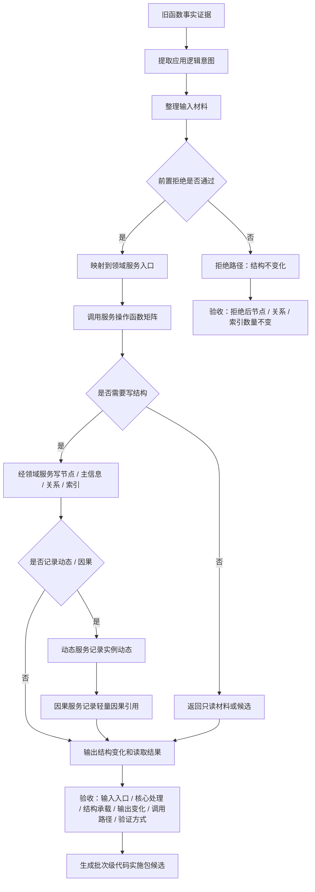

# 应用逻辑流程图迁移模板 v0.1

更新时间：2026-07-07

## 依据

```text
AGENTS.md
计划/已完成计划/20260707_服务操作函数矩阵与流程图迁移策略调整计划_v0.1.md
规范/4030_子规范_基础信息服务分层与领域写授权.md
规范/4040_子规范_不透明结构事务候选确认撤销与最后发布.md
规范/4050_子规范_入口拒绝逻辑内结果与内部逻辑错误.md
规范/0050_项目通用机器逻辑与禁止性规则总纲_20260721.md
规范/规范目录.md
```

## 说明

本模板用于把旧应用逻辑迁移为服务调用编排。旧函数事实只作为证据节点，不作为最终代码单位。

## 流程图



## 关键边界

```text
函数事实不是迁移单位；服务逻辑包才是迁移确认单位。
线程不是动作来源。
日志 / 控制台 / 显示只做人读。
需求目标是目标状态，不是 I64。
特征值服务只由特征服务直接访问。
第一版不接 SQL / 控制面板 / D455 / 体素 / 外设。
```
