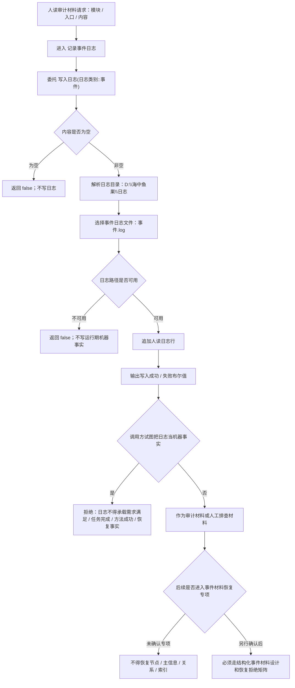

# 事件日志审计材料代码逻辑流程图 v0.1

更新时间：2026-07-08

## 依据

```text
AGENTS.md
计划/计划索引.md
规范/000_项目规则总纲.md
规范/001_规则迁移清单.md
实施记录/20260708_应用逻辑流程图迁移顺序信息数据.md
规范/详细设计/日志系统详细设计.md
规范/详细设计/事件日志持久化恢复详细设计.md
实施记录/20260707_FS09_事件日志持久化恢复增强S0当前代码事实扫描_Codex断点清单.md
海中鱼巣/核心/日志系统.h
```

## 说明

本图只表达当前日志系统中的事件日志入口和审计材料边界。当前没有独立 `事件日志服务.h`，没有结构化事件材料服务，也没有事件日志驱动恢复入口。

## 流程图



## 关键边界

```text
事件日志是人读审计材料，不是运行期机器事实。
日志、控制台输出、显示文本不得裁决业务状态。
当前记录事件日志只写 D:\海中鱼巣\日志\事件.log。
当前默认入口和领域服务未证明主动记录结构化事件材料。
```

## 当前代码差距

```text
当前没有事件日志领域服务、事件材料结构、事件恢复入口或事件回放机制。
当前事件日志不写节点、主信息、关系或索引。
事件日志持久化恢复详细设计存在，但未形成代码实施许可。
```

## 后续产物

```text
可作为事件日志审计材料详细设计复核依据。
若进入结构化事件材料或恢复实现，必须另建待确认施工计划，并与仓库快照 / 恢复拒绝矩阵联动。
```
