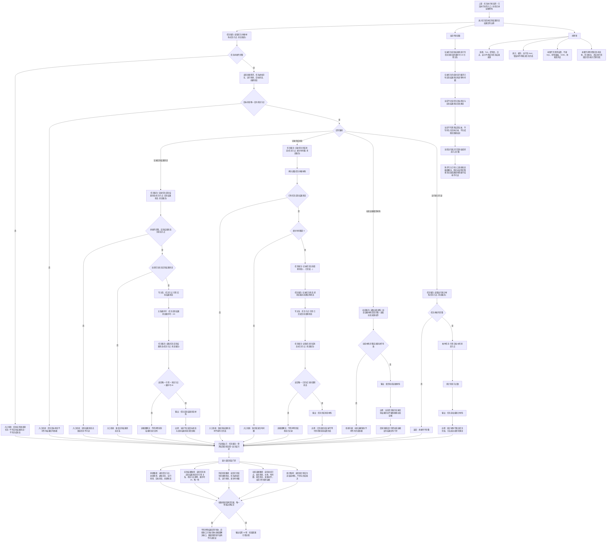

# 任务回执实际结果状态结果回写代码逻辑流程图

更新时间：2026-07-08

## 依据

```text
AGENTS.md
计划/计划索引.md
规范/000_项目规则总纲.md
规范/001_规则迁移清单.md
规范/详细设计/任务系统详细设计.md
规范/详细设计/任务状态机筹办执行桥详细设计.md
实施记录/20260708_应用逻辑流程图迁移顺序信息数据.md
实施记录/20260707_FS05_任务服务承接材料与生命周期S1-S4代码实施_Codex断点清单.md
流程图/20260708_动态记录输出结果场景代码逻辑流程图_v0.1.md
海中鱼巣/领域/任务服务.h
海中鱼巣/领域/状态服务.h
海中鱼巣/领域/动态服务.h
```

## 说明

本图是第 13 项“任务回执 / 实际结果状态 / 结果回写流程”的代码逻辑流程图，承接第 12 项动态记录材料和第 8 项任务状态机 / 执行桥请求材料。

本图只覆盖当前代码已存在的任务承接材料读回、任务实际结果状态关系写入、任务完成生命周期状态写入、运行统计只读材料，以及动态证据作为相邻材料的边界。当前代码不比较目标状态和实际结果状态是否满足，不写需求结算记录，不创建稳定因果结论，也不实现完整任务状态机或真实执行派发。

本图不确认上一份流程图；已按流程图免确认口径生成对应详细设计，但不生成施工计划，不登记可执行队列，不构成代码实施许可。

## 流程图



## 关键边界

```text
当前任务实际结果状态由任务节点到状态节点的 引用 关系承载，并通过任务服务内部顺序号 20 区分。
当前 `读取任务实际结果状态` 要求任务承接壳完整，并读取唯一 引用 + 状态节点 + 顺序号 20。
当前 `记录任务完成状态` 要求任务承接材料可读、已有实际结果状态、发生时间戳非 0，然后经状态服务写已完成生命周期实例状态。
当前代码不比较任务目标状态和实际结果状态是否满足；因此“已完成状态材料”不能扩大为“需求满足”或“结算完成”。
动态服务材料当前只能作为相邻证据读取；任务服务的实际结果状态写入口没有强制接收动态证据。
运行统计材料是非权威统计，只统计任务引用的状态节点数，不参与业务裁决。
本图不接 SQL、控制面板、D455、体素或外设。
```

## 当前代码差距

```text
当前没有目标状态满足判定入口，不能证明实际结果状态达成任务目标状态。
当前没有需求结算记录写入口，不能把任务完成状态升级为需求结算完成。
当前没有专门持久化回执记录结构，任务结果回写只落实际结果状态关系和生命周期状态。
当前任务服务未强制绑定动态证据，动态材料只能作为后续门禁候选。
当前运行统计材料非权威，不得裁决任务完成、方法成功或需求满足。
当前多步写入路径已有入口拒绝、追根因解决和读回判定，但尚未证明完整事务回滚、显式失效隔离或数量快照级半结构不可读。
当前流程图的最小读回验证是后续详细设计 / 施工计划门禁，不宣称每个当前函数内部都已具备统一事务级读回验证。
当前流程图已生成对应详细设计，但不生成待确认计划或代码实施许可。
```

## 后续产物

```text
本图可作为后续“任务回执 / 实际结果状态 / 结果回写详细设计”或第 14 项“轻量因果引用流程”的输入材料。
下一份流程图按迁移顺序应进入第 14 项：轻量因果引用流程。
若进入代码实施，必须另建待确认施工计划，明确允许文件、禁止文件、入口拒绝、追根因解决收口、读回验证和完成声明边界。
```
## 中途非成功返回二分口径

本文件按 2026-07-09 硬规则修订：中途非成功返回只分为 `追根因解决` 和 `逻辑内返回`。

- `追根因解决`：前置条件已经满足，并进入创建、绑定、写关系、写状态、记录动态、结算、读回或结构承载后，结果不符合内部预期；必须停止依赖路径，定位根因，当前未证明完整回滚时登记事务隔离缺口或半结构隔离缺口。
- `逻辑内返回`：领域协议允许的拒绝、候选为空、请求材料返回或人读材料返回；必须保证结构不变化，且返回材料、日志、回执、显示或控制台输出不裁决机器事实。
