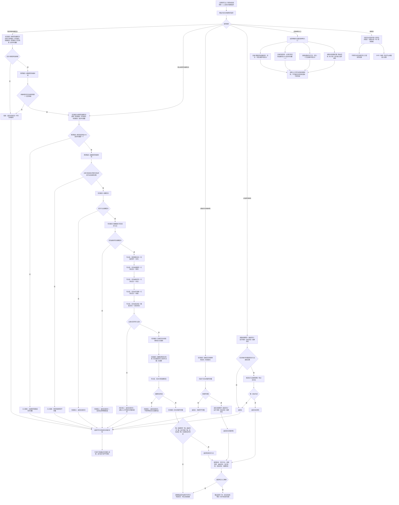

# 任务承接需求代码逻辑流程图

更新时间：2026-07-08

## 依据

```text
AGENTS.md
规范/000_项目规则总纲.md
规范/001_规则迁移清单.md
规范/详细设计/任务系统详细设计.md
规范/详细设计/服务操作函数矩阵第一批.md
实施记录/20260708_应用逻辑流程图迁移顺序信息数据.md
实施记录/20260706_FS05_任务管理入口只读扫描记录.md
实施记录/20260707_FS05_任务服务承接材料与生命周期S1-S4代码实施_Codex断点清单.md
实施记录/20260707_FS04_FS05_需求任务承接闭环联动验收_Codex断点清单.md
流程图/20260708_需求树后续结构代码逻辑流程图_v0.1.md
海中鱼巣/领域/需求服务.h
海中鱼巣/领域/任务服务.h
```

## 说明

本图是第 7 项“任务承接需求流程”的代码逻辑流程图，承接第 5 项需求创建与目标状态、第 6 项需求树后续结构输出的需求节点和需求承接材料。

本图只表达当前已落代码和第一轮验证边界：任务服务已经提供 `按需求创建任务`、任务来源需求 / 虚拟存在 / 运行场景 / 目标状态 / 创建状态读取、任务承接材料读取、实际结果状态、完成状态和任务选择方法关系等入口；但任务状态机、筹办、执行桥、方法候选、线程派发和旧任务主信息迁移仍不是本图范围。

本图已生成对应详细设计，但不生成施工计划，不登记可执行队列，不构成代码实施许可。

## 流程图



## 关键边界

```text
任务承接需求当前已落代码可以创建第一轮完整任务承接壳，并通过任务服务读取来源需求、任务虚拟存在、运行场景、目标状态和创建状态。
任务目标状态来自需求承接材料中的目标状态；需求目标仍是目标状态，不是 I64。
任务虚拟存在由存在服务创建；任务生命周期状态由状态服务创建实例状态并带发生时间戳。
任务服务不得直接依赖特征值服务；当前高级服务依赖扫描已证明任务服务、需求服务、方法服务头文件无直接特征值服务命中。
有效任务承接壳的读取门槛是：唯一来源需求、唯一任务虚拟存在、唯一运行场景、唯一目标状态、唯一创建状态均可读。
当前多步写入路径在关系或状态失败时返回无效任务，且任务服务读取入口不得把半结构视为完整承接壳；但本图不宣称物理数量完全回滚。
后续若把失败收口提升为施工门禁，必须补数量快照、读回验证、失效隔离或事务回滚证明。
实际结果状态、完成状态、任务选择方法、生命周期迁移请求、筹办回执请求、执行桥请求和运行统计材料是后续流程材料，不代表完整任务状态机、筹办、执行桥或调度完成。
任务执行权限仍来自任务方法关系；线程、控制台、日志、显示或 SQL 投影不得成为动作来源或任务事实来源。
本图不接 SQL、控制面板、D455、体素或外设。
```

## 当前代码差距

```text
当前代码尚未实现完整任务状态机、筹办流程、执行桥派发、取消、超时、重试或工作队列。
当前代码尚未实现任务候选方法算法、任务管理对象、子任务树、阶段角色、等待缺口或运行包治理协议。
当前 `按需求创建任务` 是多步写入；当前图只证明服务读取入口不会把不完整结构读成有效任务承接壳，不证明失败后节点 / 关系 / 状态物理数量完全不变。
当前任务实际结果状态第一轮只允许记录一次，历史结果和替换规则仍待后续设计。
当前运行统计材料只是非权威请求材料，不裁决任务完成、方法成功或需求满足。
当前流程图已有对应详细设计，但不生成待确认计划或代码实施许可。
```

## 后续产物

```text
本图可作为后续“任务承接需求详细设计重审”或“任务状态机 / 筹办 / 执行桥请求流程图”的输入材料。
下一份流程图按迁移顺序应进入第 8 项：任务状态机 / 筹办 / 执行桥请求流程。
若进入代码实施，必须另建待确认施工计划，明确允许文件、禁止文件、入口拒绝、失败收口、读回验证和完成声明边界。
```
