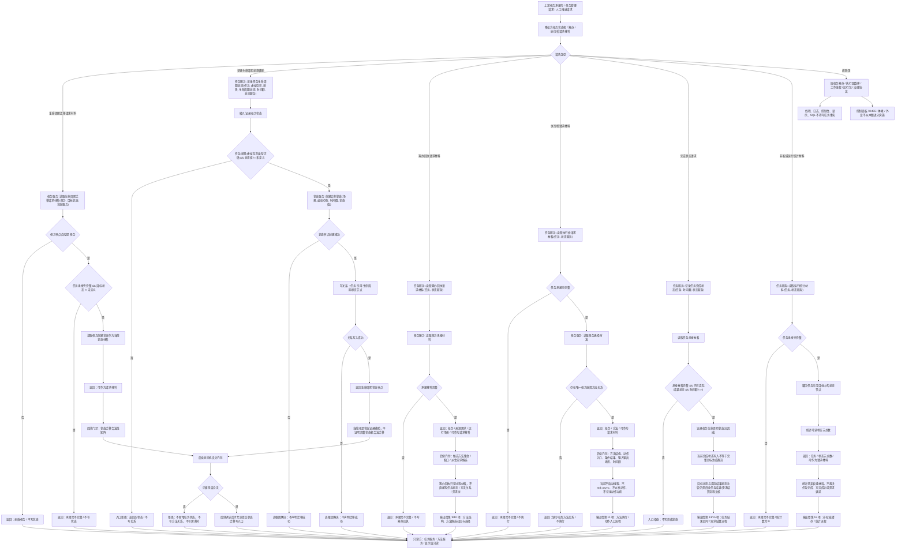

# 任务状态机筹办执行桥请求代码逻辑流程图

更新时间：2026-07-08

## 依据

```text
AGENTS.md
规范/0050_项目通用机器逻辑与禁止性规则总纲_20260721.md
规范/规范目录.md
规范/3200_根规范_任务_20260720.md
规范/5210_子规范_任务状态特征集合与阶段关联_20260720.md
规范/5230_子规范_任务筹办与执行边界_20260720.md
实施记录/20260708_应用逻辑流程图迁移顺序信息数据.md
实施记录/20260706_FS05_任务模块筹办执行管理边界只读扫描记录.md
实施记录/20260707_FS05_任务服务承接材料与生命周期S1-S4代码实施_Codex断点清单.md
实施记录/20260707_FS04_FS05_需求任务承接闭环联动验收_Codex断点清单.md
流程图/20260708_任务承接需求代码逻辑流程图_v0.1.md
海中鱼巣/领域/任务服务.h
```

## 说明

本图是第 8 项“任务状态机 / 筹办 / 执行桥请求流程”的代码逻辑流程图，承接第 7 项已确认的任务承接壳材料。

本图只表达当前已落代码与候选边界：当前 `任务服务` 已提供生命周期迁移请求材料、筹办回执请求材料、执行桥请求材料和非权威运行统计材料读取入口，并提供任务生命周期状态记录、实际结果状态、完成状态和任务选择方法关系等第一轮辅助入口；但完整状态迁移矩阵、筹办提交、候选方法算法、执行桥派发、动作动态和任务结果回写仍是后续流程。

本图已生成对应详细设计，但不生成施工计划，不登记可执行队列，不构成代码实施许可。

## 流程图



## 关键边界

```text
当前已落代码提供生命周期迁移请求材料、筹办回执请求材料、执行桥请求材料和运行统计材料读取入口。
当前 `记录任务生命周期状态` 是状态记录辅助入口，不等于完整任务状态机；状态迁移合法性矩阵仍需后续确认。
当前 `读取筹办回执请求材料` 只返回任务、来源需求和运行场景，不形成候选方法集合、缺口、派生需求或任务状态写入。
当前 `读取执行桥请求材料` 必须先有任务承接壳和唯一任务选择方法关系；缺任务方法关系时拒绝，不执行方法。
当前 `记录任务完成状态` 要求已有实际结果状态和有效时间戳，但本图不把它扩大为完整目标达成裁决；目标状态与实际结果状态比较仍需后续任务结果回写或需求结算流程复核。
当前 `读取运行统计材料` 只统计可读状态节点数，是非权威材料，不能裁决任务完成、方法成功或需求满足。
筹办回执、执行桥请求、运行包、治理协议、工作线程快照和日志显示材料都不能承载机器事实。
线程不是动作来源；执行桥当前不启动线程、不 `std::async`、不派发动作、不接外设等待。
本图不接 SQL、控制面板、D455、体素或外设。
```

## 当前代码差距

```text
当前代码尚未实现完整任务状态迁移矩阵，也未限制 `记录任务生命周期状态` 的迁移顺序。
当前代码尚未实现筹办回执提交入口、候选方法集合、方法结构缺口、派生需求候选或需求树写回。
当前代码尚未实现执行桥真实派发、动作入口依赖复核、条件 / 结果结构复核、输入输出场景复核或动作动态记录。
当前代码尚未实现任务完成前的目标状态与实际结果状态比较；完成状态写入不能单独证明任务目标已达成。
当前代码尚未实现运行统计、权重、错误码、运行包或治理协议落地；这些仍属非权威或后续专项材料。
当前流程图已有对应详细设计，但不生成待确认计划或代码实施许可。
```

## 后续产物

```text
本图可作为后续“任务状态机 / 筹办 / 执行桥请求详细设计重审”或后续施工计划候选的输入材料。
下一份流程图按迁移顺序应进入第 9 项：方法结构流程。
若进入代码实施，必须另建待确认施工计划，明确允许文件、禁止文件、入口拒绝、追根因解决收口、读回验证和完成声明边界。
```
## 中途非成功返回二分口径

本文件按 2026-07-09 硬规则修订：中途非成功返回只分为 `追根因解决` 和 `逻辑内返回`。

- `追根因解决`：前置条件已经满足，并进入创建、绑定、写关系、写状态、记录动态、结算、读回或结构承载后，结果不符合内部预期；必须停止依赖路径，定位根因，当前未证明完整回滚时登记事务隔离缺口或半结构隔离缺口。
- `逻辑内返回`：领域协议允许的拒绝、候选为空、请求材料返回或人读材料返回；必须保证结构不变化，且返回材料、日志、回执、显示或控制台输出不裁决机器事实。
