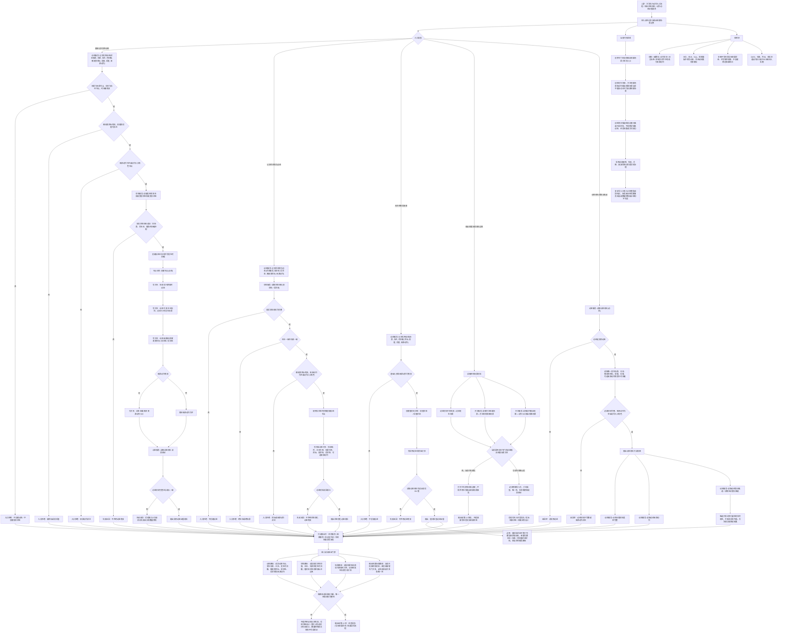

# 动态记录输出结果场景代码逻辑流程图

更新时间：2026-07-08

## 依据

```text
AGENTS.md
计划/计划索引.md
规范/000_项目规则总纲.md
规范/001_规则迁移清单.md
规范/详细设计/动态服务详细设计.md
规范/详细设计/状态动态二次特征因果服务增强详细设计.md
规范/详细设计/实例状态动态生命周期治理详细设计.md
实施记录/20260708_应用逻辑流程图迁移顺序信息数据.md
实施记录/20260706_FS02_状态与动态入口只读扫描记录.md
实施记录/20260706_FS07_动作动态因果入口只读扫描记录.md
实施记录/20260707_FS02_状态动态二次特征因果第一轮代码实施_Codex断点清单.md
流程图/20260708_方法执行动作入口代码逻辑流程图_v0.1.md
海中鱼巣/领域/动态服务.h
海中鱼巣/领域/状态服务.h
海中鱼巣/领域/场景服务.h
海中鱼巣/领域/方法服务.h
海中鱼巣/领域/任务服务.h
```

## 说明

本图是第 12 项“动态记录 / 输出结果场景流程”的代码逻辑流程图，承接第 11 项输出的动作动态证据入口和特征状态材料读取边界。

本图只覆盖当前动态服务已落代码的实例动态记录、状态变化动态记录、动态材料读取、动态证据完整性复核、场景内动态候选读取，以及“输出结果场景”在当前代码中的相邻材料边界。当前代码可以记录动态发生场景、主体、发生时间戳、被改变目标、前后状态材料和可选来源动作；但没有专门的“动态到输出结果场景”关系写入口。方法结果场景、动作输出规格场景和动态发生场景不能被混写成同一个权威结果场景。

本图生成后已按最新口径直接生成对应详细设计；流程图本身不生成施工计划，不登记可执行队列，不构成代码实施许可。

## 流程图



## 关键边界

```text
当前动态服务负责写实例动态、动态发生时间戳、发生场景、主体、被改变目标、前后值材料和可选来源动作。
当前动态发生场景通过两条材料承载：场景到动态的运行期临时关系，以及动态到场景的引用关系。
当前状态服务路径可以创建完整实例状态作为前后状态材料；动态服务无状态服务重载会创建值材料状态，不等于完整实例状态材料。
当前 `记录状态变化动态` 要求前后状态材料完整、主体一致、场景一致，并使用后状态时间戳作为动态发生时间戳。
当前 `读取动态材料` 是动态服务对因果服务、任务服务、显示层只读和后续结果回写流程提供的只读材料视图，不是新机器事实。
当前没有专门的“动态输出结果场景”关系写入口；方法结果场景、动作输出规格场景和动态发生场景只可作为相邻材料读取，不能混写成已落代码事实。
任务实际结果状态、任务完成状态、需求结算记录和轻量因果引用属于后续流程图，不在本图写入。
本图不接 SQL、控制面板、D455、体素或外设。
```

## 当前代码差距

```text
当前没有专门的输出结果场景关系类型、顺序号或写入口。
当前动态聚合候选和运动基元候选只返回非权威候选材料，不证明抽象动态、运动基元、方法成功或任务完成。
当前实例动态引用阻断已有读取材料，但未实现删除实例动态、失效、升格、衰减和淘汰的完整生命周期治理。
当前动作验证报告、预测 / 实际偏差、回读置信度、执行报告值和事实提交等级仍未成为权威结构。
当前多步写入路径已有入口拒绝、失败返回和读回判定，但尚未证明完整事务回滚、显式失效隔离或数量快照级半结构不可读。
当前流程图的最小读回验证是后续详细设计 / 施工计划门禁，不宣称每个当前函数内部都已具备统一事务级读回验证。
当前流程图只作为详细设计依据；已生成的对应详细设计仍不等于待确认计划或代码实施许可。
```

## 后续产物

```text
本图已作为 `规范/详细设计/动态记录输出结果场景代码逻辑详细设计.md` 的输入材料；该详细设计后续确认前不生成施工计划候选，也不直接写第 13 项结果回写结构。
下一份流程图按迁移顺序应进入第 13 项：任务回执 / 实际结果状态 / 结果回写流程。
若进入代码实施，必须另建待确认施工计划，明确允许文件、禁止文件、入口拒绝、失败收口、读回验证和完成声明边界。
```
