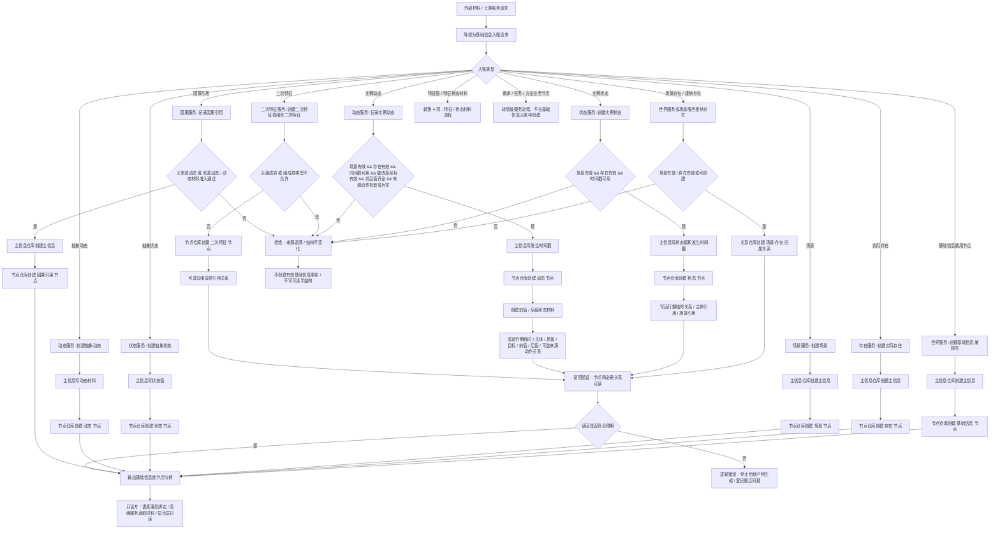

# 基础信息入账代码逻辑流程图

更新时间：2026-07-08

## 依据

```text
AGENTS.md
规范/000_项目规则总纲.md
规范/001_规则迁移清单.md
规范/基础信息服务分层规范.md
规范/详细设计/领域服务最小入口详细设计.md
实施记录/20260708_应用逻辑流程图迁移顺序信息数据.md
海中鱼巣/领域/世界服务.h
海中鱼巣/领域/存在服务.h
海中鱼巣/领域/场景服务.h
海中鱼巣/领域/状态服务.h
海中鱼巣/领域/动态服务.h
海中鱼巣/领域/二次特征服务.h
海中鱼巣/领域/因果服务.h
海中鱼巣/核心/句柄.h
```

## 说明

本图是第 3 项“基础信息入账流程”的代码逻辑流程图，表达外部材料或上游服务请求如何被降权为基础信息入账请求，并经基础信息原子服务或世界聚合服务写入节点、主信息和关系结构。

本图不展开特征值、特征状态材料、需求目标状态、任务状态机、方法执行、稳定因果结论、缓存统计、事件日志或显示层逻辑；这些分别由后续流程图承接。

## 流程图



## 关键边界

```text
基础信息入账必须经基础信息原子服务或世界聚合服务入口。
世界服务只做聚合编排；除当前兼容壳 `创建基础信息()` 外，不得绕过原子服务直接写基础信息结构。
实例状态必须有场景、存在主体和发生时间戳；抽象状态本体不携带发生时间戳。
实例动态必须有场景、存在主体、发生时间戳、被改变目标、改变前值和改变后值；抽象动态本体不携带发生时间戳。
二次特征只表达复合或关系特征结构，判断结果必须落到状态、动态或因果结构。
因果引用在本图只表达轻量入口或基础身份；稳定因果结论由后续轻量因果引用流程和因果聚合设计承接。
特征值和特征状态材料转第 4 项，不在本图中展开。
需求、任务、方法是高级业务节点，不由基础信息入账流程直接创建。
参数检测用于发现非法材料来源并追溯上游，不允许在当前函数内部修复非法数据后继续写入。
任一必需写入后读回不符合预期，属于逻辑错误，必须停止后续详细设计或施工计划推进并登记断点。
```

## 当前代码差距

```text
当前世界服务仍保留 `创建基础信息()` 兼容壳，直接创建基础信息通用节点；后续详细设计需确认兼容壳归属和使用边界。
当前状态、动态、二次特征等多步写入路径已有入口拒绝和失败返回，但未形成完整事务回滚设计；后续详细设计必须补失败收口和半结构不可读验收。
当前因果引用可无来源直接创建基础身份，也可经来源动态准入创建；稳定因果结论不在当前实现中。
本图只生成流程图，不证明基础信息服务分层完整完成，不证明旧基础信息能力已迁移。
```

## 后续产物

```text
本图经确认后，可生成基础信息入账详细设计。
详细设计确认后，才能生成施工计划候选。
施工计划候选必须明确允许文件、禁止文件、失败收口策略和验证方式。
```
