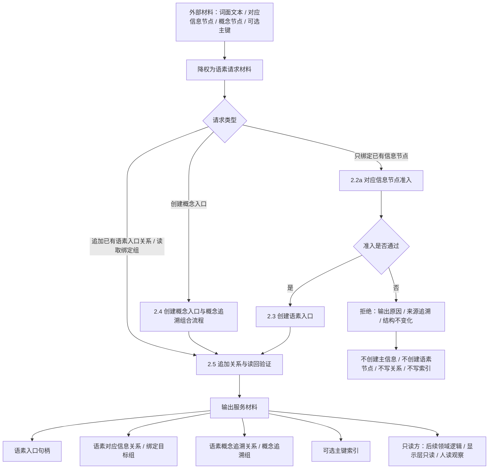

# 语素服务入口材料总览代码逻辑流程图

更新时间：2026-07-08

## 依据

```text
AGENTS.md
规范/0050_项目通用机器逻辑与禁止性规则总纲_20260721.md
规范/规范目录.md
规范/4030_子规范_基础信息服务分层与领域写授权.md
规范/2210_根规范_语素入口_20260720.md
规范/4040_子规范_不透明结构事务候选确认撤销与最后发布.md
规范/4050_子规范_入口拒绝逻辑内结果与内部逻辑错误.md
规范/7200_子规范_基础信息语素信息关系整合_20260720.md
规范/7210_子规范_信息入口类型与信息存储树路由_20260720.md
实施记录/20260708_应用逻辑流程图迁移顺序信息数据.md
实施记录/20260706_FS02_语素入口与基础信息桥接只读扫描记录.md
海中鱼巣/领域/语素服务.h
海中鱼巣/入口.cpp
```

## 说明

本图是第 2 项“外部材料 / 语素请求准入”的总览图，只表达语素服务如何把外部材料降权为语素请求、如何选择服务入口、最终向其他逻辑输出哪些入口材料。

本图不承载所有实现细节。详细实现拆为 2.1 到 2.5 五张子流程图：文本准入、对应信息节点准入、语素入口创建、概念入口与概念追溯、追加关系与读回验证。

## 流程图



## 子流程拆分

| 子流程 | 职责 |
| --- | --- |
| 2.1 文本准入 | 判断词面文本是否可作为第一轮最小词单元。 |
| 2.2 对应信息与概念追溯目标准入 | 拆为 2.2a 对应信息节点准入和 2.2b 概念追溯目标准入。 |
| 2.3 语素入口创建 | 创建主信息、语素节点、对应信息关系和可选主键索引。 |
| 2.4 概念入口与概念追溯组合流程 | 组合文本准入、对应信息准入、概念追溯目标准入、语素入口创建和概念追溯追加。 |
| 2.5 追加关系与读回验证 | 独立处理已有语素入口追加关系、只读读取绑定组、重复拒绝和读回验证。 |

## 关键边界

```text
外部文本只作为语素请求材料，不直接成为世界事实。
语素服务向其他逻辑提供入口材料，不负责自然语言理解全过程。
语素服务只绑定已有允许信息节点，不自动创建基础信息、高级信息、临时实例状态或动态。
特征值节点、运行期临时实例状态和运行期临时实例动态必须拒绝。
显示标题、语言命名、SQL 投影和控制面板材料不参与本流程。
语言命名结果只能作为人读候选，不自动回流为语素文本。
本总览图不能直接生成完整详细设计或施工计划；必须以下列子流程图为依据。
```

## 后续产物

```text
本项后续应先完成 2.1-2.5 子流程图。
子流程图确认后，再生成语素服务入口材料准入详细设计。
详细设计确认后，再生成施工计划。
```
