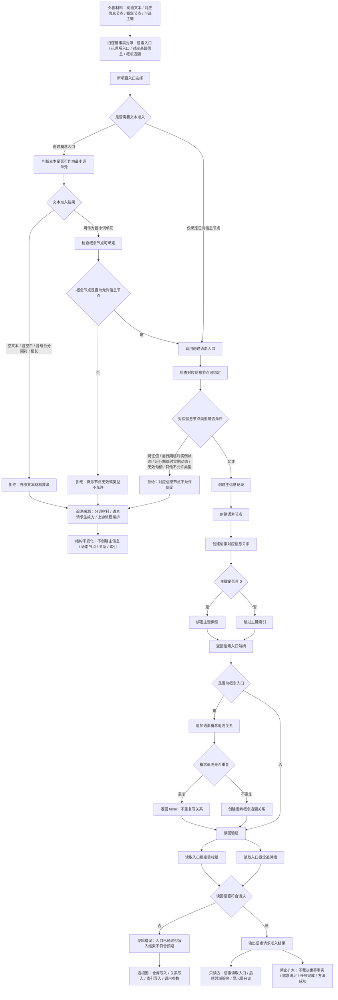

# 外部材料 / 语素请求准入代码逻辑流程图

更新时间：2026-07-08

## 依据

```text
AGENTS.md
规范/000_项目规则总纲.md
规范/001_规则迁移清单.md
规范/迁移路线权力分层规范.md
实施记录/20260708_应用逻辑流程图迁移顺序信息数据.md
实施记录/20260706_FS02_语素入口与基础信息桥接只读扫描记录.md
海中鱼巣/领域/语素服务.h
海中鱼巣/入口.cpp
```

## 说明

本流程图是应用逻辑流程图迁移顺序中的第 2 项正式产物。从本项开始，产物类型切换为代码逻辑流程图：以旧语素入口事实和当前 `语素服务` 代码为依据，画外部材料如何进入语素请求准入、如何被参数检测拒绝、如何经语素服务写入结构，以及如何读回验证。

本文件不是计划，不登记可执行队列，不形成 C++ 实施许可，不证明旧语素类、自然语言理解、候选查询或显示层已迁移。

## 当前代码事实

```text
语素服务::判断文本是否可作为最小词单元：拒绝空文本、空白、组合分隔符和第一轮长度超过 3 的文本。
语素服务::创建语素入口：先检查对应信息节点是否可绑定，通过后创建主信息、语素节点、语素对应信息关系，并在主键非 0 时绑定索引。
语素服务::创建概念入口：先检查文本准入和概念节点可绑定，再调用创建语素入口，最后追加语素概念追溯。
语素服务::追加语素对应信息：先检查语素入口有效和对应信息可绑定，重复关系返回 false，不重复时创建语素对应信息关系。
语素服务::追加语素概念追溯：先检查语素入口有效和概念节点可绑定，重复关系返回 false，不重复时创建语素概念追溯关系。
语素服务::读取入口绑定目标组 / 读取入口概念追溯组：只读返回关系目标组。
当前可绑定信息节点：基础信息、存在、场景、特征、非运行期临时状态、非运行期临时动态、二次特征、因果引用、需求、任务、方法。
当前明确拒绝：特征值节点、运行期临时实例状态、运行期临时实例动态。
```

## 流程图



## 参数检测与非法来源追溯

| 检测点 | 拒绝条件 | 问题来源追溯 |
| --- | --- | --- |
| 文本准入 | 空文本、含空白、含组合分隔符、超过第一轮长度 | 分词材料、外部文本请求、上游流程编排 |
| 对应信息节点 | 无效句柄、特征值、运行期临时实例状态、运行期临时实例动态、其他不允许类型 | 调用方没有先经对应领域服务创建长期信息节点 |
| 概念节点 | 无效句柄或不可绑定类型 | 概念材料未先形成允许的信息节点 |
| 语素入口 | 追加关系时入口不是语素节点 | 调用方传错入口句柄 |
| 重复关系 | 已存在同一对应信息或概念追溯关系 | 重复请求；返回不写入，不当作新事实 |
| 写后读回 | 读回目标组或概念组不符合请求 | 仓库写入、关系写入、索引写入或调用参数存在逻辑错误 |

## 关键边界

```text
外部文本只作为语素请求材料，不直接成为世界事实。
语素服务只绑定已有允许信息节点，不自动创建基础信息、高级信息、临时实例状态或动态。
特征值节点不得作为语素入口对应信息。
实例状态和实例动态如果属于运行期临时关系，不得作为语素入口对应信息。
语素对应信息和概念追溯由关系承载，支持集合读取；不得退回旧主信息单字段。
显示标题、语言命名、SQL 投影和控制面板材料不参与本流程。
拒绝路径用于发现非法数据来源，不在当前函数内部兜底修复非法数据。
本流程图只描述当前代码逻辑和迁移承接边界，不代表需要立即修改代码。
```

## 结构不变化验收

```text
文本准入失败时：不创建主信息、不创建语素节点、不写语素对应信息关系、不写索引。
对应信息节点不可绑定时：不创建主信息、不创建语素节点、不写语素对应信息关系、不写索引。
概念节点不可绑定时：不创建语素入口、不写概念追溯关系。
追加对应信息或概念追溯时入口无效：不写关系。
追加重复关系时：返回 false，不重复写关系。
写后读回不符合请求时：按逻辑错误追根因，不把错误结果静默当成功。
```

## 后续产物

```text
下一张正式流程图建议：基础信息入账代码逻辑流程图。
本图如后续转为实施包候选，必须先明确允许文件、禁止文件和验证方式；当前不入队。
```
