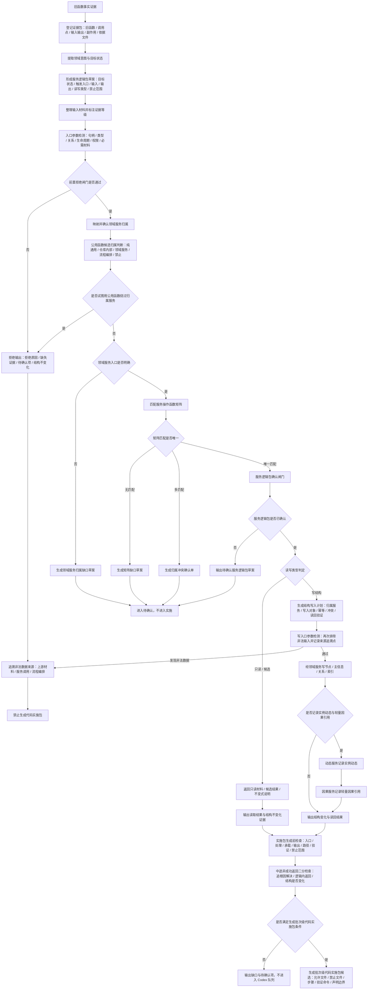

# 应用逻辑流程图迁移模板 v0.2

更新时间：2026-07-08

## 依据

```text
AGENTS.md
规范/000_项目规则总纲.md
规范/001_规则迁移清单.md
规范/迁移路线权力分层规范.md
规范/公用函数规则规范.md
规范/详细设计/服务操作函数矩阵第一批.md
流程图/20260707_应用逻辑流程图迁移模板_v0.1.md
实施记录/20260708_应用逻辑流程图迁移顺序信息数据.md
用户提供的《应用逻辑流程图迁移模板 v0.1》只读分析材料
```

## 说明

本模板用于把旧应用逻辑迁移为服务调用编排。v0.2 在 v0.1 的主轴上显式增加证据包、服务逻辑包确认闸门、矩阵缺口路径、结构写入计划、入口参数检测与非法数据来源追溯、实施包生成前检查和禁止宣称边界。

入口参数检测不是为了在当前函数内部给非法数据兜底，而是为了发现非法数据来源，拒绝本次写入并回到上游材料生成、服务调用或流程编排处消除来源。

以后基于本模板制作、修订或审查流程图时，所有中途非成功返回必须按“追根因解决 / 逻辑内返回”二分口径标注。前置条件通过后进入创建、绑定、写关系、写状态、记录动态、结算、读回或结构承载仍出现非预期结果的，必须标为追根因解决；设计内允许分支、结构不变化或只返回材料的，才可标为逻辑内返回。

## 流程图



## 关键边界

```text
函数事实不是迁移单位；服务逻辑包才是迁移确认单位。
流程图中出现公用函数候选时，必须先判断归属；不得自动生成全局工具函数。
触碰领域结构的共享逻辑必须归属对应仓库或领域服务，跨服务逻辑必须回到服务逻辑包和流程图编排。
入口参数检测必须发现问题数据来源，不得在当前函数内部兜底修复非法数据。
拒绝路径必须输出拒绝原因、缺失证据、待确认项和结构不变化断言。
矩阵无匹配时生成矩阵缺口草案；多匹配时生成归属冲突确认单；二者都不进入实施。
写结构前必须先形成结构写入计划，说明归属服务、写入对象、幂等、冲突和读回验证。
实施包生成前检查只代表设计层具备候选条件，不代表代码已实现或已验收。
线程不是动作来源。
日志 / 控制台 / 显示只做人读。
需求目标是目标状态，不是 I64。
特征值服务只由特征服务直接访问。
中途非成功返回必须标明“追根因解决”或“逻辑内返回”；不得只写失败、异常、不能声明成功等含混口径。
第一版不接 SQL / 控制面板 / D455 / 体素 / 外设。
```

## 证据包字段

| 字段 | 说明 |
| --- | --- |
| 旧函数事实 | 旧函数名、文件路径、调用点、输入输出、可观察副作用 |
| 应用逻辑意图 | 旧逻辑真正想完成的领域动作或目标状态 |
| 依据文件 | 规范、详细设计、计划、服务矩阵、实施记录 |
| 当前结构事实 | 现有服务入口、结构承载、字段或节点事实 |
| 禁止来源 | 日志、显示、控制台、聊天摘要不得当作机器事实 |
| 缺口 | 找不到服务入口、矩阵无函数、结构无承载、验证方式不足 |

## 前置拒绝闸门

```text
输入材料缺核心证据时拒绝。
目标状态不是领域状态时拒绝。
触发来源是线程 / 日志 / 显示 / 控制台时拒绝。
试图直接迁移旧函数时拒绝。
试图越过领域服务写结构时拒绝。
试图用公用函数绕过归属服务、仓库锁、入口拒绝或确认门禁时拒绝。
命中特征值服务边界时拒绝。
涉及第一版禁止接入范围时拒绝。
入口参数非法、句柄无效、类型错误、关系缺失、生命周期不满足、权限不足或必需材料缺失时拒绝。
```

拒绝后必须：

```text
不写节点。
不写主信息。
不写关系。
不写索引。
不生成代码实施包。
登记非法数据来源追溯点，回到上游流程优化。
```

## 结构写入计划字段

| 项 | 内容 |
| --- | --- |
| 写入归属 | 哪个领域服务负责 |
| 写入对象 | 节点、主信息、关系、索引中的哪一种 |
| 写入条件 | 什么输入满足时写 |
| 幂等策略 | 重复调用是否会重复写 |
| 冲突策略 | 已存在节点 / 关系 / 索引时如何处理 |
| 读回验证 | 写后通过什么读取入口验证 |
| 禁止范围 | 不写 SQL / 控制面板 / D455 / 体素 / 外设等 |

## 批次级代码实施包候选生成条件

只有同时满足以下条件，才允许生成批次级代码实施包候选：

```text
服务逻辑包已确认。
领域服务入口明确。
服务操作函数矩阵存在唯一匹配。
读写类型明确。
如需写结构，已有结构写入计划。
如需动态 / 因果记录，已有动态服务和因果服务的调用边界。
已列出允许文件、禁止文件和验证命令。
已列出完成声明边界和禁止宣称。
不涉及第一版禁止接入范围。
不把旧函数、线程、日志、控制台、显示材料当作迁移单位或机器事实。
不把公用函数候选当作绕过领域服务的代码入口。
所有中途非成功返回已按“追根因解决 / 逻辑内返回”二分口径标注，并说明结构是否变化。
```

## 禁止宣称

在仅完成本流程分析、设计验收或实施包候选生成时，不得宣称：

```text
旧应用逻辑已迁移完成。
服务调用编排已落地。
节点 / 主信息 / 关系 / 索引已经写入。
动态服务或因果服务已经接入。
SQL / 控制面板 / D455 / 体素 / 外设已经接入。
代码已经构建、运行、提交或推送。
自我循环、自我苏醒、初步成熟等状态已经完成。
```

可以宣称：

```text
已形成服务逻辑包候选。
已完成设计层检查。
已生成实施包候选草案。
```

不得宣称：

```text
代码已实现。
已接入。
已闭环。
已验证通过。
```
