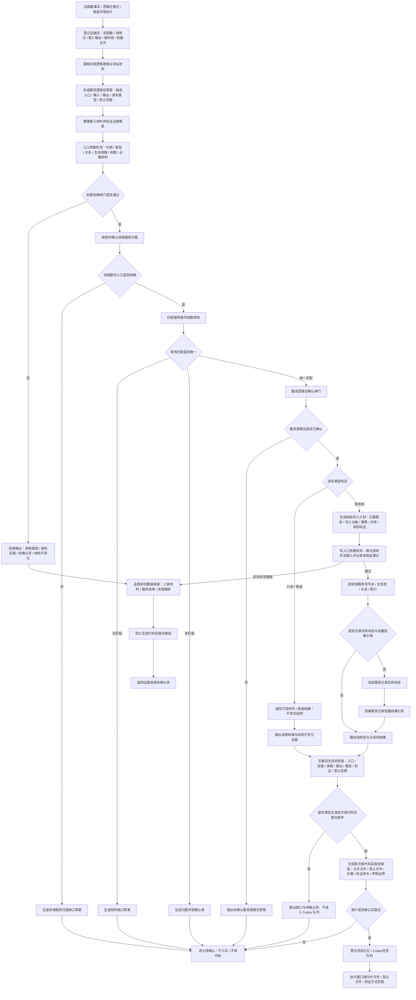

# 总入口边界 / 权力链流程图

更新时间：2026-07-08

## 依据

```text
AGENTS.md
规范/000_项目规则总纲.md
规范/001_规则迁移清单.md
规范/迁移路线权力分层规范.md
规范/详细设计/服务操作函数矩阵第一批.md
流程图/20260708_应用逻辑流程图迁移模板_v0.2.md
实施记录/20260708_应用逻辑流程图迁移顺序信息数据.md
实施记录/20260708_应用逻辑流程图草稿提取信息数据.md
```

## 说明

本流程图是应用逻辑流程图迁移顺序中的第 0 项正式流程图产物，用于约束旧函数事实、逻辑迁移包、候选详细设计、服务矩阵、流程图迁移包、批次级代码实施包和可执行队列之间的权力链。

本文件是流程图迁移层文档，不是计划，不登记可执行队列，不形成 C++ 实施许可，不证明旧项目能力已迁移。

入口参数检测的目标是发现非法数据来源，并把问题返回到上游材料生成、服务调用或流程编排处处理；不得在当前函数内部为非法数据兜底修复。

## 流程图



## 关键边界

```text
函数事实不是迁移单位；服务逻辑包才是迁移确认单位。
旧函数体、旧字段、旧小切片和候选详细设计不得直接进入 C++。
入口参数检测必须发现问题数据来源，不得在当前函数内部兜底修复非法数据。
拒绝路径必须输出拒绝原因、缺失证据、待确认项和结构不变化断言。
矩阵无匹配时生成矩阵缺口草案；多匹配时生成归属冲突确认单；二者都不进入实施。
服务逻辑包未确认时，不生成批次级代码实施包候选。
批次级代码实施包候选不等于代码实施许可；必须经用户确认并登记可执行队列。
执行窗口只能按实施包列出的允许文件、禁止文件和验证方式实施。
线程、Tick、控制台命令、面板刷新、日志标签和显示标题不得成为动作来源或机器事实写入方。
日志、控制台和显示只做人读材料。
需求目标是目标状态，不是 I64。
特征值服务只由特征服务直接访问。
第一版不接 SQL / 控制面板 / D455 / 体素 / 外设。
控制面板和数据库只作为后置候选，不能自动从旧控制面板、SQL、ADO 事实生成迁移计划。
```

## 结构不变化验收

```text
前置拒绝闸门未通过时：不写节点、不写主信息、不写关系、不写索引、不生成代码实施包候选。
领域服务入口不明确时：只生成归属缺口草案，不入队，不改代码。
矩阵无匹配或多匹配时：只生成缺口或冲突确认材料，不入队，不改代码。
服务逻辑包未确认时：只保留待确认草案，不进入实施包层。
用户未确认批次级代码实施包时：不登记 Codex 任务队列，不进入执行窗口。
```

## 后续产物

```text
下一张正式流程图建议：运行宿主 / 自我锚点 / 主循环降权边界流程图。
后续核心链路仍按 0-20 顺序逐张生成，不自动跳到控制面板、数据库或外设。
```
