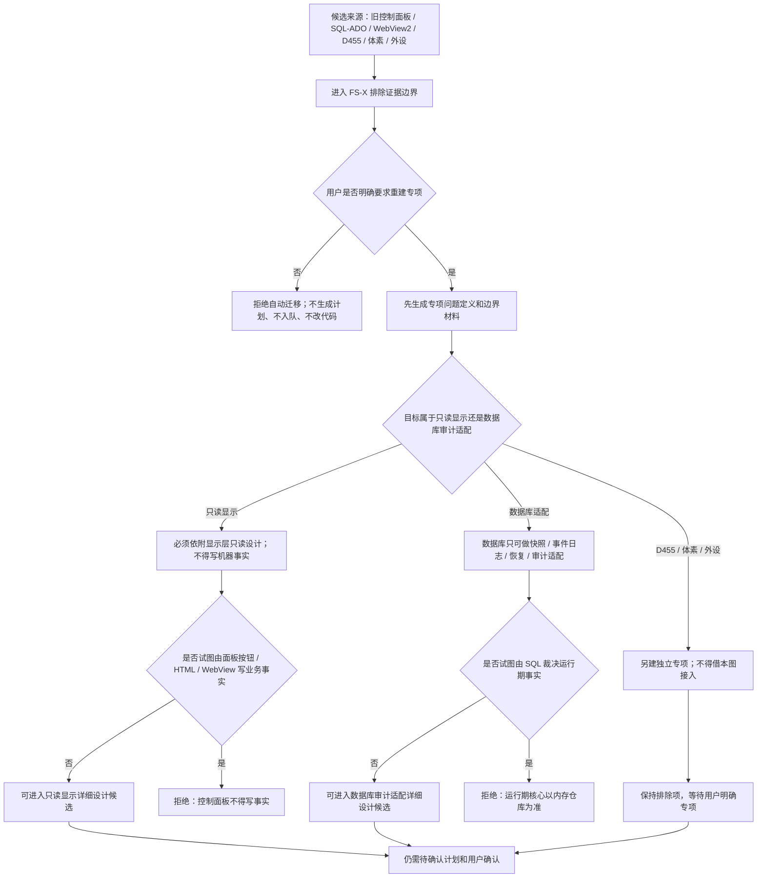

# 控制面板数据库重建候选代码逻辑流程图 v0.1

更新时间：2026-07-08

## 依据

```text
AGENTS.md
计划/计划索引.md
规范/000_项目规则总纲.md
规范/001_规则迁移清单.md
实施记录/20260708_应用逻辑流程图迁移顺序信息数据.md
实施记录/20260706_FSX_控制面板SQLD455体素外设排除项汇总记录.md
实施记录/20260706_FS10_显示层只读候选只读扫描记录.md
```

## 说明

本图是第 20 项后置候选 / 排除证据图，不是控制面板或数据库实施图。旧控制面板、SQL / ADO、WebView2、D455、体素和外设事实不能自动生成迁移计划、不能入队、不能改 C++。

## 流程图



## 关键边界

```text
控制面板、SQL / ADO、WebView2、D455、体素、外设当前均为排除项或后续专项候选。
数据库不直接裁决机器事实，只能作为快照、事件日志、恢复和审计适配。
控制面板后续最多先作为只读显示或操作壳候选，不得越过领域服务写事实。
本图已按流程图免确认口径生成对应详细设计；仍不生成施工计划、不登记可执行队列。
```

## 当前代码差距

```text
当前未见 DTO / JSON / WebView / SQL / ADO / 控制面板 / D455 / 体素 / 外设接入口。
当前没有数据库审计适配服务，也没有控制面板只读服务。
旧项目事实只作为排除证据，不能作为新项目代码事实。
```

## 后续产物

```text
只有用户明确要求时，才可生成控制面板重建专项或数据库审计适配专项。
专项仍必须先走详细设计 / 待确认计划 / 明确允许文件和禁止文件 / 验证方式，不得直接进入代码实施。
```
