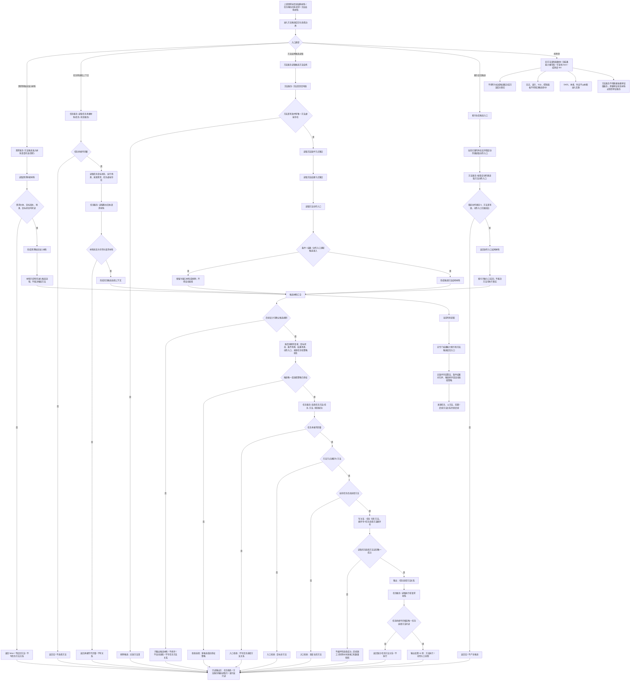

# 方法候选召回与选择代码逻辑流程图

更新时间：2026-07-08

## 依据

```text
AGENTS.md
规范/000_项目规则总纲.md
规范/001_规则迁移清单.md
规范/详细设计/方法系统详细设计.md
规范/详细设计/任务系统详细设计.md
计划/20260707_FS06_方法候选召回与条件结果对拆分设计专项_v0.1.md
实施记录/20260708_应用逻辑流程图迁移顺序信息数据.md
实施记录/20260706_FS06_方法系统入口只读扫描记录.md
流程图/20260708_方法结构代码逻辑流程图_v0.1.md
海中鱼巣/领域/需求服务.h
海中鱼巣/领域/任务服务.h
海中鱼巣/领域/方法服务.h
```

## 说明

本图是第 10 项“方法候选召回与选择流程”的代码逻辑流程图，承接第 9 项已生成的“方法结构”流程图。

本图只表达当前已落代码、候选材料门禁和后续设计边界。当前代码已有需求侧方法候选准入材料可读、任务侧选择任务方法关系、执行桥请求材料读取、方法侧方法首 / 条件 / 结果 / 动作入口结构读取；但尚未实现专门的方法候选召回算法、结果能力索引、条件结果对归并、候选排序、自动选择策略或方法学习。

本图不确认上一份流程图，不生成详细设计，不生成施工计划，不登记可执行队列，不构成代码实施许可。

## 流程图



## 关键边界

```text
当前需求服务只提供 `方法候选准入材料是否可读`，其含义是需求承接材料可读，不等于已召回方法。
当前任务服务已有 `选择任务方法` 和 `读取任务选择方法`，任务选择方法关系是后续方法执行权限依据。
当前 `选择任务方法` 只校验任务承接壳完整、目标节点为方法、当前任务尚无选择方法；它不证明候选算法、排序策略或条件满足。
当前方法服务可读取方法首、条件节点、结果节点、条件 / 结果场景、动作入口和稳定动作键动作入口，但没有结果能力索引和候选排序算法。
索引仓库在本图中只可作为候选入口或稳定动作键读取材料，不裁决方法可执行事实。
候选召回结果、缓存命中、统计次数、显示文本和 SQL 投影都不能成为任务选择方法的权威依据。
自动选择必须另有后续设计确认；没有唯一候选或授权策略时不得写任务选择方法关系。
本图不接 SQL、控制面板、D455、体素或外设。
```

## 当前代码差距

```text
当前没有专门的“按目标状态 / 结果能力召回方法”入口。
当前没有条件判定索引、结果能力索引、结果初始状态组、来源任务、父方法、前置方法、后续方法的已落代码入口。
当前没有条件结果对归并、复现评分、方法学习、候选排序或自动选择策略。
当前 `选择任务方法` 是写入当前任务方法关系的保守入口，不证明候选方法满足需求目标。
当前流程图只生成流程图依据，不生成详细设计、待确认计划或代码实施许可。
```

## 后续产物

```text
本图可作为后续“方法候选召回与条件结果对详细设计”或后续施工计划候选的输入材料。
下一份流程图按迁移顺序应进入第 11 项：方法执行 / 动作入口流程。
若进入代码实施，必须另建待确认施工计划，明确允许文件、禁止文件、入口拒绝、失败收口、读回验证和完成声明边界。
```
