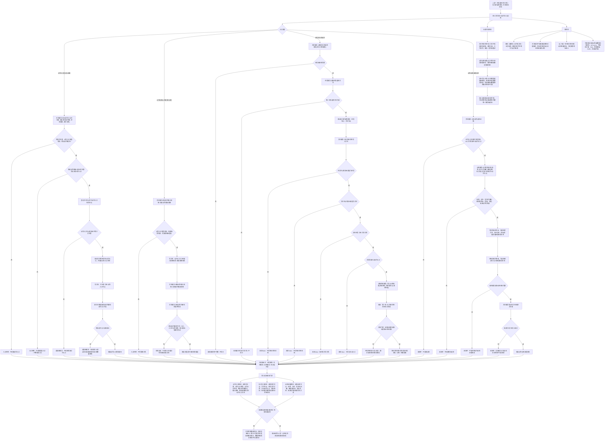

# 方法执行动作入口代码逻辑流程图

更新时间：2026-07-08

## 依据

```text
AGENTS.md
计划/计划索引.md
规范/000_项目规则总纲.md
规范/001_规则迁移清单.md
规范/动作入口规范.md
规范/详细设计/动作入口详细设计.md
实施记录/20260708_应用逻辑流程图迁移顺序信息数据.md
实施记录/20260706_FS07_动作动态因果入口只读扫描记录.md
实施记录/20260707_FS07_动作动态因果入口增强S1-S4代码实施_Codex断点清单.md
流程图/20260708_方法结构代码逻辑流程图_v0.1.md
流程图/20260708_方法候选召回与选择代码逻辑流程图_v0.1.md
海中鱼巣/领域/任务服务.h
海中鱼巣/领域/方法服务.h
海中鱼巣/领域/特征服务.h
海中鱼巣/领域/动态服务.h
```

## 说明

本图是第 11 项“方法执行 / 动作入口流程”的代码逻辑流程图，承接第 10 项输出的任务选择方法关系和执行桥请求材料。

本图只覆盖当前第一轮动作入口结构准入、执行桥请求读取、特征状态材料写入入口、动作动态证据记录入口和拒绝边界。当前代码已有动作入口登记 / 读取、稳定动作键读取、输入 / 输出规格绑定与读取、本能动作注册材料复核、任务执行桥请求材料读取、方法服务经特征服务写 I64 特征状态材料、方法服务经动态服务记录动作动态证据等入口；但尚未实现真实线程调度、工作队列、外部执行器、本能动作函数分派、取消 / 超时 / 重试、任务结果回写、需求结算或稳定因果结论。

本图生成后已按最新口径直接生成对应详细设计；流程图本身不生成施工计划，不登记可执行队列，不构成代码实施许可。

## 流程图



## 关键边界

```text
当前动作入口第一轮使用 `节点类型::方法` 的动作入口角色节点、动作入口角色状态、动作入口状态、方法首到动作入口的引用关系和稳定动作键索引承载。
稳定动作键只用于定位动作入口候选，不裁决动作事实，不替代方法条件、任务方法关系或动作动态证据。
当前任务执行桥请求材料只证明任务承接壳完整且唯一任务选择方法可读，不等于真实执行分派已经发生。
当前 `方法服务::执行特征状态写入方法` 的权限前置为有效任务、有效方法、任务到方法引用关系和主动动作入口；写入必须经 `特征服务`，不得由方法服务直接依赖特征值服务。
当前 `方法服务::记录动作动态证据` 只在动作入口归属有效且主动入口成立后调用动态服务记录实例动态；动作动态是证据材料，不是任务完成、需求满足或稳定因果结论。
当前 `动态服务::记录实例动态` 会读回场景、主体、被改变目标、前后值、发生时间戳和来源动作；来源方法关系仍需按路径纳入后续最小读回验证。
线程、函数名、动作文本、日志、显示、SQL 投影、控制面板输出都不能成为动作身份、动作来源或方法成功依据。
本图不接 SQL、控制面板、D455、体素或外设。
```

## 当前代码差距

```text
当前没有真实线程调度、工作队列、std::async、外部执行器、本能动作函数指针注册表、取消、超时或重试。
当前没有把执行写入结果回写为任务实际结果状态，也不生成需求结算记录。
当前没有动作验证报告、预测 / 实际偏差、回读置信度、执行报告值或事实提交等级的权威结构。
当前动作动态证据和轻量因果仍分层；不得把单条动态或单个因果引用解释为稳定因果结论。
当前多步写入路径已有入口拒绝、追根因解决和部分读回复核，但尚未证明完整事务回滚、显式失效隔离或数量快照级半结构不可读。
当前流程图的最小读回验证是后续详细设计 / 施工计划门禁，不宣称每个当前函数内部都已具备统一事务级读回验证。
当前流程图只作为详细设计依据；已生成的对应详细设计仍不等于待确认计划或代码实施许可。
```

## 后续产物

```text
本图已作为 `规范/详细设计/方法执行动作入口代码逻辑详细设计.md` 的输入材料；该详细设计后续确认前不生成施工计划候选。
下一份流程图按迁移顺序应进入第 12 项：动态记录 / 输出结果场景流程。
若进入代码实施，必须另建待确认施工计划，明确允许文件、禁止文件、入口拒绝、追根因解决收口、读回验证和完成声明边界。
```
## 中途非成功返回二分口径

本文件按 2026-07-09 硬规则修订：中途非成功返回只分为 `追根因解决` 和 `逻辑内返回`。

- `追根因解决`：前置条件已经满足，并进入创建、绑定、写关系、写状态、记录动态、结算、读回或结构承载后，结果不符合内部预期；必须停止依赖路径，定位根因，当前未证明完整回滚时登记事务隔离缺口或半结构隔离缺口。
- `逻辑内返回`：领域协议允许的拒绝、候选为空、请求材料返回或人读材料返回；必须保证结构不变化，且返回材料、日志、回执、显示或控制台输出不裁决机器事实。
