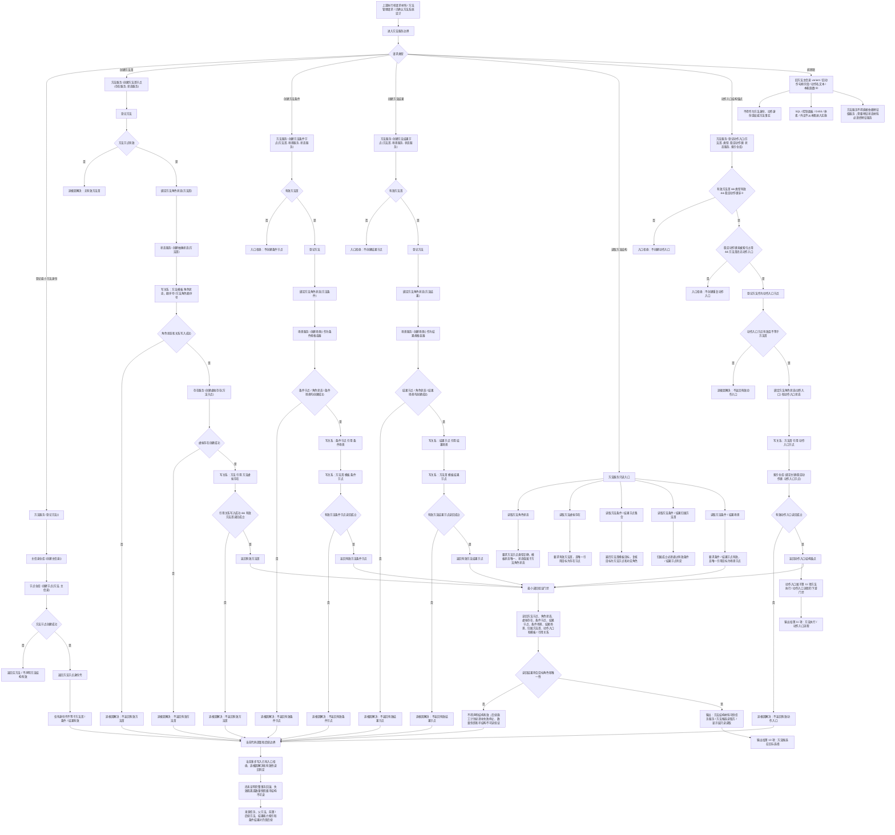

# 方法结构代码逻辑流程图

更新时间：2026-07-08

## 依据

```text
AGENTS.md
规范/0050_项目通用机器逻辑与禁止性规则总纲_20260721.md
规范/规范目录.md
规范/3300_根规范_方法_20260720.md
规范/5300_子规范_方法登记选择与执行规则_20260720.md
规范/5320_子规范_本能函数实现与返回边界_20260720.md
规范/详细设计/方法系统详细设计.md
实施记录/20260708_应用逻辑流程图迁移顺序信息数据.md
实施记录/20260706_FS06_方法系统入口只读扫描记录.md
实施记录/20260707_FS06_方法服务角色与条件结果读取S1-S4代码实施_Codex断点清单.md
流程图/20260708_任务状态机筹办执行桥请求代码逻辑流程图_v0.1.md
海中鱼巣/领域/方法服务.h
```

## 说明

本图是第 9 项“方法结构流程”的代码逻辑流程图，承接第 8 项已确认的执行桥请求材料。

本图主线只覆盖方法首、方法条件、方法结果、方法角色状态、方法虚拟存在、条件 / 结果规格场景和动作入口结构锚点。当前代码已经提供方法角色创建与读取、条件 / 结果节点集合读取、条件 / 结果场景读取、方法虚拟存在唯一读取、动作入口登记与读取、动作动态证据入口和特征状态写入方法入口；但本图不把方法候选召回、任务选择算法、条件结果对归并、方法学习、完整动作执行或动态结果回写纳入第 9 项完成范围。

本图已有对应详细设计，但不生成施工计划，不登记可执行队列，不构成代码实施许可。

## 流程图



## 关键边界

```text
当前 `登记方法` 只创建 `节点类型::方法` 身份壳，不等于有效方法首、条件节点或结果节点。
当前有效方法首要求方法角色状态为方法首，且存在唯一方法虚拟存在引用。
当前有效方法条件节点要求方法首有效、条件节点角色为方法条件、方法首到条件节点存在模板关系，并且条件节点唯一引用条件场景。
当前有效方法结果节点要求方法首有效、结果节点角色为方法结果、方法首到结果节点存在模板关系，并且结果节点唯一引用结果场景。
当前动作入口结构锚点已经存在于方法服务，但本图只把它作为下游动作入口流程门禁，不展开方法执行、动作动态或特征状态写入。
当前 `执行特征状态写入方法` 和 `记录动作动态证据` 属于第 11 项及后续动态结果链路，不作为本图主干完成范围。
方法服务不得直接依赖特征值服务；高级服务需要特征状态材料必须经特征服务。
线程、日志、控制台输出、显示标题、SQL 投影和控制面板不得成为方法事实、动作来源或方法成功依据。
本图不接 SQL、控制面板、D455、体素或外设。
```

## 当前代码差距

```text
当前多步写入路径已有入口拒绝、追根因解决和有效性读回判定，但尚未证明完整事务回滚、显式失效隔离或数量快照级半结构不可读。
当前流程图的最小读回验证是后续详细设计 / 施工计划门禁，不宣称每个当前函数内部都已具备统一事务级读回验证。
当前来源任务、父方法、前置方法、后续方法、条件判定索引、结果初始状态、结果能力索引、条件结果对和方法学习仍未纳入本图实施范围。
当前动作入口已有结构锚点，但完整方法执行、动作动态、任务结果回写和需求结算仍属于后续流程图。
当前流程图已有对应详细设计，但不生成待确认计划或代码实施许可。
```

## 后续产物

```text
本图可作为后续“方法结构详细设计重审”或后续施工计划候选的输入材料。
下一份流程图按迁移顺序应进入第 10 项：方法候选召回与选择流程。
若进入代码实施，必须另建待确认施工计划，明确允许文件、禁止文件、入口拒绝、追根因解决收口、读回验证和完成声明边界。
```
## 中途非成功返回二分口径

本文件按 2026-07-09 硬规则修订：中途非成功返回只分为 `追根因解决` 和 `逻辑内返回`。

- `追根因解决`：前置条件已经满足，并进入创建、绑定、写关系、写状态、记录动态、结算、读回或结构承载后，结果不符合内部预期；必须停止依赖路径，定位根因，当前未证明完整回滚时登记事务隔离缺口或半结构隔离缺口。
- `逻辑内返回`：领域协议允许的拒绝、候选为空、请求材料返回或人读材料返回；必须保证结构不变化，且返回材料、日志、回执、显示或控制台输出不裁决机器事实。
