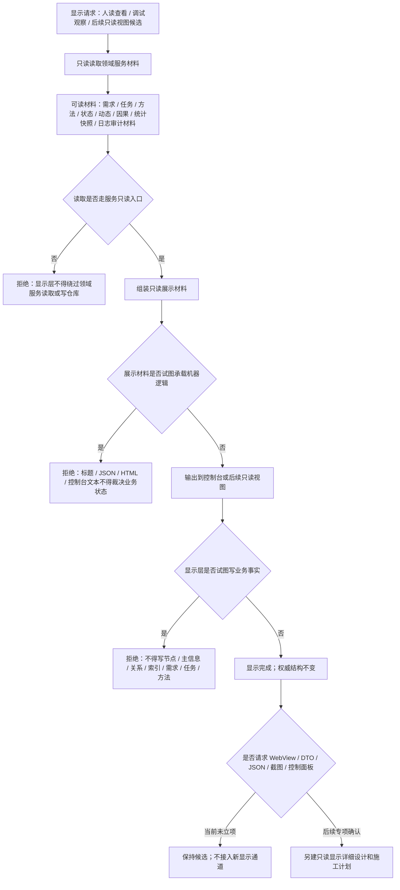

# 显示层只读代码逻辑流程图 v0.1

更新时间：2026-07-08

## 依据

```text
AGENTS.md
计划/计划索引.md
规范/0050_项目通用机器逻辑与禁止性规则总纲_20260721.md
规范/规范目录.md
规范/4010_子规范_统一仓库稳定句柄与通用关系索引边界.md
规范/4060_子规范_非权威缓存统计失效与确定重建.md
实施记录/20260708_应用逻辑流程图迁移顺序信息数据.md
实施记录/20260706_FS10_显示层只读候选只读扫描记录.md
实施记录/20260707_FS10_显示层只读视图增强S0当前代码事实扫描_Codex断点清单.md
```

## 说明

本图是显示层只读候选的代码逻辑边界图。当前没有独立显示层只读视图服务文件；当前控制台 `std::cout` 自检输出只能作为人读诊断，不能当作显示层只读视图能力完成。

## 流程图



## 关键边界

```text
显示层只读，不写机器事实。
控制台输出、日志、HTML、JSON、截图和显示标题只做人读材料。
显示层不得绕过领域服务写节点仓库、主信息仓库、关系仓库或索引仓库。
当前没有 DTO / JSON / WebView / 窗口 / 截图 / 控制面板接入口。
```

## 当前代码差距

```text
当前没有独立显示层只读视图服务。
当前只有控制台自检输出，不能声明显示层只读视图完成。
当前没有跨服务只读 DTO、稳定显示契约或显示层验收入口。
```

## 后续产物

```text
可作为显示层只读详细设计输入。
若进入显示层实现，必须另建待确认施工计划，明确只读入口、禁止写入、展示字段来源和结构不变验证。
```
