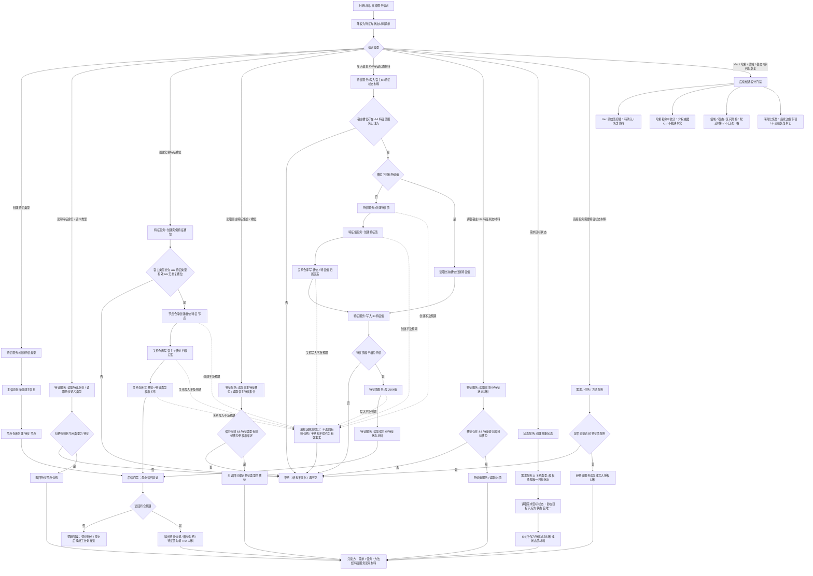

# 特征与状态材料代码逻辑流程图

更新时间：2026-07-08

## 依据

### 已确认 / 已验证依据

```text
AGENTS.md
规范/0050_项目通用机器逻辑与禁止性规则总纲_20260721.md
规范/规范目录.md
规范/4030_子规范_基础信息服务分层与领域写授权.md
规范/详细设计/特征服务封口增强详细设计.md
规范/1130_根规范_特征节点_20260720.md
规范/1160_根规范_状态节点_20260720.md
规范/4110_子规范_特征节点实现与字段边界_20260720.md
规范/4140_子规范_枚举型实例特征值合法来源_20260720.md
实施记录/20260708_应用逻辑流程图迁移顺序信息数据.md
实施记录/20260707_FS03_特征服务封口增强S1代码实施_Codex断点清单.md
实施记录/20260707_FS03_特征服务封口增强S2代码实施_Codex断点清单.md
实施记录/20260707_FS03_特征服务封口增强S3代码实施_Codex断点清单.md
实施记录/20260707_FS03_特征服务封口增强S4代码实施_Codex断点清单.md
海中鱼巣/领域/特征服务.h
海中鱼巣/领域/特征值服务.h
海中鱼巣/领域/状态服务.h
海中鱼巣/领域/需求服务.h
```

### 后续候选依据

```text
规范/详细设计/特征值Vec原始值容器详细设计.md：已生成详细设计 / 待确认 / 未改代码
规范/详细设计/特征值非权威缓存与内容哈希详细设计.md：已生成详细设计 / 待确认 / 未改代码
规范/详细设计/特征值值域稳态与候选比较详细设计.md：已生成详细设计 / 待确认 / 未改代码
```

## 说明

本图是第 4 项“特征与状态材料流程”的代码逻辑流程图，承接第 3 项基础信息入账图中转出的“特征 / 特征值 / 特征状态材料”分支。

本图只表达当前已确认和已验证的第一轮代码逻辑：特征身份读取、实例特征槽位、I64 特征状态材料、特征值服务封口、目标状态与 I64 材料边界。Vec 原始值容器、内容哈希、命中统计、值域、稳态、区间升格和序列化恢复仍是后续候选或待确认设计，不在本图中生成代码实施许可。

本次确认范围仅限第 4 项“特征与状态材料流程”的代码逻辑流程图材料；可作为后续“特征与状态材料详细设计”或“特征值系统第二轮确认”的输入，不构成代码实施许可。

本流程图本身不产生新的构建、运行或依赖扫描验证；当前可引用验证仅限 FS-03 S1-S4 已完成并验证的第一轮入口。FS-03 当前为专项计划已确认、S0 完成、S1-S4 代码实施切片已确认并验证；仍未迁移旧函数。

## 流程图



## 关键边界

```text
特征服务是唯一对外特征值访问入口；特征值服务只作为特征服务内部依赖。
需求服务、任务服务、方法服务不得直接包含、接收或调用特征值服务。
I64 只作为第一轮特征状态材料或状态值材料，不得作为需求目标对外语义。
需求目标状态当前由 需求节点 -> 目标状态节点 的 `关系类型::模板` 承载；读取时必须复核目标节点为 状态，且目标状态唯一；“目标状态关系”是语义口径，不表示已新增独立关系枚举。
实例特征槽位第一轮复用 特征 节点，并由 宿主->槽位 归属关系、槽位->特征类型 模板关系承载。
宿主 I64 特征状态材料写入必须先找到宿主槽位，再找或创建槽位归属特征值，最后经特征值服务内部入口写 I64。
非归属特征值写入和读取必须拒绝，拒绝后节点、主信息、关系、索引和既有 I64 材料不变。
当前多步创建路径只能确认失败不返回有效句柄、半结构不得作为有效事实；若要声明失败后节点 / 主信息 / 关系物理数量完全不变，必须另有事务回滚或补偿验证。
最小读回验证是后续详细设计 / 施工计划门禁要求；本图不证明所有当前写入口已经内置统一读回验证。
第一轮 `读取特征语义类型` 等同于 `读取特征身份` 复核 / 命名材料入口，不代表完整特征语义类型系统已实现。
Vec 原始值容器、内容哈希、命中统计、值域、稳态、区间升格和序列化恢复不在当前第一轮代码逻辑中实现。
内容哈希和命中统计只作候选或缓存，不裁决需求满足、任务完成、方法成功或世界事实。
值域、复合比较、稳态和区间升格只作候选材料，升格为二次特征、状态或抽象材料必须另建切片确认。
控制面板、SQL、ADO、D455、体素和外设不得从本流程图自动进入计划或代码实施。
```

## 当前代码差距

```text
当前 I64 特征状态材料第一轮入口已通过 FS-03 S1-S4 默认入口验证，但不代表完整特征系统完成。
当前 `读取特征语义类型` 直接返回 `读取特征身份`，只能作为第一轮身份复核 / 命名材料入口。
当前读取宿主当前特征值会返回槽位下第一个特征值；当前值唯一性治理仍需后续专项，不得据此宣称完整当前值系统已完成。
当前特征值服务 public 入口第一轮保持现状；治理目标是外部业务服务不得直接依赖它，不是已经完成所有 public 入口收束。
当前 Vec 原始值容器、内容哈希、命中统计、值域稳态、序列化恢复均未落代码。
当前多步写入路径存在先创建节点、再写关系、关系追根因解决空的代码形态；本图不得扩大声明为已经具备完整事务回滚。
当前多步写入路径已有入口拒绝和追根因解决，但尚未证明完整事务回滚、失效隔离或数量快照级半结构不可读；后续详细设计或施工计划必须补读回验证、数量快照和失败停止门禁。
当前最小读回验证只表达流程图门禁要求，不证明所有当前函数已内置统一读回。
当前可引用验证仅限 FS-03 S1-S4 第一轮入口；本流程图未运行构建、未运行默认入口、未运行依赖扫描。
当前图已有对应详细设计，但不生成待确认计划或代码实施许可。
```

## 后续产物

```text
本图可作为后续“特征与状态材料详细设计”或“特征值系统第二轮确认”材料。
若进入代码实施，必须另建待确认施工计划，明确允许文件、禁止文件、入口拒绝、追根因解决收口、读回验证和完成声明边界。
```
## 中途非成功返回二分口径

本文件按 2026-07-09 硬规则修订：中途非成功返回只分为 `追根因解决` 和 `逻辑内返回`。

- `追根因解决`：前置条件已经满足，并进入创建、绑定、写关系、写状态、记录动态、结算、读回或结构承载后，结果不符合内部预期；必须停止依赖路径，定位根因，当前未证明完整回滚时登记事务隔离缺口或半结构隔离缺口。
- `逻辑内返回`：领域协议允许的拒绝、候选为空、请求材料返回或人读材料返回；必须保证结构不变化，且返回材料、日志、回执、显示或控制台输出不裁决机器事实。
