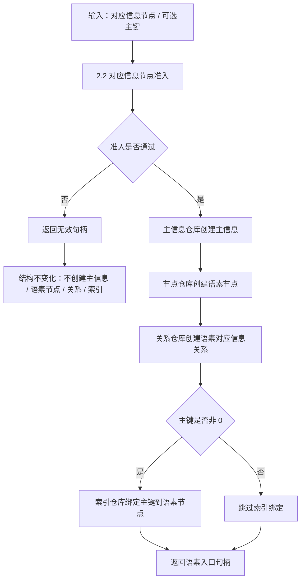

# 2.3 语素入口创建子流程图

更新时间：2026-07-08

## 依据

```text
海中鱼巣/领域/语素服务.h
海中鱼巣/入口.cpp
```

## 说明

本子流程表达 `语素服务::创建语素入口` 的代码逻辑。它只在对应信息节点准入通过后写结构。

## 流程图



## 关键边界

```text
创建入口前必须先排除不可绑定节点。
语素入口写入结构为主信息、语素节点、语素对应信息关系和可选主键索引。
本流程不解析文本、不创建概念追溯、不自动创建对应信息节点。
```
