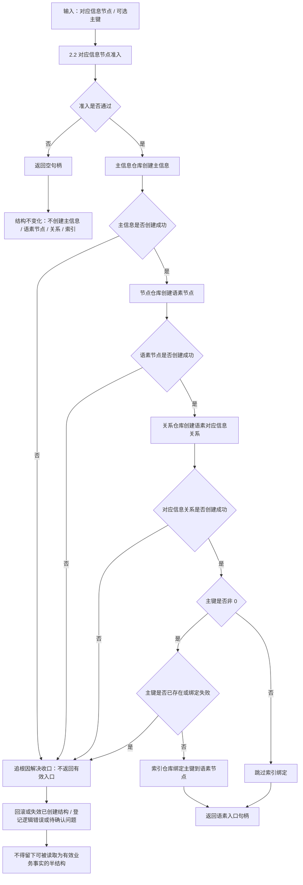

# 2.3 语素入口创建子流程图

更新时间：2026-07-08

## 依据

```text
海中鱼巣/领域/语素服务.h
海中鱼巣/入口.cpp
```

## 说明

本子流程表达 `语素服务::创建语素入口` 的代码逻辑。它只在对应信息节点准入通过后写结构。

## 流程图



## 关键边界

```text
创建入口前必须先排除不可绑定节点。
语素入口写入结构为主信息、语素节点、语素对应信息关系和可选主键索引。
本流程不解析文本、不创建概念追溯、不自动创建对应信息节点。
任一写入步骤失败时，必须追根因解决收口，不返回有效语素入口。
主键索引按唯一主键处理；主键已存在或索引绑定失败时不得返回“入口有效但索引失败”的半结构，除非后续详细设计显式改口径。
当前图给出目标追根因解决收口规则；若当前代码未完整实现回滚或失效，详细设计必须列为缺口。
```
## 中途非成功返回二分口径

本文件按 2026-07-09 硬规则修订：中途非成功返回只分为 `追根因解决` 和 `逻辑内返回`。

- `追根因解决`：前置条件已经满足，并进入创建、绑定、写关系、写状态、记录动态、结算、读回或结构承载后，结果不符合内部预期；必须停止依赖路径，定位根因，当前未证明完整回滚时登记事务隔离缺口或半结构隔离缺口。
- `逻辑内返回`：领域协议允许的拒绝、候选为空、请求材料返回或人读材料返回；必须保证结构不变化，且返回材料、日志、回执、显示或控制台输出不裁决机器事实。
