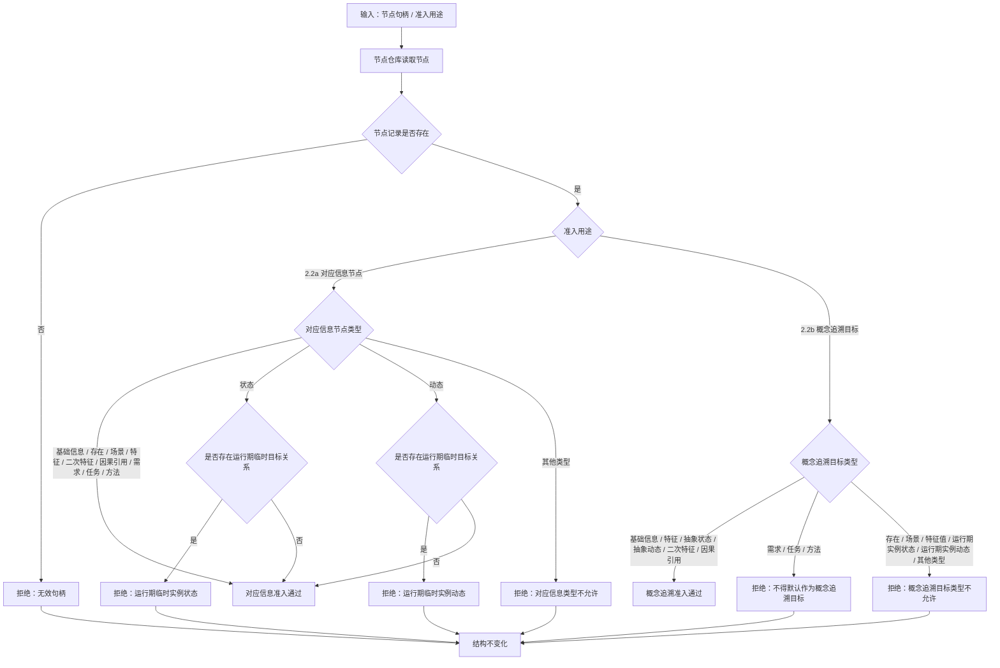

# 2.2 语素对应信息与概念追溯目标准入子流程图

更新时间：2026-07-08

## 依据

```text
AGENTS.md
海中鱼巣/领域/语素服务.h
规范/0050_项目通用机器逻辑与禁止性规则总纲_20260721.md
规范/2210_根规范_语素入口_20260720.md
规范/4050_子规范_入口拒绝逻辑内结果与内部逻辑错误.md
规范/7200_子规范_基础信息语素信息关系整合_20260720.md
规范/7210_子规范_信息入口类型与信息存储树路由_20260720.md
```

## 说明

本子流程拆成 2.2a 和 2.2b：对应信息节点准入用于 `语素对应信息` 关系，概念追溯目标准入用于 `语素概念追溯` 关系。

当前代码中 `创建概念入口` 复用了 `节点是可绑定信息`；本图按迁移设计口径收紧概念追溯目标。若当前代码与本图不一致，后续详细设计必须登记为缺口，不得直接生成施工计划。

## 流程图



## 关键边界

```text
准入对象必须是已有节点。
语素服务不得为了绑定而自动创建基础信息、需求、任务或方法。
特征值节点不在允许类型中，必须拒绝。
实例状态和实例动态是场景内临时零散节点，不得作为语素入口对应信息。
概念追溯目标默认收紧到基础信息类抽象材料，不默认允许需求、任务、方法作为概念节点。
如后续确需需求 / 任务 / 方法作为高级语义追溯目标，必须在详细设计中显式确认，且不得新增“高级信息”节点类型。
```
