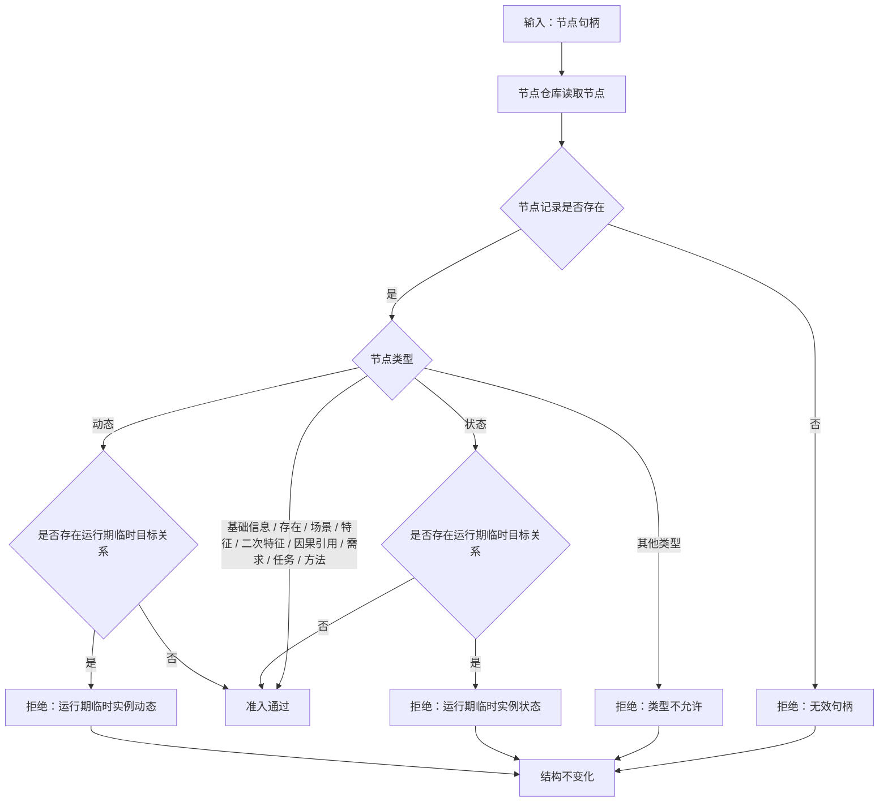

# 2.2 语素对应信息节点准入子流程图

更新时间：2026-07-08

## 依据

```text
海中鱼巣/领域/语素服务.h
规范/000_项目规则总纲.md
```

## 说明

本子流程表达 `节点是可绑定信息` 的准入逻辑：语素入口只能绑定已有允许信息节点，不能绑定特征值、运行期临时实例状态或运行期临时实例动态。

## 流程图



## 关键边界

```text
准入对象必须是已有节点。
语素服务不得为了绑定而自动创建基础信息、需求、任务或方法。
特征值节点不在允许类型中，必须拒绝。
实例状态和实例动态是场景内临时零散节点，不得作为语素入口对应信息。
```
