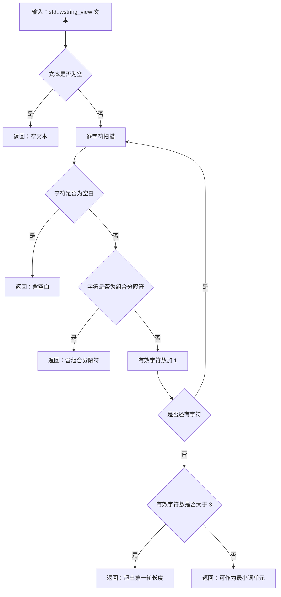

# 2.1 语素文本准入子流程图

更新时间：2026-07-08

## 依据

```text
海中鱼巣/领域/语素服务.h
海中鱼巣/入口.cpp
```

## 说明

本子流程只表达 `语素服务::判断文本是否可作为最小词单元` 的代码逻辑。它不创建语素入口，不写节点、主信息、关系或索引。

## 流程图



## 关键边界

```text
文本准入只返回准入状态，不写任何机器事实。
拒绝结果用于追溯外部材料来源，不在本函数内部兜底修复文本。
第一轮长度上限为 3，是当前代码事实，不扩大解释为完整自然语言理解能力。
组合分隔符集合以当前 `语素服务::字符是组合分隔符` 代码事实为准；后续详细设计需列出第一轮分隔符集合并避免散落定义。
```
