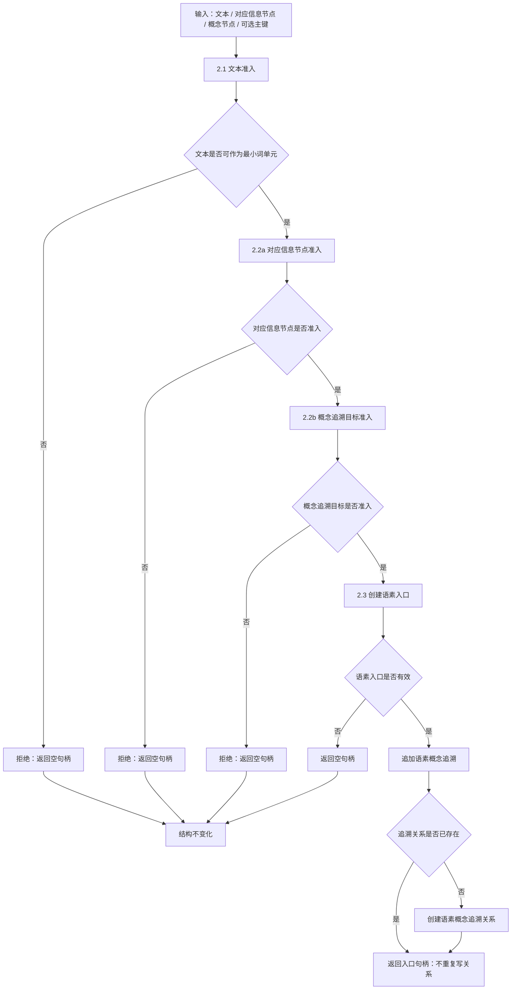

# 2.4 语素概念入口与追溯组合流程图

更新时间：2026-07-08

## 依据

```text
海中鱼巣/领域/语素服务.h
海中鱼巣/入口.cpp
```

## 说明

本子流程表达 `语素服务::创建概念入口` 的组合代码逻辑。它已经包含文本准入、对应信息节点准入、概念追溯目标准入、语素入口创建和概念追溯追加；总览图不得在调用 2.4 前再次单独调用 2.3。

## 流程图



## 关键边界

```text
文本不合法时不能创建入口。
对应信息节点或概念追溯目标不合法时不能创建入口。
创建语素入口失败后不能继续追加概念追溯。
概念追溯是关系材料，不是稳定概念裁决或自然语言理解完成。
本流程是创建概念入口组合流程，不是单纯追加追溯流程；已有入口追加追溯走 2.5。
```
## 中途非成功返回二分口径

本文件按 2026-07-09 硬规则修订：中途非成功返回只分为 `追根因解决` 和 `逻辑内返回`。

- `追根因解决`：前置条件已经满足，并进入创建、绑定、写关系、写状态、记录动态、结算、读回或结构承载后，结果不符合内部预期；必须停止依赖路径，定位根因，当前未证明完整回滚时登记事务隔离缺口或半结构隔离缺口。
- `逻辑内返回`：领域协议允许的拒绝、候选为空、请求材料返回或人读材料返回；必须保证结构不变化，且返回材料、日志、回执、显示或控制台输出不裁决机器事实。
