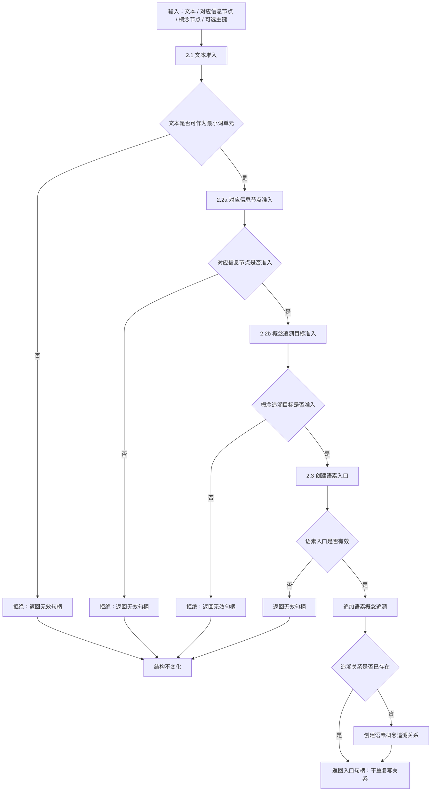

# 2.4 语素概念入口与追溯组合流程图

更新时间：2026-07-08

## 依据

```text
海中鱼巣/领域/语素服务.h
海中鱼巣/入口.cpp
```

## 说明

本子流程表达 `语素服务::创建概念入口` 的组合代码逻辑。它已经包含文本准入、对应信息节点准入、概念追溯目标准入、语素入口创建和概念追溯追加；总览图不得在调用 2.4 前再次单独调用 2.3。

## 流程图



## 关键边界

```text
文本不合法时不能创建入口。
对应信息节点或概念追溯目标不合法时不能创建入口。
创建语素入口失败后不能继续追加概念追溯。
概念追溯是关系材料，不是稳定概念裁决或自然语言理解完成。
本流程是创建概念入口组合流程，不是单纯追加追溯流程；已有入口追加追溯走 2.5。
```
