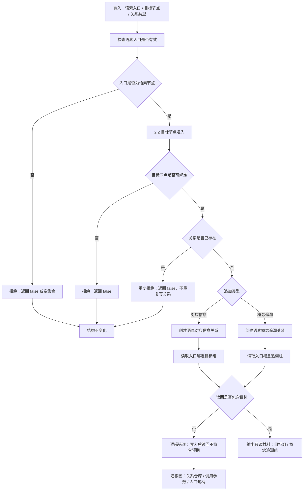

# 2.5 语素追加关系与读回验证子流程图

更新时间：2026-07-08

## 依据

```text
海中鱼巣/领域/语素服务.h
海中鱼巣/入口.cpp
规范/000_项目规则总纲.md
```

## 说明

本子流程表达 `追加语素对应信息`、`追加语素概念追溯`、`读取入口绑定目标组` 和 `读取入口概念追溯组` 的代码逻辑。

## 流程图



## 关键边界

```text
追加关系前必须先确认入口是语素节点。
目标节点仍必须满足可绑定信息准入。
重复关系不重复写入，不把重复请求当新事实。
读回不符合预期时是逻辑错误，不能静默吞掉后继续生成详细设计或施工计划。
读取目标组和概念追溯组只是只读材料，不写业务事实。
```
