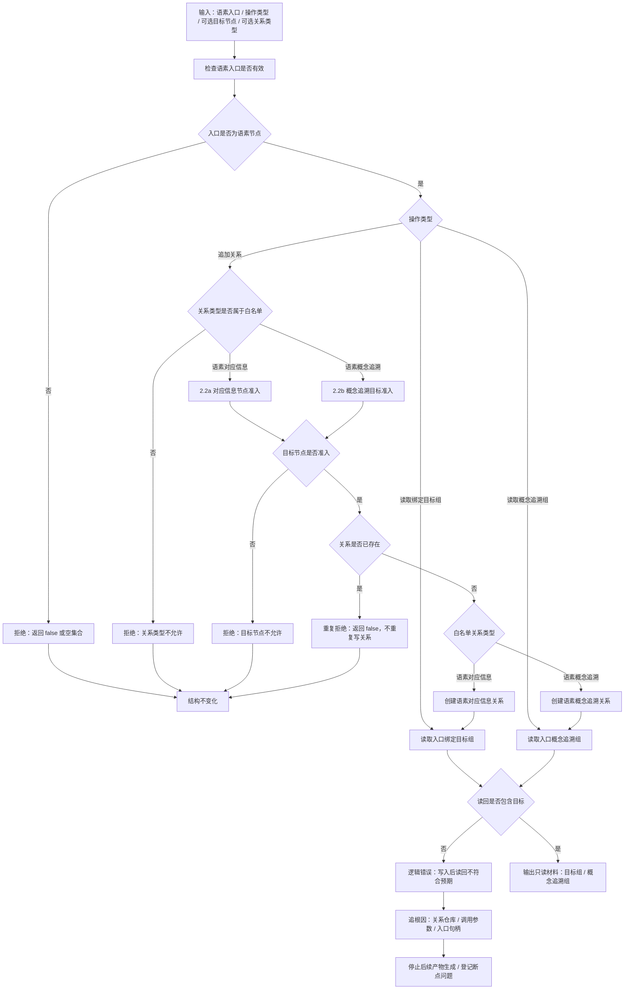

# 2.5 语素追加关系与读回验证子流程图

更新时间：2026-07-08

## 依据

```text
海中鱼巣/领域/语素服务.h
海中鱼巣/入口.cpp
规范/000_项目规则总纲.md
```

## 说明

本子流程表达 `追加语素对应信息`、`追加语素概念追溯`、`读取入口绑定目标组` 和 `读取入口概念追溯组` 的代码逻辑。

## 流程图



## 关键边界

```text
追加关系前必须先确认入口是语素节点。
关系类型白名单只允许语素对应信息和语素概念追溯。
语素对应信息关系使用 2.2a 对应信息节点准入；语素概念追溯关系使用 2.2b 概念追溯目标准入。
重复关系不重复写入，不把重复请求当新事实。
读回不符合预期时是逻辑错误，不能静默吞掉后继续生成详细设计或施工计划。
读回不符合预期时，必须停止后续流程图推进、登记断点问题、追溯关系仓库 / 调用参数 / 入口句柄，不生成施工计划或代码实施候选。
读取目标组和概念追溯组只是只读材料，不写业务事实。
```
## 中途非成功返回二分口径

本文件按 2026-07-09 硬规则修订：中途非成功返回只分为 `追根因解决` 和 `逻辑内返回`。

- `追根因解决`：前置条件已经满足，并进入创建、绑定、写关系、写状态、记录动态、结算、读回或结构承载后，结果不符合内部预期；必须停止依赖路径，定位根因，当前未证明完整回滚时登记事务隔离缺口或半结构隔离缺口。
- `逻辑内返回`：领域协议允许的拒绝、候选为空、请求材料返回或人读材料返回；必须保证结构不变化，且返回材料、日志、回执、显示或控制台输出不裁决机器事实。
