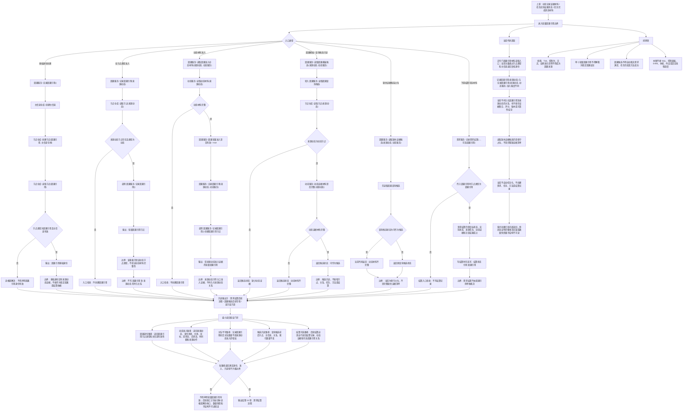

# 轻量因果引用代码逻辑流程图

更新时间：2026-07-08

## 依据

```text
AGENTS.md
计划/计划索引.md
规范/0050_项目通用机器逻辑与禁止性规则总纲_20260721.md
规范/规范目录.md
规范/1190_根规范_因果_20260720.md
规范/4220_子规范_动作动态与因果账本边界_20260720.md
规范/4310_子规范_因果补完与因果信息用法_20260720.md
规范/详细设计/状态动态二次特征因果服务增强详细设计.md
规范/详细设计/因果模板与查询候选详细设计.md
实施记录/20260708_应用逻辑流程图迁移顺序信息数据.md
实施记录/20260707_FS02_状态动态二次特征因果第一轮代码实施_Codex断点清单.md
实施记录/20260707_服务操作函数矩阵第一批代码实施_Codex断点清单.md
实施记录/20260708_BASE-D1_基础信息入账代码实施_Codex断点清单.md
流程图/20260708_任务回执实际结果状态结果回写代码逻辑流程图_v0.1.md
海中鱼巣/领域/因果服务.h
海中鱼巣/领域/动态服务.h
海中鱼巣/领域/需求服务.h
```

## 说明

本图是第 14 项“轻量因果引用流程”的代码逻辑流程图，承接第 13 项任务回执 / 实际结果状态 / 结果回写后的动态证据材料，并为第 15 项需求结算流程提供可选因果引用材料边界。

本图只覆盖当前代码已存在的因果引用基础身份创建、来源动态轻量准入、动态材料准入、因果模板 / 查询候选只读入口和缺失证据候选占位边界。当前代码不持久化“因果引用 -> 来源动态”的关系，不生成稳定因果结论，不自动创建需求、任务、方法或结算记录，也不让单个轻量因果引用裁决需求满足。

本图不确认上一份流程图；已按流程图免确认口径生成对应详细设计，但不生成施工计划，不登记可执行队列，不构成代码实施许可。

## 流程图



## 关键边界

```text
当前 `因果服务::记录因果引用()` 只创建因果引用节点，并在函数内部读回节点类型和主信息有效性。
当前 `因果服务::记录因果引用(来源动态)` 只验证来源动态是动态节点，然后创建因果引用；该重载不验证动态材料完整性。
当前 `因果服务::记录因果引用(来源动态, 动态服务)` 通过 `动态服务::读取动态材料` 做动态材料准入后创建因果引用。
当前轻量因果引用不持久化来源动态关系；入口验证中关系数量不应因来源动态准入而增加。
当前因果模板候选、因果查询候选和缺失证据候选均为只读候选材料，不写结构，不创建任务、方法、需求或结算。
当前缺失证据候选入口仍是保守占位，不是完整缺失证据清单。
当前需求结算可以接收可选因果引用，但仍必须由需求服务自行复核目标状态、实际状态、来源任务、动态证据和结算结果；因果引用不能单独裁决需求满足。
本图不接 SQL、控制面板、D455、体素或外设。
```

## 当前代码差距

```text
当前没有专门的因果引用材料读取入口，不能读出证据集合、来源动态集合、评分、版本或可靠性状态。
当前轻量因果引用只创建节点身份，不持久化来源动态关系。
当前 `记录因果引用(来源动态)` 和 `记录因果引用(来源动态, 动态服务)` 的准入强度不同，后续设计必须明确推荐入口和禁止误用边界。
当前缺失证据候选入口不是完整缺证据结构，只能作为保守候选材料。
当前没有稳定因果结论、因果模板持久化、因果任务化或可靠性评分落代码。
当前不自动创建需求、任务、方法或需求结算记录。
当前多步创建路径已有内部读回和追根因解决，但尚未证明完整事务回滚、显式失效隔离或数量快照级半结构不可读。
当前流程图的最小读回验证是后续详细设计 / 施工计划门禁，不宣称每个当前函数内部都已具备统一事务级读回验证。
当前流程图已生成对应详细设计，但不生成待确认计划或代码实施许可。
```

## 后续产物

```text
本图可作为后续“轻量因果引用详细设计重审”或第 15 项“需求结算流程”的输入材料。
下一份流程图按迁移顺序应进入第 15 项：需求结算流程。
若进入代码实施，必须另建待确认施工计划，明确允许文件、禁止文件、入口拒绝、追根因解决收口、读回验证和完成声明边界。
```
## 中途非成功返回二分口径

本文件按 2026-07-09 硬规则修订：中途非成功返回只分为 `追根因解决` 和 `逻辑内返回`。

- `追根因解决`：前置条件已经满足，并进入创建、绑定、写关系、写状态、记录动态、结算、读回或结构承载后，结果不符合内部预期；必须停止依赖路径，定位根因，当前未证明完整回滚时登记事务隔离缺口或半结构隔离缺口。
- `逻辑内返回`：领域协议允许的拒绝、候选为空、请求材料返回或人读材料返回；必须保证结构不变化，且返回材料、日志、回执、显示或控制台输出不裁决机器事实。
