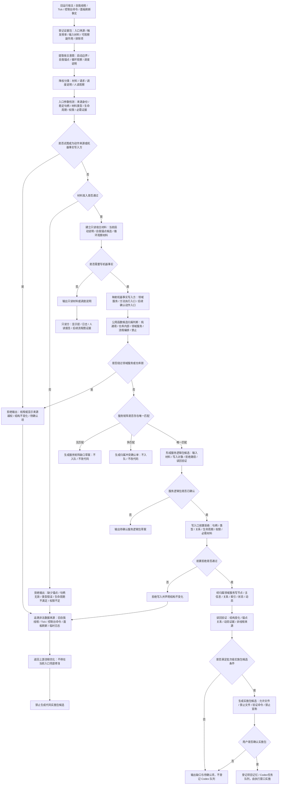

# 运行宿主 / 自我锚点 / 主循环降权边界流程图

更新时间：2026-07-08

## 依据

```text
AGENTS.md
规范/0050_项目通用机器逻辑与禁止性规则总纲_20260721.md
规范/规范目录.md
规范/4030_子规范_基础信息服务分层与领域写授权.md
规范/代码文件建立归属与模块命名规范.md
规范/8100_子规范_自我线程与任务管理线程权责边界_20260720.md
规范/8200_子规范_自我内部循环实现_20260720.md
流程图/20260708_应用逻辑流程图迁移模板_v0.2.md
流程图/20260708_总入口边界权力链流程图_v0.1.md
实施记录/20260708_应用逻辑流程图迁移顺序信息数据.md
实施记录/20260708_应用逻辑流程图草稿提取信息数据.md
```

## 说明

本流程图是应用逻辑流程图迁移顺序中的第 1 项正式流程图产物，用于约束旧运行宿主、自我锚点、Tick、主循环、控制台命令和面板刷新在新项目中的降权边界。

本文件是流程图迁移层文档，不是计划，不登记可执行队列，不形成 C++ 实施许可，不证明自我循环、自我苏醒、真实线程调度或旧项目能力已迁移。

入口参数检测的目标是发现非法数据来源，并把问题返回到上游材料生成、服务调用或流程编排处处理；不得在当前函数内部为非法数据兜底修复。

## 流程图



## 关键边界

```text
本流程图不迁移旧自我线程、旧 Tick、旧控制台命令、旧面板刷新或旧主循环实现。
旧运行宿主事实只能作为材料、请求、调度说明或人读观察，不得成为动作来源。
线程、Tick、控制台命令、面板刷新、日志标签和显示标题不得成为机器事实写入方。
机器事实写入方只能是归属领域服务、方法执行入口或后续已确认的动作入口。
入口参数检测必须发现问题数据来源，不得在当前函数内部兜底修复非法数据。
拒绝路径必须输出拒绝原因、非法来源、待确认项和结构不变化断言。
写机器事实前必须先通过服务矩阵唯一匹配、服务逻辑包确认和写入口前置拒绝。
公用函数候选只按需归属判断，不主动迁移，不主动建立公共工具层。
显示层、日志和控制台只做人读观察，不写业务事实。
第一版不实现真实线程调度、工作队列、std::async、外设等待或并发压力测试。
第一版不接 SQL / 控制面板 / D455 / 体素 / 外设。
控制面板和数据库只作为后置候选，不能自动从旧控制面板、SQL、ADO 事实生成迁移计划。
```

## 结构不变化验收

```text
触发来源试图成为动作来源时：不写节点、不写主信息、不写关系、不写索引、不生成实施包候选。
材料准入失败时：只输出拒绝原因和非法来源追溯点，不创建事实。
服务矩阵无匹配或多匹配时：只生成缺口或冲突确认材料，不入队，不改代码。
服务逻辑包未确认时：只保留待确认草案，不进入实施包层。
写入口前置拒绝未通过时：不写结构，并回溯非法数据来源。
用户未确认批次级代码实施包时：不登记 Codex 任务队列，不进入执行窗口。
```

## 后续产物

```text
下一张正式流程图应切换为代码逻辑流程图：外部材料 / 语素请求准入代码逻辑流程图。
后续第 2 项起不再继续生成同类规范性流程图，而是按旧逻辑入口、当前代码事实、新项目服务承接、参数检测、拒绝路径、写入方和读回验证生成代码逻辑流程图。
后续核心链路仍按 0-20 顺序逐张生成，不自动跳到控制面板、数据库或外设。
```
