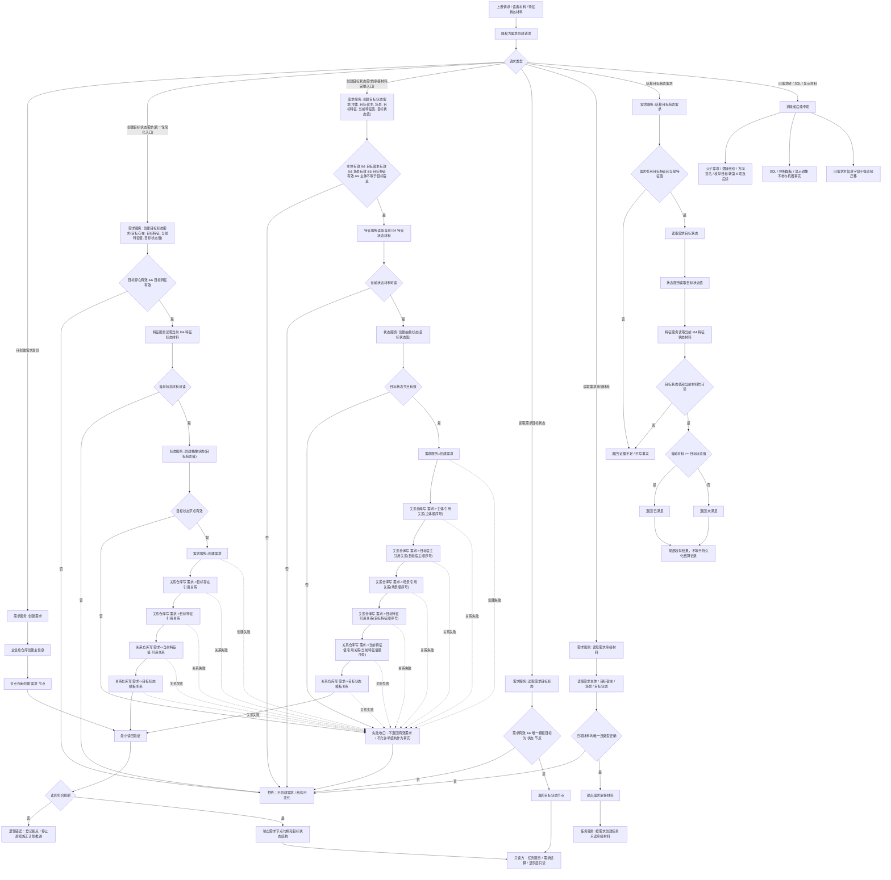

# 需求创建与目标状态代码逻辑流程图

更新时间：2026-07-08

## 依据

```text
AGENTS.md
规范/000_项目规则总纲.md
规范/001_规则迁移清单.md
规范/详细设计/需求目标状态承载详细设计.md
规范/详细设计/服务操作函数矩阵第一批.md
实施记录/20260708_应用逻辑流程图迁移顺序信息数据.md
实施记录/20260706_FS04_需求树入口只读扫描记录.md
计划/20260707_FS04_需求服务目标状态与任务承接材料增强专项_v0.1.md
计划/已完成计划/20260707_FS04_需求服务目标状态与任务承接材料S1-S4代码实施切片_v0.1.md
实施记录/20260707_FS04_需求服务目标状态与任务承接材料S1-S4代码实施_Codex断点清单.md
流程图/20260708_特征与状态材料代码逻辑流程图_v0.1.md
海中鱼巣/领域/需求服务.h
海中鱼巣/领域/状态服务.h
海中鱼巣/领域/特征服务.h
海中鱼巣/领域/任务服务.h
```

## 说明

本图是第 5 项“需求创建与目标状态流程”的代码逻辑流程图，承接第 4 项“特征与状态材料”输出的当前特征状态材料和抽象目标状态材料。

本图只表达当前已确认和已验证的第一轮需求创建逻辑：需求目标必须由目标状态节点和需求到目标状态的模板关系承载；I64 只作为状态服务或特征服务内部状态值材料；任务承接只能读取需求服务提供的主体、目标宿主、场景和目标状态材料。父子需求、逻辑组织需求、方向签名、枚举目标、方法候选、SQL 显示和控制面板均不在本图中实施。

## 流程图



## 关键边界

```text
需求目标是目标状态，不是 I64。
I64 只允许作为状态服务或特征服务内部状态值材料，不得作为需求目标对外语义。
目标状态由状态服务创建抽象状态节点；目标状态本体不携带发生时间戳。
需求到目标状态使用模板关系承载，不能写入旧需求主信息目标字段。
需求主体、目标宿主、场景、目标特征和当前特征值均由需求服务写关系承载，不由调用方隐式补齐事实。
任务服务只能通过需求服务读取需求承接材料，缺主体、目标宿主、场景或目标状态时不得创建任务承接壳。
结算目标状态需求当前只返回局部领域枚举结果，不等于权威需求结算记录；权威结算记录属于后续需求结算流程。
任一必需节点、状态材料或关系写入失败，必须进入失败收口，不得把半结构当作有效需求。
旧需求主信息字段、旧任务列表字段、SQL 投影、控制面板显示和文本语义不得作为机器事实迁移。
父子需求、逻辑组织需求、方向签名、枚举目标、方法候选和需求树结构化更新转第 6 项及后续流程。
```

## 当前代码差距

```text
当前需求目标状态、需求主体、目标宿主、场景和承接材料读取已通过 FS-04 S1-S4 第一轮验证，但不代表完整需求树完成。
当前目标状态比较仍是第一轮固定规则：当前状态材料 >= 目标状态值；不支持任意比较表达式、枚举目标生产者分级或方法候选裁决。
当前创建需求过程对多步写入失败只返回无效句柄，尚未形成完整事务回滚设计；后续详细设计或施工计划需要继续补失败收口和半结构不可读验收。
当前需求结算摘要不作为权威事实；需求结算权威记录转后续需求结算流程。
当前图只生成流程图依据，不生成详细设计、待确认计划或代码实施许可。
```

## 后续产物

```text
本图可作为后续“需求创建与目标状态详细设计”或“需求树后续结构流程图”材料。
下一份流程图按迁移顺序应进入第 6 项：需求树后续结构流程。
若进入代码实施，必须另建待确认施工计划，明确允许文件、禁止文件、入口拒绝、失败收口、读回验证和完成声明边界。
```
