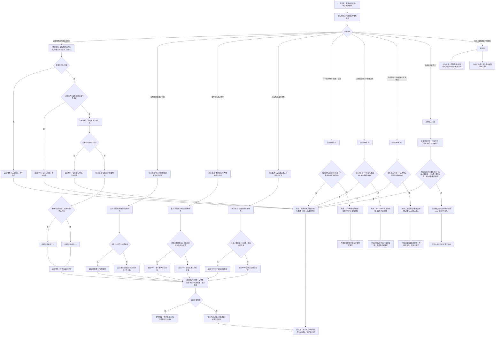

# 需求树后续结构代码逻辑流程图

更新时间：2026-07-08

## 依据

```text
AGENTS.md
规范/000_项目规则总纲.md
规范/001_规则迁移清单.md
规范/详细设计/需求树后续结构详细设计.md
规范/详细设计/服务操作函数矩阵第一批.md
实施记录/20260708_应用逻辑流程图迁移顺序信息数据.md
实施记录/20260707_FS04_需求树入口逻辑迁移包归并表.md
实施记录/20260707_FS04_需求树后续结构拆分设计_Codex断点清单.md
实施记录/20260707_服务操作函数矩阵第一批代码实施_Codex断点清单.md
流程图/20260708_需求创建与目标状态代码逻辑流程图_v0.1.md
海中鱼巣/领域/需求服务.h
```

## 说明

本图是第 6 项“需求树后续结构流程”的代码逻辑流程图，承接第 5 项“需求创建与目标状态”输出的需求节点、目标状态、主体、目标宿主、场景和当前特征状态材料。

本图只表达当前已落代码与已确认候选边界：当前代码已提供需求树后续结构材料读取、结构化更新请求拒绝、枚举目标准入材料可读判断和方法候选准入材料可读判断；父子需求运行时更新、逻辑组织需求、方向签名、枚举目标值域、方法候选算法和结构化更新提交入口均仍是后续候选或待确认施工内容。

本图已有对应详细设计，但不生成施工计划，不登记可执行队列，不构成代码实施许可。

## 流程图



## 关键边界

```text
需求树后续结构当前已落代码只提供材料读取、拒绝判断和候选准入布尔，不等于完整需求树实现。
当前 `读取需求树后续结构材料` 只复核需求节点、可选父需求、自环、目标状态，并以承接材料是否齐全生成第一轮阻塞权重 1 或 0。
当前阻塞权重是第一轮请求材料，不是权威权重系统，不得裁决需求满足、任务完成或方法成功。
当前 `需求树结构化更新请求已拒绝` 只返回拒绝判断，不提交父子关系、不写需求树关系、不写索引。
当前 `枚举目标准入材料是否可读` 只证明目标状态材料可读，不实现枚举目标值域、生产者分级或合法性算法。
当前 `方法候选准入材料是否可读` 只证明需求承接材料可读，不召回方法、不选择方法、不绕过任务方法关系。
父子需求、逻辑组织需求、方向签名、枚举目标、方法候选准入和结构化更新提交仍须另建待确认施工计划后才能进入 C++。
父子关系非法、父子自环、父子成环、阻塞目标无效、方向签名无材料或枚举目标不准入时必须拒绝，拒绝后需求树关系数量、索引数量和需求节点数量不变。
逻辑组织需求仍是需求节点角色或关系材料，不新增“逻辑组织需求”独立节点类型。
旧需求树裸指针、旧主信息字段、旧方向 bool、旧获取途径枚举、SQL 投影和控制面板显示不得作为机器事实迁移。
本图不接 SQL、控制面板、D455、体素或外设。
```

## 当前代码差距

```text
当前代码尚未实现父子需求运行时写入和环路完整检测，只在材料读取入口拒绝父需求等于当前需求。
当前代码尚未实现需求树结构化更新提交入口；请求判定通过不代表会写结构。
当前代码尚未实现逻辑组织角色、获取途径、方向签名、枚举目标值域、生产者分级或方法候选算法。
当前代码尚未实现失败回滚或半结构隔离，因为本图当前已落路径不写需求树关系；后续若新增写入口，必须另建失败收口和读回验证。
当前流程图已有对应详细设计，但不生成待确认计划或代码实施许可。
```

## 后续产物

```text
本图可作为后续“需求树后续结构流程图迁移包确认”或“需求树后续结构施工计划候选”的输入材料。
下一份流程图按迁移顺序应进入第 7 项：任务承接需求流程。
若进入代码实施，必须另建待确认施工计划，明确允许文件、禁止文件、入口拒绝、失败收口、读回验证和完成声明边界。
```
