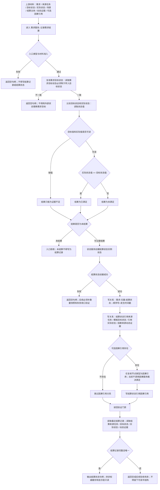

# 需求结算代码逻辑流程图 v0.1

更新时间：2026-07-08

## 依据

```text
AGENTS.md
计划/计划索引.md
规范/000_项目规则总纲.md
规范/001_规则迁移清单.md
实施记录/20260708_应用逻辑流程图迁移顺序信息数据.md
规范/详细设计/需求结算记录详细设计.md
流程图/20260708_轻量因果引用代码逻辑流程图_v0.1.md
流程图/20260708_任务回执实际结果状态结果回写代码逻辑流程图_v0.1.md
海中鱼巣/领域/需求服务.h
```

## 说明

本图只表达当前 `需求服务` 中需求结算记录的代码逻辑和后续门禁，不生成详细设计、施工计划、可执行队列或 C++ 修改许可。需求结算使用目标状态和实际状态比较；I64 只作为状态材料值，不作为需求目标对外语义。

## 流程图



## 关键边界

```text
需求目标是目标状态，不是 I64。
因果引用只是可选证据材料，不提前裁决需求满足。
线程、日志、显示、缓存不得写需求结算事实。
需求服务当前包含 因果服务 参数，但记录需求结算中未调用因果服务复核因果材料，只复核节点类型。
本图不证明完整需求结算系统完成。
```

## 当前代码差距

```text
当前多步写入路径已有入口拒绝和失败返回，但尚未证明完整事务回滚、失效隔离或数量快照级半结构不可读。
后续详细设计或施工计划必须补：写前数量快照、每段关系写入失败停止门禁、失败后读回不可见验证、最近结算冲突样例。
当前因果服务参数未参与复核，不能宣称结算已具备因果裁决能力。
```

## 后续产物

```text
可作为需求结算详细设计或验收计划的依据。
若进入代码实施，必须另建待确认施工计划，明确允许文件、禁止文件、入口拒绝、失败收口、读回验证和完成声明边界。
```
