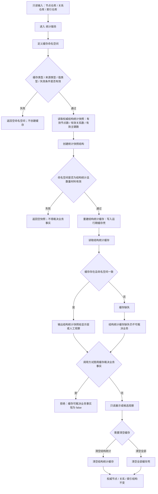

# 非权威缓存统计代码逻辑流程图 v0.1

更新时间：2026-07-08

## 依据

```text
AGENTS.md
计划/计划索引.md
规范/0050_项目通用机器逻辑与禁止性规则总纲_20260721.md
规范/规范目录.md
规范/4010_子规范_统一仓库稳定句柄与通用关系索引边界.md
规范/4060_子规范_非权威缓存统计失效与确定重建.md
实施记录/20260708_应用逻辑流程图迁移顺序信息数据.md
规范/详细设计/非权威缓存与统计详细设计.md
实施记录/20260707_FS08_缓存统计结构快照增强S1-S4代码实施_Codex断点清单.md
海中鱼巣/领域/统计服务.h
```

## 说明

本图以当前真实代码入口 `统计服务.h` 为准。当前没有独立 `非权威缓存服务.h`；非权威缓存 / 统计第一轮只落到结构统计运行期快照，不裁决需求、任务、方法、状态或结算事实。

## 流程图



## 关键边界

```text
统计服务当前只写非权威运行期缓存壳，不写权威机器事实。
缓存可裁决业务事实 当前恒为 false。
哈希、命中观察、需求结算摘要只存在于枚举 / 设计占位，不能宣称已实现。
缓存清空不得改变节点、主信息、关系、索引、需求、任务、方法、状态、动态或结算记录。
```

## 当前代码差距

```text
当前没有独立非权威缓存服务文件。
当前只实现结构统计快照缓存；内容哈希、命中观察、需求结算摘要未落代码。
当前流程不包含持久化缓存、跨进程恢复或缓存命中统计验收。
```

## 后续产物

```text
可作为非权威缓存 / 统计第二轮详细设计依据。
若后续实现哈希、命中观察或结算摘要，必须另建待确认计划，并保持缓存不得裁决业务事实。
```
