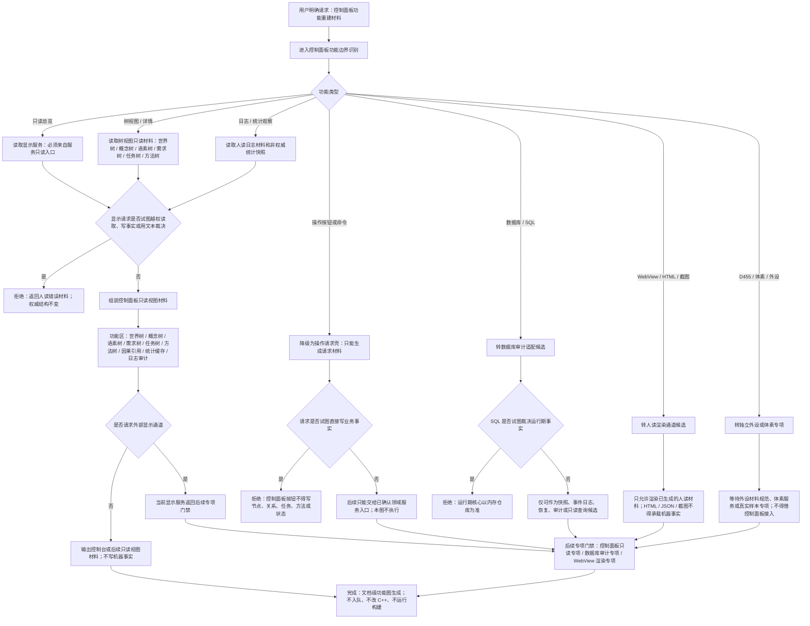

# 控制面板功能流程图 v0.1

更新时间：2026-07-09

## 依据

```text
AGENTS.md
计划/计划索引.md
规范/0050_项目通用机器逻辑与禁止性规则总纲_20260721.md
规范/规范目录.md
规范/4010_子规范_统一仓库稳定句柄与通用关系索引边界.md
规范/8110_子规范_线程生命周期状态上报与控制面板线程信息_20260720.md
实施记录/20260706_FS10_显示层只读候选只读扫描记录.md
实施记录/20260706_FSX_控制面板SQLD455体素外设排除项汇总记录.md
实施记录/20260708_FLOW-19_显示层只读代码实施_Codex断点清单.md
流程图/20260708_显示层只读代码逻辑流程图_v0.1.md
流程图/20260708_控制面板数据库重建候选代码逻辑流程图_v0.1.md
规范/详细设计/显示层只读代码逻辑详细设计.md
规范/详细设计/控制面板数据库重建候选代码逻辑详细设计.md
海中鱼巣/领域/显示服务.h
```

## 说明

本图是控制面板后续重建的功能流程图，不是代码实施许可。当前代码已有第一轮 `显示服务`，只验证服务只读来源、越权读取拒绝、显示写入拒绝、文本裁决拒绝、外部通道门禁和权威结构不变；控制面板树视图第一轮候选只保留世界树、概念树、语素树、需求树、任务树和方法树，不把状态、动态作为控制面板树视图分类；仍不得宣称控制面板、WebView、SQL、D455、体素或外设已接入。

## 流程图



## 关键边界

```text
控制面板第一位功能是人读只读视图，不是机器事实写入方。
树视图第一轮候选为世界树、概念树、语素树、需求树、任务树和方法树；状态、动态不作为控制面板树视图分类。
控制面板按钮、命令、HTML、JSON、截图、显示标题和日志不得裁决需求满足、任务完成、方法成功或世界事实。
当前显示服务会把外部显示通道识别为后续专项门禁；这不是控制面板已接入。
SQL / ADO 只能作为快照、事件日志、恢复、审计或只读查询候选，不得裁决运行期事实。
D455、体素和外设必须另建独立专项，不得借控制面板功能图提前接入。
```

## 当前代码事实

```text
海中鱼巣/领域/显示服务.h 已存在第一轮显示服务。
显示服务当前只接收 显示请求，返回 显示材料，不写节点、主信息、关系、索引、需求、任务、方法、状态、动态或因果结构。
显示服务当前可拒绝越权读取、显示写入、文本裁决和外部显示通道请求。
FLOW-19 默认入口已验证显示层只读第一轮边界，但明确不代表控制面板、DTO、JSON、WebView、截图或外设显示完成。
```

## 当前代码差距

```text
当前没有控制面板服务。
当前没有控制面板 DTO / JSON / HTML / WebView / 截图入口。
当前没有世界树、概念树、语素树控制面板树视图 DTO 契约。
当前没有数据库审计适配服务或 SQL 只读查询适配入口。
当前没有控制面板操作请求壳、权限流转、按钮到领域服务的请求材料契约。
当前没有外设、D455、体素材料在控制面板中的合法只读显示契约。
```

## 后续产物

```text
可基于本图生成控制面板功能详细设计。
若进入计划层，必须先生成待确认专项计划，明确只读入口、允许文件、禁止文件、外部通道门禁、数据库边界、操作请求边界和验证方式。
本图不生成代码实施许可、不登记可执行队列、不修改 C++。
```
