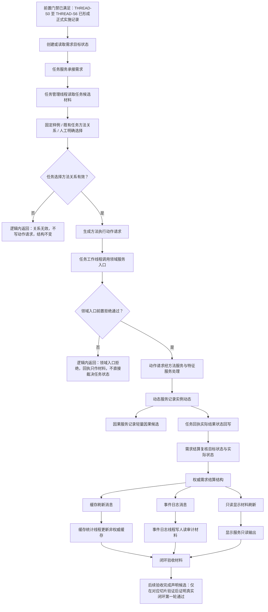

# 真实闭环串联优先目标流程图

更新时间：2026-07-10

状态：已随 `计划/20260709_真实闭环串联优先目标计划_v0.1.md` 修订确认联动确认 / 只作为 #162 S0 只读复核上游依据 / 不构成 C++ 实施许可

## 依据

```text
AGENTS.md
规范/000_项目规则总纲.md
规范/001_规则迁移清单.md
规范/验收/最小闭环验收用例.md
规范/详细设计/运行宿主与多线程消息队列详细设计.md
计划/20260709_运行宿主与多线程消息队列专项计划_v0.1.md
规范/详细设计/方法候选召回与选择代码逻辑详细设计.md
规范/详细设计/方法执行动作入口代码逻辑详细设计.md
规范/详细设计/动态记录输出结果场景代码逻辑详细设计.md
规范/详细设计/任务回执实际结果状态结果回写代码逻辑详细设计.md
规范/详细设计/需求结算代码逻辑详细设计.md
规范/详细设计/非权威缓存统计代码逻辑详细设计.md
规范/详细设计/事件日志审计材料代码逻辑详细设计.md
规范/详细设计/显示层只读代码逻辑详细设计.md
项目记忆/当前状态.md
```

## 说明

本图定义运行宿主与多线程消息队列专项完成后的下一批优先目标：把已完成的分散能力串成更真实的需求到结算闭环。THREAD-S0 至 THREAD-S6 已形成正式实施记录，本图已随对应计划确认联动确认；本图仍不构成 C++ 实施许可，也不表示真实闭环已经完成。

## 流程图



## 关键边界

```text
THREAD-S0 至 THREAD-S6 已形成正式实施记录，当前只打开本计划确认和 REAL-LOOP-S0 只读复核入口。
线程只调度、搬运、等待和执行耗时计算，不作为动作来源。
动作来源候选只能来自方法执行或领域服务写入入口。
第一轮方法选择只允许固定验收样例、读取既有任务选择方法关系或人工明确选择，不实现自动召回排序、自动选择、在线学习或评分更新。
消息、队列、日志、控制台输出和显示材料不得承载机器事实。
需求目标仍是目标状态，不是 I64。
任务回执和需求结算必须回到领域服务入口复核，不得由工作线程直接写权威事实。
非权威缓存、事件日志和只读显示材料只作为观察、审计和恢复候选材料，不裁决需求满足、任务完成或方法成功。
第一批不接 SQL、ADO、WebView、D455、体素或真实外设。
```
## 中途非成功返回二分口径

本文件按 2026-07-09 硬规则修订：中途非成功返回只分为 `追根因解决` 和 `逻辑内返回`。

- `追根因解决`：前置条件已经满足，并进入创建、绑定、写关系、写状态、记录动态、结算、读回或结构承载后，结果不符合内部预期；必须停止依赖路径，定位根因，当前未证明完整回滚时登记事务隔离缺口或半结构隔离缺口。
- `逻辑内返回`：领域协议允许的拒绝、候选为空、请求材料返回或人读材料返回；必须保证结构不变化，且返回材料、日志、回执、显示或控制台输出不裁决机器事实。
