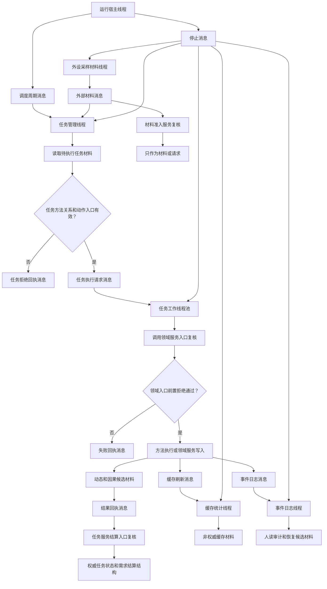

# 运行宿主与多线程消息队列流程图

更新时间：2026-07-09

## 依据

```text
AGENTS.md
规范/000_项目规则总纲.md
规范/001_规则迁移清单.md
规范/多线程防锁机制规范.md
规范/详细设计/任务状态机筹办执行桥详细设计.md
规范/详细设计/动作执行桥与本能动作治理详细设计.md
规范/详细设计/非权威缓存二级材料详细设计.md
规范/详细设计/事件日志持久化恢复详细设计.md
项目记忆/当前状态.md
用户口径：性能优先；可并行处默认设计为可并行；线程通信采用消息语义和有界队列承载。
```

## 说明

本图只定义运行宿主线程、任务管理线程、任务工作线程、缓存统计线程、事件日志线程和外设采样材料线程的消息流与边界，不构成代码实施许可。

## 流程图



## 关键边界

```text
线程、锁、等待事件、日志标签和控制台命令不得成为动作来源。
消息和队列只承载请求、材料、回执和调度信号，不承载机器事实。
权威写入必须回到领域服务或正式仓库入口重新复核句柄、版本、任务状态、任务方法关系、动作入口和时间戳。
任务工作线程不得绕过领域服务直接写节点、主信息、关系、索引、需求、任务、方法、状态、动态或因果引用。
缓存统计线程只写非权威缓存材料，不裁决需求满足、任务完成、方法成功或世界事实。
事件日志线程只写人读审计和恢复候选材料，不反向裁决当前事实。
外设采样材料线程第一轮只允许产生外部材料消息，不接 D455、体素、真实外设控制或外设事实入账。
```
## 中途非成功返回二分口径

本文件按 2026-07-09 硬规则修订：中途非成功返回只分为 `追根因解决` 和 `逻辑内返回`。

- `追根因解决`：前置条件已经满足，并进入创建、绑定、写关系、写状态、记录动态、结算、读回或结构承载后，结果不符合内部预期；必须停止依赖路径，定位根因，当前未证明完整回滚时登记事务隔离缺口或半结构隔离缺口。
- `逻辑内返回`：领域协议允许的拒绝、候选为空、请求材料返回或人读材料返回；必须保证结构不变化，且返回材料、日志、回执、显示或控制台输出不裁决机器事实。
