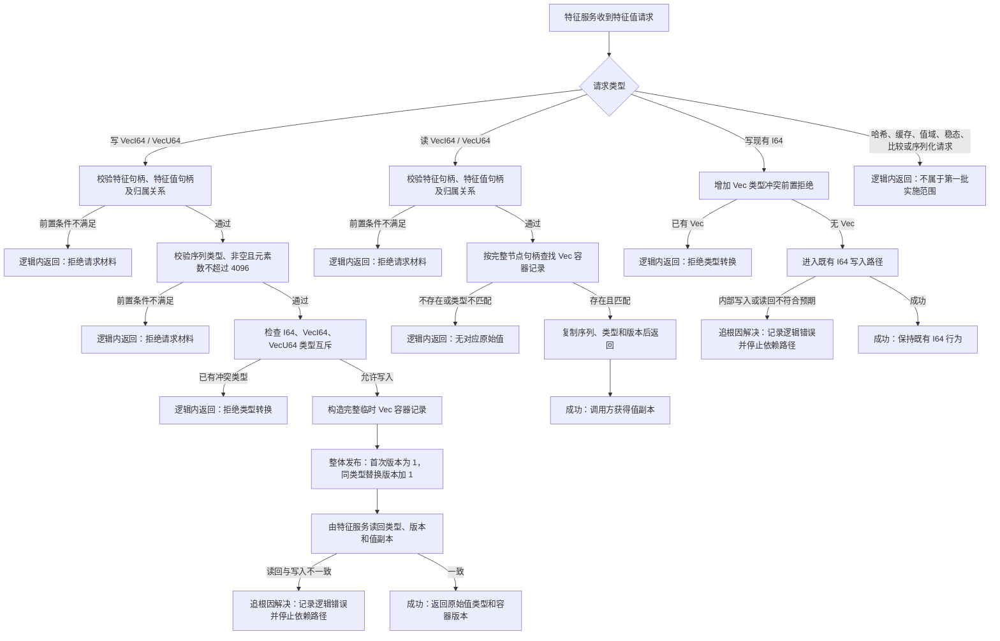

# FS-03 特征值系统第二轮第一批代码实施流程图 v0.1

更新时间：2026-07-10

## 1. 图示目的

本图用于限定 FS-03 第二轮第一批代码实施边界。第一批只落地 `VecI64 / VecU64` 原始值容器、值类型互斥、容器版本和特征服务封口；内容哈希、命中缓存、值域稳态、候选比较、序列化恢复和当前值唯一性治理留待后续批次。

## 2. 依据

- `计划/20260707_FS03_特征值系统第二轮专项_v0.1.md`
- `实施记录/20260707_FS03_特征值系统第二轮S0当前代码事实扫描_Codex断点清单.md`
- `规范/详细设计/特征值Vec原始值容器详细设计.md`
- `规范/详细设计/特征值非权威缓存与内容哈希详细设计.md`
- `规范/详细设计/特征值值域稳态与候选比较详细设计.md`
- `规范/详细设计/过期设计/特征值序列化恢复边界详细设计.md`
- 当前 `特征值服务`、`特征服务` 与 `入口.cpp` 实现事实

## 3. 主流程

## 4. 结构与权限边界

1. Vec 原始值由 `特征值服务` 内部运行期结构承载，键使用完整 `节点句柄`；不得只用节点编号，也不得用指针作为长期身份。
2. `特征服务` 是业务调用方唯一入口；需求、任务、方法等高级服务不得直接访问 `特征值服务`。
3. `I64 / VecI64 / VecU64` 在同一特征值节点上互斥。第一批不提供类型转换、追加、局部修改或跨类型覆盖。
4. Vec 写入采用“完整临时记录构造后整体发布”。不得先留下半结构，再靠扫描或事后修复收口。
5. 读取返回副本；调用方不得获得内部容器的可写引用。
6. 容器版本只描述 Vec 原始值内容迭代，不得修改节点句柄生命周期版本。
7. 第一批不写数据库、不接快照恢复、不生成内容哈希、不建立命中缓存、不裁决值域或稳态。

## 5. 非成功返回口径

- 句柄无效、节点类型不符、归属关系不符、空序列、超长序列、类型冲突、读取不存在值，均在写入前或读取入口处拒绝，属于逻辑内返回。
- 前置条件通过后，完整记录构造、整体发布、现有 I64 写入或读回结果不符合内部预期，属于逻辑错误，必须追根因解决；不得静默返回后继续依赖路径。
- 哈希、缓存、值域、稳态、候选比较和序列化恢复请求不在第一批承诺内，属于范围门控下的逻辑内返回。

## 6. 后续依赖出口

第一批完成并验证后，后续批次才可分别复核并制定：

1. 基于稳定 Vec 原始值和容器版本的内容哈希、命中缓存计划。
2. 基于稳定原始值读取入口的值域、候选比较与稳态计划。
3. 基于稳定运行期记录格式的序列化、恢复和版本兼容计划。
4. 当前值唯一性、提升与淘汰治理计划。
