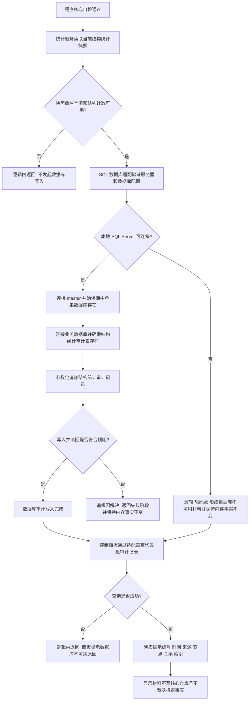

# SQL Server 结构审计投影与控制面板查看流程图 v0.1

更新时间：2026-07-10

## 依据

```text
用户明确指令：本地 SQL Server 已启动，实现数据写入，并从控制面板查看。
AGENTS.md
规范/000_项目规则总纲.md
规范/详细设计/事件日志持久化恢复详细设计.md
规范/详细设计/仓库快照格式与恢复拒绝矩阵详细设计.md
规范/详细设计/控制面板数据库重建候选代码逻辑详细设计.md
海中鱼巣/领域/统计服务.h
海中鱼巣/界面/控制面板窗口.h
```

## 说明

本流程只把内存仓库的结构统计快照追加为 SQL Server 审计投影，并由控制面板只读查询。数据库记录不裁决运行期事实，不参与核心仓库写入、恢复或回放。

## 流程图



## 关键边界

```text
运行期机器事实仍以内存节点、主信息、关系和索引仓库为准。
数据库只承载结构统计审计投影，不承载业务裁决。
数据库写入由入口调用适配器完成，控制面板只查询。
数据库不可用不得破坏或回滚已经成立的内存结构。
本轮不实现节点明细快照、主信息值序列化、关系回放、索引恢复或数据库恢复入口。
```
