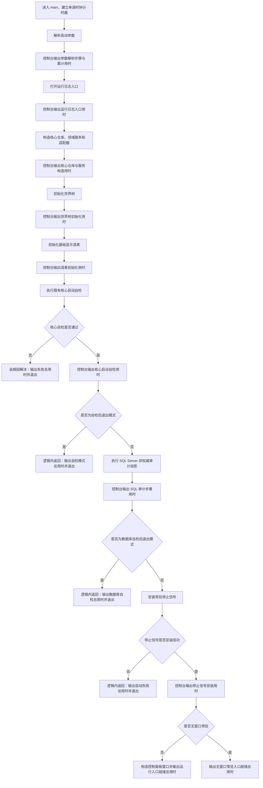

# 控制台启动步骤用时显示流程图

更新时间：2026-07-10

## 依据

```text
用户要求：在控制台实现启动步骤用时显示。
AGENTS.md
规范/0050_项目通用机器逻辑与禁止性规则总纲_20260721.md
规范/规范目录.md
规范/日志系统规范.md
编号对象规范：不适用；本图只描述人读启动计时，不定义机器对象。
海中鱼巣/入口.cpp
```

## 说明

本图只增加人读启动耗时观察，不改变启动顺序、返回裁决、机器事实或领域结构。每个步骤输出本步骤毫秒数和自进程入口起算的累计毫秒数。

## 流程图



## 关键边界

```text
计时使用 std::chrono::steady_clock，不使用系统墙上时间。
计时输出只做人读观察，不写节点、主信息、关系、索引、缓存或 SQL。
控制台输出失败不参与机器裁决，不改变既有返回值。
控制面板运行入口就绪只计到调用阻塞式窗口运行函数之前，不把窗口存续时间冒充启动时间。
SQL Server 审计不可用仍沿既有非权威边界处理。
```
