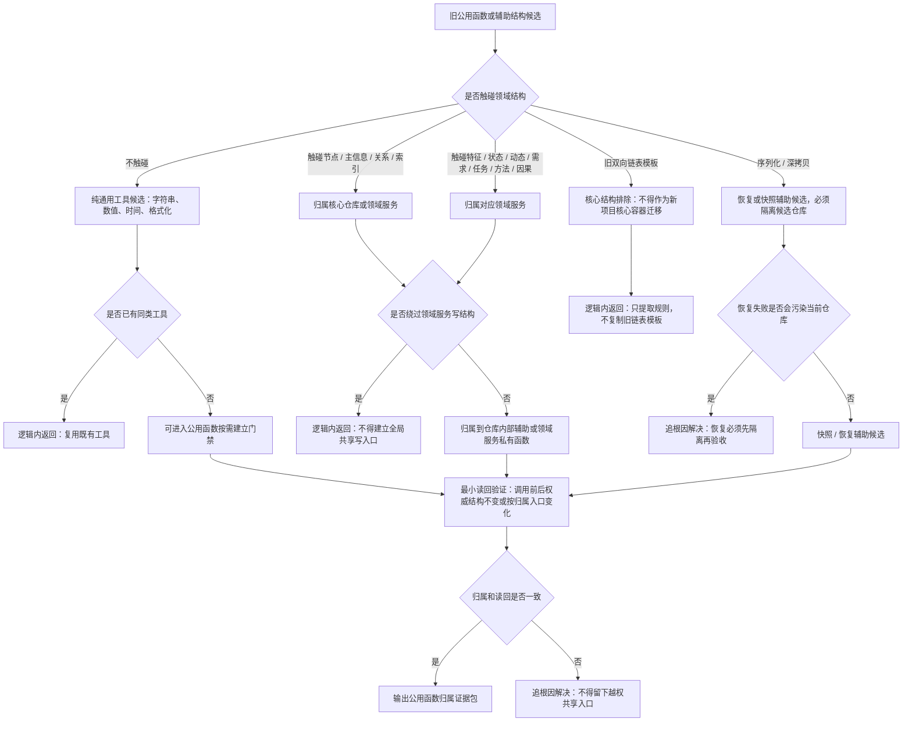

# 旧鱼巢公用函数与双向链表归属边界流程图 v0.1

更新时间：2026-07-10

## 依据

```text
AGENTS.md
规范/0050_项目通用机器逻辑与禁止性规则总纲_20260721.md
规范/规范目录.md
规范/4010_子规范_统一仓库稳定句柄与通用关系索引边界.md
规范/4030_子规范_基础信息服务分层与领域写授权.md
规范/代码文件建立归属与模块命名规范.md
实施记录/20260708_公用函数规则后续实施门禁信息数据.md
D:\鱼巢\全局共享函数类.ixx
D:\鱼巢\双向链表模板核心.h
D:\鱼巢\基础数据类型.h
```

## 说明

本图用于补齐旧全局共享函数、双向链表模板、可解析引用、值容器和序列化 / 深拷贝辅助的归属判断。它不是迁移旧双向链表核心结构的许可，只给后续新增公共工具或仓库内部辅助时使用。

## 流程图



## 关键边界

```text
1. 纯通用函数才可进入公用函数候选。
2. 触碰领域结构的共享逻辑必须归属对应仓库或领域服务。
3. 旧双向链表模板不作为海中鱼巣核心结构迁移。
4. 已加锁辅助只能由同仓库内部持锁路径调用，不得暴露为跨服务公共入口。
5. 序列化 / 恢复辅助必须证明失败不污染当前仓库。
```
