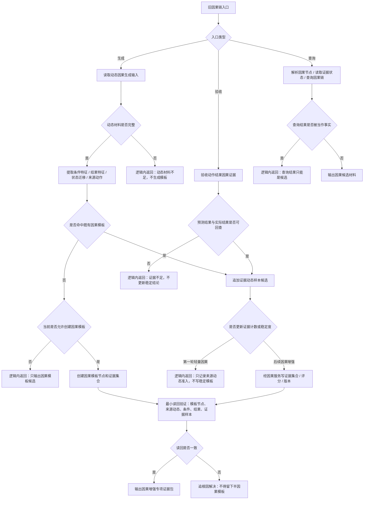

# 旧鱼巢因果模板证据样本代码逻辑流程图 v0.1

更新时间：2026-07-10

## 依据

```text
D:\海中鱼巣\实施记录\20260706_FS07_动作动态因果入口只读扫描记录.md
D:\鱼巢\因果类.h
D:\鱼巢\因果类.cpp
D:\鱼巢\动态类.h
D:\鱼巢\动态类.cpp
```

## 说明

本图提取旧因果模板身份、证据状态、从动态生成或命中因果模板、追加证据动态样本和动作结果因果验收路径。当前海中鱼巣第一轮只有轻量因果引用，不生成稳定因果模板，不迁移旧因果主信息字段。

## 流程图



## 关键边界

```text
1. 轻量因果引用不等于稳定因果结论。
2. 单条动态、单个模板命中、日志文本或动作语义文本键不得成为可靠因果事实。
3. 旧因果模板主信息、证据计数字段和稳定度字段不得直接迁移为新主信息字段。
4. 后续因果增强必须补因果服务详细设计，并明确证据集合、评分、版本和复判边界。
5. 创建模板或写证据后读回不一致，必须追根因解决。
```
