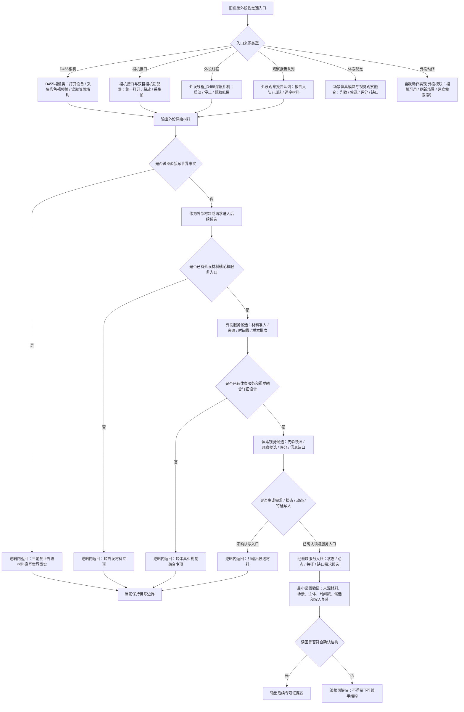

# 旧鱼巢外设 D455 体素视觉融合代码逻辑流程图 v0.1

更新时间：2026-07-10

## 依据

```text
D:\海中鱼巣\实施记录\20260706_FSX_控制面板SQLD455体素外设排除项汇总记录.md
D:\鱼巢\D455相机类.ixx
D:\鱼巢\D455相机类.cpp
D:\鱼巢\相机接口类.ixx
D:\鱼巢\双目相机本能适配器.h
D:\鱼巢\双目相机本能适配器.cpp
D:\鱼巢\外设观察报告队列.ixx
D:\鱼巢\外设线程_D455深度相机.ixx
D:\鱼巢\场景体素模块.ixx
D:\鱼巢\视觉观察融合模块.ixx
D:\鱼巢\自我动作实现.外设模块.ixx
```

## 说明

本图按旧 `D:\鱼巢` 外设 / D455 / 体素 / 视觉融合代码链提取候选逻辑，只作为 `D:\海中鱼巣` 后续外设材料、体素服务和视觉融合专项的流程图依据。当前结论仍是排除 / 后续专项，不接真实 D455，不接体素，不接外设，不生成代码实施许可。

## 流程图



## 关键边界

```text
1. 本图不证明 D455、体素、真实外设或视觉融合已接入。
2. 外设材料只能作为材料或请求，不能直接成为世界事实。
3. 线程、采样队列、帧、截图、日志和显示文本不得成为动作来源或事实来源。
4. 后续若恢复，必须先有外设材料规范、体素服务详细设计、领域服务写入口、真实样本验收和失败收口。
5. 进入创建、绑定、写状态、写动态或写特征后不及预期，必须追根因解决，不得画成普通失败返回。
```
