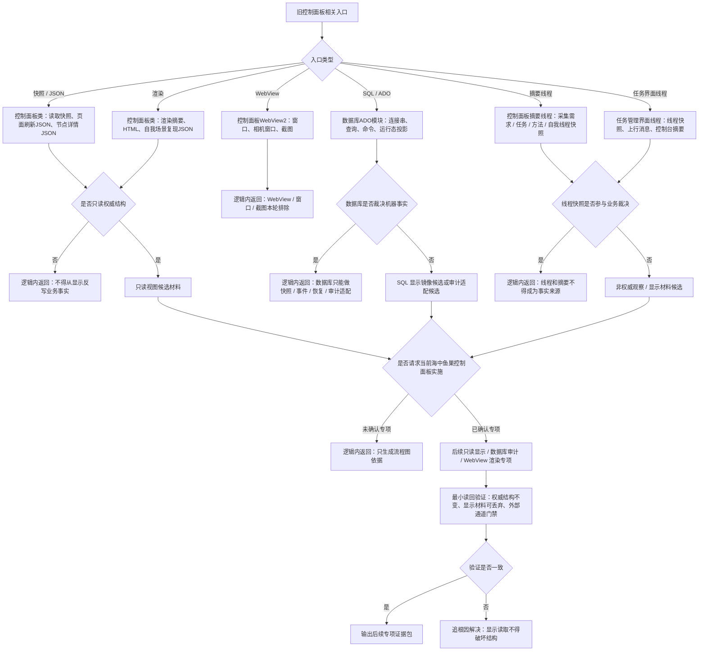

# 旧鱼巢控制面板 SQL WebView 摘要线程代码逻辑流程图 v0.1

更新时间：2026-07-10

## 依据

```text
D:\海中鱼巣\实施记录\20260706_FS10_显示层只读候选只读扫描记录.md
D:\海中鱼巣\实施记录\20260706_FSX_控制面板SQLD455体素外设排除项汇总记录.md
D:\鱼巢\控制面板类.ixx
D:\鱼巢\控制面板类.cpp
D:\鱼巢\控制面板WebView2.ixx
D:\鱼巢\控制面板WebView2.cpp
D:\鱼巢\数据库ADO模块.ixx
D:\鱼巢\数据库ADO模块.cpp
D:\鱼巢\控制面板摘要线程模块.ixx
D:\鱼巢\控制面板摘要线程模块.impl.cpp
D:\鱼巢\任务模块.管理界面线程.ixx
D:\鱼巢\任务模块.管理界面线程.impl.cpp
```

## 说明

本图按旧控制面板、SQL / ADO、WebView2、摘要线程和任务管理界面线程代码链生成。它不是现有控制面板功能图的替代，也不证明控制面板、SQL、WebView 或摘要线程已经接入。

## 流程图



## 关键边界

```text
1. 控制面板、HTML、JSON、截图、SQL 投影和线程摘要只做人读或非权威材料。
2. SQL / ADO 不裁决运行期机器事实。
3. WebView2、窗口、截图、相机窗口和自我场景窗口不借本图接入。
4. 摘要线程和任务管理界面线程不是动作来源，也不是需求结算或任务完成证据。
5. 后续如实施，必须先建只读视图、数据库审计或 WebView 渲染专项。
```
