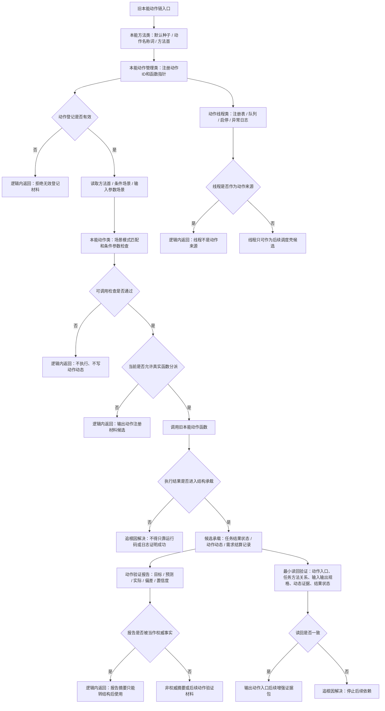

# 旧鱼巢本能动作注册执行分派代码逻辑流程图 v0.1

更新时间：2026-07-10

## 依据

```text
D:\海中鱼巣\实施记录\20260706_FS07_动作动态因果入口只读扫描记录.md
D:\鱼巢\本能方法类.h
D:\鱼巢\本能方法类.cpp
D:\鱼巢\本能动作类.ixx
D:\鱼巢\本能动作管理类.ixx
D:\鱼巢\动作线程类.ixx
D:\鱼巢\动作验证报告类.h
D:\鱼巢\动作闭环特征定义.ixx
D:\鱼巢\自我动作实现模块.ixx
D:\鱼巢\自我动作实现.内部模块.ixx
D:\鱼巢\自我动作实现.服务模块.ixx
D:\鱼巢\自我动作实现.扫描.ixx
D:\鱼巢\自我动作实现.外部模块.ixx
D:\鱼巢\自我动作实现.外设模块.ixx
```

## 说明

本图只提取旧本能动作注册、可调用检查、执行分派、动作线程和动作验证报告的代码逻辑。它不迁移旧函数指针注册表、不接真实动作线程、不接外设动作，只形成后续动作入口增强和动作验证专项依据。

## 流程图



## 关键边界

```text
1. 本图不迁移旧函数体、旧动作句柄字段、函数指针注册表或动作线程。
2. 动作身份必须由动作入口角色节点、稳定动作键和方法动作入口关系承载。
3. 线程、日志、运行码、文本动作名和摘要文本不得成为动作来源或方法成功事实。
4. 动作验证报告若进入新项目，必须转为动作动态、任务实际结果状态、需求结算记录或非权威缓存材料。
5. 真实分派、取消、超时、重试和外设动作必须另建施工计划。
```
