# 旧鱼巢自我线程逻辑提取流程图 v0.1

更新时间：2026-07-10

状态：已作为旧项目只读证据随 `计划/已完成计划/20260710_自我治理循环详细设计生成计划_v0.1.md` 修订确认联动确认 / #163 文档治理已完成并归档计划 / 不构成旧函数迁移或 C++ 实施许可

## 依据

```text
D:\海中鱼巣\AGENTS.md
D:\海中鱼巣\计划\计划索引.md
D:\海中鱼巣\规范\000_项目规则总纲.md
D:\海中鱼巣\规范\001_规则迁移清单.md
D:\鱼巢\自我线程模块.ixx
D:\鱼巢\自我线程模块.impl.cpp
D:\鱼巢\自我线程模块.消息协议.ixx
D:\鱼巢\自我线程模块.消息处理器.ixx
D:\鱼巢\自我线程模块.消息批次执行器.ixx
D:\鱼巢\流程图\20260605_自我线程总流程图_v0.1.md
D:\鱼巢\流程图\20260609_三线程消息传递清单与流程图_v0.1.md
D:\鱼巢\docs\工程图谱\01_任务需求方法闭环图谱.md
D:\鱼巢\docs\工程图谱\05_规则原子索引.md
D:\鱼巢\docs\工程图谱\08_事实来源与写入权限图谱.md
```

## 说明

本图只提取旧 `D:\鱼巢` 自我线程的当前代码逻辑和可迁移边界，作为 `D:\海中鱼巣` 后续详细设计依据。它不迁移旧函数体，不修改 C++，不生成代码实施许可，也不证明新项目已经实现自我线程、自我循环、自我苏醒或初步成熟。

旧自我线程在代码中承担的是治理循环和跨线程消息裁决：初始化自我环境，维护治理 mailbox，每轮冻结和规范化消息，抢占处理任务管理成功结果、派生需求、观察事实承接和执行前许可，再刷新治理帧、整理需求、生成主派发决议，并从任务管理后台上行继续回灌材料。线程本身不是动作来源，任务状态写入仍属于任务管理线程和任务域提交入口。

## 流程图

```mermaid
flowchart TD
    START["旧鱼巢自我线程逻辑提取开始"]
    SRC["只读旧项目代码与旧流程图"]
    INIT_CALL["自我线程类::自我初始化"]
    INIT_FAST{"已经初始化且非故障"}
    INIT_RETURN["逻辑内返回：初始化快路径成功"]
    INIT_ENV["执行自我初始化并记录步骤耗时"]
    INIT_INSTINCT["注册本能函数执行闭环"]
    INIT_DELAY["默认本能方法专属规格延后确认"]
    INIT_DEMAND["刷新需求列表并确保需求相关任务"]
    INIT_MAIN["选择当前主任务候选并同步当前主需求"]
    INIT_MARK["刷新初始化标记与最近初始化结果"]
    INIT_OK{"初始化完成"}
    INIT_FAIL["追根因解决：初始化异常或标记不及预期进入故障收口"]

    RUN_ENTER["线程函数进入运行态"]
    LOOP["while 未收到停止请求"]
    ROUND["执行主循环一轮"]
    FREEZE["冻结本轮治理消息批次"]
    STOP1{"停止请求"}
    STOP_RETURN["逻辑内返回：停止请求中"]
    NORMALIZE["规范化消息并落一次特征账"]
    PREEMPT1["抢占处理：成功结果、派生需求、观察事实承接、执行前许可"]
    DERIVED1{"存在待落账派生需求"}
    WAIT_DERIVED["逻辑内返回：暂停本轮任务派发，等待派生需求入树"]
    SECONDARY["重算受影响二次特征"]
    FRAME["刷新线程上下文并生成治理帧"]
    DEMAND["整理需求并做根层重判"]
    DISPATCH["生成并执行主派发决议"]
    TASK_REQ["向任务管理界面提交任务治理请求或调度意图"]
    PREEMPT2["主派发后再次抢占落账与许可审批"]
    DERIVED2{"主派发后出现待落账派生需求"}
    WAIT_DERIVED2["逻辑内返回：暂停任务巡检，下一轮优先冻结治理邮箱"]
    TASK_UP["提取并上报任务管理后台上行消息"]
    SERVICE["执行服务治理周期维护"]
    SELF_CHECK["休眠期自检报告修复门控"]
    ROUND_OK["更新 Tick、最近时间、首轮完成和最近循环结果"]
    WAIT_WAKE["等待 Tick 间隔或治理邮箱唤醒"]

    MSG_IN["外部反馈、自检报告、任务管理上行消息"]
    POST["投递治理消息"]
    POST_STOP{"停止请求中"}
    POST_SKIP["逻辑内返回：拒绝入队"]
    POST_FILL["补齐产生时间、来源链、优先级、可抢占、消息主键和载荷键"]
    POST_MERGE{"幂等键已存在"}
    POST_UPDATE["合并既有事件的优先级、摘要和附加载荷"]
    POST_APPEND["追加到治理 mailbox 并唤醒线程"]

    PROTOCOL["结构_治理消息"]
    PAYLOAD["附加载荷：线程状态、派生需求、结果状态、观察承接、执行前许可、自检报告、控制面板刷新请求"]
    BATCH["消息批次执行器拆分抢占消息与普通消息"]
    ACTION["消息处理器计算动作：需求队列刷新、根层重判、主派发、二次特征、结算候选"]

    TASK_UI["任务管理界面线程"]
    TASK_WORKER["任务管理工作线程"]
    TASK_RESULT["任务工作结果与结构_任务管理上行消息"]
    SELF_MAILBOX["转换为自我线程结构_治理消息"]
    PERMIT["执行前许可请求由自我线程审批并回传许可结果"]

    EXCEPTION["运行期异常"]
    FAULT["追根因解决：故障收口，生命周期置故障，停止请求生效"]
    EXIT["退出循环并切换已停止"]

    RULE_THREAD["边界：线程不是动作来源"]
    RULE_TASK["边界：自我线程不得直接写任务状态"]
    RULE_TEXT["边界：日志、摘要、控制台和显示不承载机器事实"]
    RULE_MIGRATE["边界：本图只生成流程图依据，不迁移旧函数体"]
    RULE_EXCLUDE["排除：SQL、控制面板实现、D455、体素、外设接入不借本图进入实施"]

    START --> SRC --> INIT_CALL --> INIT_FAST
    INIT_FAST -->|是| INIT_RETURN
    INIT_FAST -->|否| INIT_ENV --> INIT_INSTINCT --> INIT_DELAY --> INIT_DEMAND --> INIT_MAIN --> INIT_MARK --> INIT_OK
    INIT_OK -->|是| RUN_ENTER
    INIT_OK -->|否| INIT_FAIL
    INIT_FAIL --> FAULT

    RUN_ENTER --> LOOP --> ROUND --> FREEZE --> STOP1
    STOP1 -->|是| STOP_RETURN --> WAIT_WAKE
    STOP1 -->|否| NORMALIZE --> PREEMPT1 --> DERIVED1
    DERIVED1 -->|是| WAIT_DERIVED --> WAIT_WAKE
    DERIVED1 -->|否| SECONDARY --> FRAME --> DEMAND --> DISPATCH
    DISPATCH --> TASK_REQ --> TASK_UI
    DISPATCH --> PREEMPT2 --> DERIVED2
    DERIVED2 -->|是| WAIT_DERIVED2 --> WAIT_WAKE
    DERIVED2 -->|否| TASK_UP --> SERVICE --> SELF_CHECK --> ROUND_OK --> WAIT_WAKE --> LOOP
    ROUND --> EXCEPTION --> FAULT --> EXIT
    LOOP -->|停止请求| EXIT

    MSG_IN --> POST --> POST_STOP
    POST_STOP -->|是| POST_SKIP
    POST_STOP -->|否| POST_FILL --> POST_MERGE
    POST_MERGE -->|是| POST_UPDATE --> POST_APPEND
    POST_MERGE -->|否| POST_APPEND
    POST_APPEND --> LOOP

    POST_FILL --> PROTOCOL --> PAYLOAD
    FREEZE --> BATCH --> ACTION
    ACTION --> NORMALIZE

    TASK_UI --> TASK_WORKER --> TASK_RESULT --> SELF_MAILBOX --> MSG_IN
    TASK_WORKER -->|执行前许可请求| PERMIT --> TASK_UI
    TASK_REQ -.->|只发意图| RULE_TASK
    PERMIT -.->|许可不等于任务状态裁决| RULE_TASK
    DISPATCH -.->|线程不生成动作动态| RULE_THREAD
    PAYLOAD -.->|摘要只做人读| RULE_TEXT
    SRC -.->|证据材料| RULE_MIGRATE
    SRC -.->|排除项| RULE_EXCLUDE

    classDef source fill:#eef2f7,stroke:#59687a,color:#102030;
    classDef init fill:#e8f4ff,stroke:#2f6f9f,color:#102030;
    classDef loop fill:#edf7ed,stroke:#3f7f4f,color:#102010;
    classDef msg fill:#f6f0ff,stroke:#6c56a4,color:#1d1730;
    classDef gate fill:#fff8e8,stroke:#9a6a1a,color:#24160a;
    classDef logic fill:#eef7f6,stroke:#3c8b86,color:#102827;
    classDef fault fill:#ffecec,stroke:#b84a4a,color:#401111;
    classDef boundary fill:#fff0f3,stroke:#b4234a,color:#3a0d18;

    class START,SRC source;
    class INIT_CALL,INIT_ENV,INIT_INSTINCT,INIT_DELAY,INIT_DEMAND,INIT_MAIN,INIT_MARK,INIT_RETURN init;
    class RUN_ENTER,LOOP,ROUND,FREEZE,NORMALIZE,PREEMPT1,SECONDARY,FRAME,DEMAND,DISPATCH,PREEMPT2,TASK_UP,SERVICE,SELF_CHECK,ROUND_OK,WAIT_WAKE,EXIT loop;
    class MSG_IN,POST,POST_FILL,POST_UPDATE,POST_APPEND,PROTOCOL,PAYLOAD,BATCH,ACTION,TASK_REQ,TASK_UI,TASK_WORKER,TASK_RESULT,SELF_MAILBOX,PERMIT msg;
    class INIT_FAST,INIT_OK,STOP1,DERIVED1,DERIVED2,POST_STOP,POST_MERGE gate;
    class STOP_RETURN,WAIT_DERIVED,WAIT_DERIVED2,POST_SKIP logic;
    class INIT_FAIL,EXCEPTION,FAULT fault;
    class RULE_THREAD,RULE_TASK,RULE_TEXT,RULE_MIGRATE,RULE_EXCLUDE boundary;
```



## 关键边界

```text
1. 旧自我线程逻辑只作为证据材料和迁移候选，不作为海中鱼巣已实现事实。
2. 线程不是动作来源；方法执行或领域服务写入才可成为动作动态和因果引用的来源候选。
3. 自我线程可生成任务发起、调度、重筹办和执行前许可等治理意图，但不得直接写任务状态、当前方法、筹办缺口或执行缺口。
4. 任务状态合法写入方仍是任务管理线程和任务域提交入口；自我线程只能读取或接收结构化上行材料后裁决需求侧后续。
5. 治理消息中的摘要、日志、控制台输出、显示标题和控制面板刷新请求只做人读或显示材料，不承载机器事实。
6. 外部反馈、自检报告、外设观察材料和任务管理回执必须先转成结构化治理消息，再由自我线程循环裁决；不能直接成为世界事实或需求满足事实。
7. 停止请求、空候选、等待派生需求入树、拒绝入队等不产生可读半结构的分支，本图按逻辑内返回处理。
8. 初始化或运行态异常，以及入口前置条件通过后结构承载不及预期的情况，本图按追根因解决处理，不画成普通失败返回。
9. SQL、控制面板实现、D455、体素、真实外设接入、旧函数体复制和旧线程调度实现均不借本图进入实施。
```

## 当前代码事实

```text
1. 自我线程类::自我初始化 会先走已初始化快路径；非快路径会执行自我初始化、注册本能函数执行闭环、延后确认默认本能方法专属规格、刷新需求列表、选择当前主任务候选并刷新初始化标记。
2. 初始化异常会调用 故障收口_已加锁，并通过 私有_切换自我线程生命周期并上报 切到故障生命周期。
3. 线程函数进入运行态后循环调用 执行主循环一轮_，每轮结束更新 Tick计数、最近Tick时间、首轮运行已完成和最近循环结果。
4. 执行主循环一轮_ 的主干顺序为：冻结本轮消息批次、规范化消息并落一次特征账、抢占处理、待落账派生需求门控、二次特征重算、治理帧刷新、需求整理根层重判、主派发决议、后台上行提取、服务治理周期维护和休眠期自检报告修复门控。
5. 投递治理消息 会补齐产生时间、来源链、优先级、可抢占、消息主键和载荷键；命中同一载荷键和重放代数时合并既有事件，否则追加到治理 mailbox。
6. 结构_治理消息 由消息头、存在动作语义、来源诊断、附加载荷、重放代数、变化项集、载荷键和摘要组成；附加载荷覆盖线程状态、任务管理派生需求、结果状态、观察事实承接、执行前许可、自检报告和控制面板刷新请求等。
7. 消息批次执行器能把冻结批次拆成抢占消息与普通消息；任务管理观察事实承接和执行前许可在构造治理消息时可置为紧急优先级和可抢占。
8. 旧工程图谱明确约束：线程不是动作来源，自我线程不得直接写任务状态，纯线程状态不得进入自我治理事实，任务状态由任务管理线程和任务域提交入口写入。
```

## 迁移候选 / 后续产物

```text
1. 可基于本图继续生成“自我治理循环详细设计”，但详细设计必须重写为海中鱼巣节点仓库、关系仓库、索引仓库、需求服务、任务服务、方法服务和基础信息服务分层口径。
2. 若后续进入实施，必须另建待确认施工计划，明确允许文件、禁止文件、入口拒绝、逻辑内返回 / 追根因解决收口、读回验证、日志弹窗边界和完成声明边界。
3. 旧治理 mailbox、结构_治理消息、抢占消息、执行前许可和任务管理上行消息可作为服务逻辑包候选；旧函数体、旧双向链表结构、旧控制面板刷新、旧 SQL 投影、外设和体素路径不得直接迁移。
4. 后续详细设计必须把“线程状态可显示”和“机器事实可裁决”分开；纯线程生命周期只能作为运行诊断或治理材料，不能直接冒充需求满足、任务完成或动作动态。
5. 本图之后可继续拆分为：自我治理消息协议详细设计、治理 mailbox 与抢占处理详细设计、自我线程到任务服务桥接详细设计、需求回写与结算预览详细设计。
```
